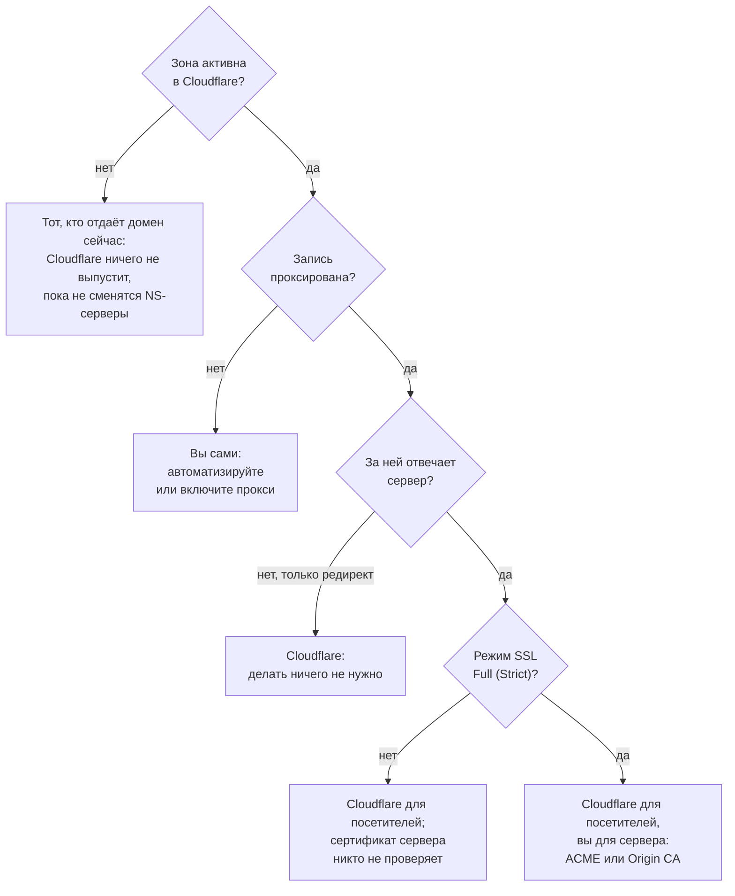

# Сертификат теперь живёт 200 дней: какие домены вы всё ещё продлеваете руками

С марта публичный сертификат живёт не дольше 200 дней, и первые короткие уже истекли. Один скрипт делит ваши домены по тому, кто продлевает их сертификаты.

Source: https://ru.301.sh/200-day-certificates-on-a-domain-portfolio/
Published: 2026-09-19
Cloudflare facts checked: 2026-09-19

---

Если этой весной вы купили для домена сертификат «на год», установили вы сертификат на 199
дней. Перевыпуск на остаток года тоже ставить вам. Правила для публично доверенных сертификатов
поменялись 15 марта 2026 года, а DigiCert и Sectigo перешли на новые сроки ещё раньше: DigiCert
с 24 февраля не выпускает ничего дольше 199 дней, Sectigo — с 12 марта. Сертификат DigiCert,
выпущенный 24 февраля, закончился в конце дня 10 сентября. Выпущенный 15 марта на полные 200
дней закончится в конце сентября.

Эти 200 дней — первая ступень графика из Baseline Requirements, правил, которым подчиняется
каждый публичный удостоверяющий центр. Версия 2.3.0 от 7 сентября 2026 года:

| Сертификат выпущен | Срок действия, не больше | Проверку домена можно переиспользовать |
| --- | --- | --- |
| до 15 марта 2026 | 398 дней | 398 дней |
| с 15 марта 2026 | 200 дней | 200 дней |
| с 15 марта 2027 | 100 дней | 100 дней |
| с 15 марта 2029 | 47 дней | 10 дней |

Удостоверяющие центры не ждут этих дат. В собственной таблице DigiCert следующая ступень,
99 дней, стоит на начало 2027 года. Let's Encrypt забегает ещё дальше: с 10 февраля 2027 года его
сертификаты по умолчанию живут 64 дня, с 16 февраля 2028 года — 45, а проверка домена остаётся в
силе сначала 10 дней, потом 7 часов.

По ручной работе сильнее всего бьёт правая колонка. Заказ сертификата руками начинается с доказательства,
что домен ваш: DNS-запись, файл на сервере или письмо — если только прошлое доказательство не
достаточно свежее. С марта 2029 года «достаточно свежее» значит десять дней, и для сертификата
на 47 дней доказывать придётся при каждом заказе. Домену, чей сертификат продлевает человек, этот
человек сейчас нужен примерно дважды в год, с 2027 года — примерно четыре раза, с 2029-го —
около восьми.

На домене, который только редиректит, этим не должен заниматься никто. Дальше — как найти
домены, где кто-то всё ещё занимается. Если вы пока выбираете, чем вообще делать редирект, все
варианты разобраны в [сравнении способов на Cloudflare](/every-way-to-redirect-on-cloudflare/).

## Домену-редиректу не нужен сертификат, который продлеваете вы

Сертификат на припаркованном домене или на домене, который только отправляет посетителя
дальше, нужен ровно для одного: тот, кто набрал `https://`, должен пройти TLS-рукопожатие, прежде чем
получит ваш `301`. Больше сертификат на этом домене ни для чего не используется. Спрячьте запись
за прокси Cloudflare, и сертификат станет заботой Cloudflare. Документация, редакция от 16 апреля 2026
года:

> Universal certificates have a 90-day validity period. The auto renewal period starts 30 days before expiration.

Universal SSL входит в любой тариф, включая Free. Его 90 дней уже укладываются в пределы 2026 и
2027 годов. Предел 2029 года в 47 дней они превышают, но и этот разрыв закрывать не вам:

> For Universal certificates, Cloudflare controls the validity periods and certificate authorities (CAs), making sure that renewal always occur.

Схема, которая снимает вопрос целиком, описана в
[инструкции для портфеля](/redirect-200-parked-domains/): проксированная `A`-запись на
`192.0.2.1` — адрес из диапазона для документации, на нём не отвечает ни один сервер, — и
правило редиректа на краю сети. Сервера за доменом нет, значит, нет и серверного сертификата.
Единственный сертификат, через который идёт запрос, продлевает Cloudflare.

## Разделить домены по тому, кто продлевает сертификат

Чтобы найти домены, которые в эту схему не вписываются, инвентаризация не нужна. Сертификат,
который отдаёт каждый домен, сам несёт даты начала и конца, и расстояние между ними многое
говорит о том, откуда он взялся. Скрипту нужны только `openssl` и GNU `date` — та же пара, которой
[скрипт аудита](/audit-300-domains-one-script/) заполняет колонку сертификатов. На macOS
вместо `date -d` используйте `date -j -f '%b %d %T %Y %Z'`.

```bash
#!/usr/bin/env bash
set -uo pipefail

printf '%-34s %-24s %-9s %s\n' DOMAIN ISSUER LIFETIME LEFT

while read -r domain; do
  [ -z "$domain" ] && continue

  cert=$(echo | openssl s_client -servername "$domain" -connect "$domain:443" 2>/dev/null \
         | openssl x509 -noout -issuer -startdate -enddate 2>/dev/null)
  if [ -z "$cert" ]; then
    printf '%-34s %s\n' "$domain" "no certificate"
    continue
  fi

  issuer=$(printf '%s\n' "$cert" | sed -n 's/^issuer=.*O *= *\([^,]*\).*/\1/p')
  from=$(date -d "$(printf '%s\n' "$cert" | sed -n 's/^notBefore=//p')" +%s)
  until=$(date -d "$(printf '%s\n' "$cert" | sed -n 's/^notAfter=//p')" +%s)

  life=$(( (until - from + 43200) / 86400 ))
  left=$(( (until - $(date +%s)) / 86400 ))

  printf '%-34s %-24.24s %-9s %s\n' "$domain" "${issuer:--}" "${life}d" "${left}d"
done < domains.txt
```

Срок жизни округляется до ближайшего дня: удостоверяющие центры добавляют к обоим концам по
нескольку часов. Прогон 19 сентября 2026 года по английской версии этого блога, по этому сайту
и для сравнения по нескольким крупным сайтам:

```
DOMAIN                             ISSUER                   LIFETIME  LEFT
301.sh                             Google Trust Services    90d       89d
www.301.sh                         Google Trust Services    90d       89d
ru.301.sh                          Let's Encrypt            90d       72d
www.paypal.com                     DigiCert Inc             199d      176d
www.salesforce.com                 DigiCert Inc             199d      13d
www.zoom.us                        DigiCert Inc             366d      101d
www.adobe.com                      DigiCert Inc             365d      107d
this-domain-does-not-exist-9f3.com no certificate
```

Сортировать нужно по колонке `LIFETIME`, сроку жизни.

**90 дней или меньше.** Этот сертификат выпустила машина, и машина же его заменит. За прокси
Cloudflare вы должны увидеть 90 дней от Google Trust Services, Let's Encrypt или SSL.com;
`301.sh` перевыпустился за несколько часов до прогона. Чья это машина, короткий срок не говорит.
Этот сайт, `ru.301.sh`, стоит вообще не за Cloudflare: его отдаёт GitHub Pages, и сертификат
Let's Encrypt продлевает GitHub.

**199 или 200 дней.** Самый длинный сертификат, который коммерческий удостоверяющий центр
выпускает по новым правилам, — тот, что приходит вместе с заказом. Сертификат
`www.salesforce.com` выпущен 18 марта, и жить ему осталось 13 дней. Тот, кто его продлевает,
сделает это снова не позже чем через 200 дней, а с 15 марта 2027 года — не позже чем через 100.

**365 дней и больше.** Выпущен до 15 марта 2026 года, один из последних таких. Следующий
сертификат для этого домена проживёт не больше 200 дней или 100, если его закажут после 15
марта 2027 года. На таких доменах дата продления тихо подъезжает ближе, и никто об этом не
предупреждает.

**Сертификата нет.** Рукопожатие не состоялось: имя не резолвится или на порту 443 никто не
отвечает. Тот, кто набрал `https://`, получит ошибку раньше, чем успеет сработать хоть какой-то
редирект.

Если в портфеле каждый домен должен стоять за Cloudflare, срок жизни больше 90 дней означает,
что этот домен отдаёт не Cloudflare. На Business и Enterprise это может быть загруженный вами
собственный сертификат — его Cloudflare тоже не продлевает. Во всех остальных случаях это
запись, которую так и не спрятали за прокси, или домен, у которого так и не сменились
NS-серверы.



## Сертификат, которого скрипт не видит

За прокси скрипт читает сертификат Cloudflare — тот, который получают посетители. Если
Cloudflare передаёт запрос на ваш сервер, на этом соединении есть второй сертификат. В режиме
SSL/TLS `Full (Strict)` Cloudflare его проверяет, и в день, когда он истечёт, посетители получат
[`526`](/redirect-silently-fails/) вместо вашей страницы или вашего редиректа. Ни один браузер
этот сертификат не видит, поэтому заранее вас никто не предупредит.

Прочитать его можно, подключившись напрямую к адресу сервера и указав домен:

```bash
echo | openssl s_client -connect 203.0.113.10:443 -servername example.com 2>/dev/null \
  | openssl x509 -noout -issuer -enddate
```

Убрать этот сертификат из своего календаря можно тремя способами.

1. **Автоматизировать на сервере.** Любой ACME-клиент продлевает сам. К переходу на 64 дня в
   феврале 2027 года у Let's Encrypt один совет: «you should verify that your automation is
   compatible with certificates that have shorter validity periods» — проверьте, что ваша
   автоматизация справится с более короткими сертификатами.
2. **Поставить сертификат Origin CA от Cloudflare.** Он бесплатен на любом тарифе, и доверяет ему
   только Cloudflare, больше никто, поэтому публичный график на него не распространяется: API
   предлагает срок от 7 до 5 475 дней, то есть до 15 лет. Два условия Cloudflare называет на
   своей странице сама. Первое:

   > Cloudflare does not currently send expiration notifications for origin CA certificates.

   Второе: он работает, только пока запись проксирована.

   > Site visitors may see untrusted certificate errors if you pause Cloudflare or disable proxying on subdomains that use Cloudflare origin CA certificates.

   Запишите дату окончания туда, куда вы действительно смотрите: Cloudflare о ней не напомнит.
3. **Убрать сервер с пути запроса.** Если сервер существует только ради того, чтобы отдать
   редирект, перенесите редирект в Cloudflare и направьте запись на `192.0.2.1`, как выше. Второй
   сертификат исчезнет вместе с сервером.

## Где это ломается

У Universal SSL есть условия. В портфеле за каждым из них стоит какой-нибудь домен из списка.

**Запись не проксирована.** Запись в режиме DNS only сертификата от Cloudflare не получает:

> Cloudflare can only serve an SSL/TLS certificate for a DNS record when you set the record's proxy status to Proxied. If you do not do this, the origin server your record points to will be responsible for supporting SSL/TLS connections.

**Зона всё ещё ожидающая.** Universal SSL выдаётся доменам, которые добавлены в Cloudflare и
активированы там. Пока у регистратора не сменились NS-серверы, сертификата нет вовсе, а у
массового добавления зон [свой лимит](/api-token-cannot-add-more-zones/).

**Имя лежит на два уровня глубже.** В полной настройке (full setup) сертификат покрывает
`example.com` и `www.example.com`, но не `www.shop.example.com`. Лечится это Advanced
Certificate Manager с Total TLS — на странице тарифов Cloudflare 19 сентября 2026 года он стоил
10 долларов в месяц.

**Cloudflare отказывается сертифицировать имя.** Со страницы ограничений:

> Some domains are not eligible for Universal SSL if they contain words that conflict with trademarked domains.

Портфель имён, созвучных брендам, найдёт здесь часть своих доменов. Выход, который предлагает
Cloudflare, — платный advanced-сертификат или собственный на Business и Enterprise.

**CAA-запись где-то дальше по цепочке.** Если вы добавляете CAA-записи в зону с Universal SSL,
Cloudflare сама дописывает те, что нужны её удостоверяющим центрам. Записи зоны, на которую вы
ссылаетесь через CNAME, она изменить не может:

> If your hostname CNAMEs to a domain whose zone has restrictive CAA records, those records take precedence — even if your own domain has no CAA records.

## Когда нужен 301.st

Для нескольких доменов мы вам не нужны. Включите прокси на записях, перенесите редиректы на
край сети и раз в квартал запускайте скрипт. Это минута работы.

Когда доменов сотни, схему нужно выстраивать в тот момент, когда домен добавляется.
[301.st](https://301.st) так и делает для каждого домена, который заводит: апекс получает
проксированную `A`-запись на `192.0.2.1`, редирект работает на краю сети, и серверного
сертификата у таких доменов нет вовсе. Кроме того, раз в сутки он забирает у Cloudflare
состояние сертификата каждой зоны и показывает, у каких доменов сертификат ещё ждёт выпуска
или не выпускается вовсе — например, застрял на проверке из-за CAA-записи через два перехода.

Сертификатов на ваших собственных серверах он не видит, а запись, которую кто-то потом переведёт
в DNS only, для Cloudflare ошибкой сертификата не считается. Такая запись видна в колонке
`LIFETIME` скрипта, серверный сертификат — в строке с `openssl` из предыдущего раздела. Поставьте
обе проверки в cron.
