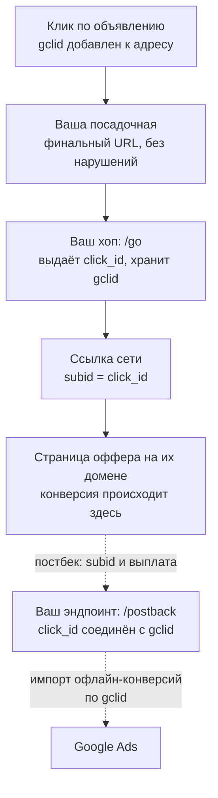

# Конверсия на чужом домене: как атрибутировать её через постбек партнёрки

Годы тредов без ответа и даже награда в €100 за решение. Петля, которая закрывает вопрос: свой хоп-редирект выдаёт click_id и принимает постбек от партнёрки.

Source: https://ru.301.sh/attribution-when-the-conversion-page-is-not-yours/
Published: 2026-07-27
Cloudflare facts checked: 2026-08-17

---

Трафик покупаете вы, а продажа происходит на домене, до которого вам не дотянуться. Партнёрский
оффер, карточка товара на маркетплейсе, чужая касса, любая программа, где страница «спасибо»
принадлежит площадке. Пиксель туда не поставить, и рекламная система оптимизируется вслепую: в
кабинете сети десятки конверсий, в рекламном аккаунте единицы, а алгоритм оптимизируется на клики,
потому что клики — это всё, что он видит.

Вопрос всплывает в PPC- и партнёрских сообществах год за годом: про трафик из Meta на
маркетплейсы, про офферы ClickBank, про программы white label, — и публичные ответы не
изменились за десять лет. Они бывают двух видов: «на их стороне вы ничего не внедрите» — и это
правда — и «купите трекер», который начинается от трёхзначной суммы в месяц. Кто-то из
спрашивавших в итоге сдался и публично назначил награду в €100 за любую рабочую идею. Её никто не забрал.

Запасной вариант, к которому в итоге приходят все, — считать клики по исходящей ссылке вместо
конверсий. Он протухает, потому что клик — не продажа, а боты тоже кликают; те самые €100, к
слову, предлагались как раз за способ отфильтровать ботов из этой суррогатной метрики. Деньги за
симптом, потому что лекарство нигде не было записано.

Ответ «на их стороне ничего» верен, и это не конец истории. Всё, что вам нужно, может жить на
вашей стороне, в единственном месте, через которое всё ещё проходит каждый клик, — в вашем
собственном хопе-редиректе. Эту схему статья и собирает: во что она обходится, где ломается и
что разрешают рекламные площадки; всё сверено с их документацией по состоянию на 27 июля
2026 года.

## Петля: click_id туда, постбек обратно

Механика стандартна для партнёрских сетей уже десять лет. Чего нет ни в одном из тех тредов, так
это разложенной от начала до конца петли.

1. Клик уходит с вашей страницы через редирект, который вы держите сами: `/go`. Хоп генерирует
   `click_id`, сохраняет его вместе со всем, что вы знаете о клике, — `gclid` из объявления,
   источник, отметку времени, — и отдаёт `302` на ссылку сети, положив `click_id` в её параметр
   subid.
2. Сеть проносит ваш subid до самой продажи. Когда конверсия происходит на их стороне, их
   система шлёт **постбек**: запрос с сервера на сервер, на зарегистрированный вами адрес, возвращающий
   subid, обычно вместе с суммой выплаты.
3. Ваш эндпоинт постбека находит `click_id` в базе — и вот конверсия соединена с конкретным
   кликом, кампанией и креативом, которые её породили. На вашей инфраструктуре, из серверных
   логов, без единого пикселя.



Обратите внимание, от чего это не зависит. Ни от JavaScript на странице конверсии — его у вас там
нет. Ни от того, переживут ли что-нибудь куки, — ключ сопоставления едет внутри адресов и серверных
вызовов. Ни от баннера согласия на пути, потому что в браузере посетителя не выполняется ничего,
кроме самого редиректа. Хоп серверный по построению, поэтому и блокировщики его не видят: клик —
это запрос к вашему собственному хосту раньше, чем браузер уйдёт куда-либо ещё.

## Почему хоп не должен быть финальным URL объявления

Напрашивается короткий путь: направить объявление прямо на `/go`, пропустив посадочную. В
Google Ads этот путь закрыт дважды, и понимание, как именно, спасает аккаунт от бана.

Во-первых, tracking template больше не проводит через себя пользователя. Parallel tracking
обязателен для Search, Shopping, Display, Video и Performance Max, и описание Google
недвусмысленно:

> Parallel tracking sends customers directly from your ad to your final URL while click
> measurement happens in the background (without sending them to the tracking URLs first).

Адрес из шаблона всё ещё запрашивается — фоновым пингом из браузера, — так что хоп в tracking
template может посчитать клик. Но он не может провести посетителя, поменять, куда тот попадёт,
или отдать сети subid на том визите, который реально конвертируется.

Во-вторых, сделать хоп финальным URL — это нарушение, прямо названное в правилах. Требования Google к
месту назначения называют это прямо: «Redirects from the final URL that take the user to a
different domain» — это несоответствие места назначения. Именно это правило и приводит к
блокировкам партнёрских аккаунтов за прямые ссылки.

Значит, разрешённая форма в Google Ads — мост: финальный URL — это настоящая страница на вашем
домене, а хоп — исходящая ссылка на ней. Проследите, чтобы страница пробрасывала свою строку
запроса в ссылку хопа: `gclid` приходит на адрес посадочной благодаря автопометке, а
[редирект, который его теряет](/find-the-redirect-that-drops-your-gclid/), заканчивает атрибуцию
до того, как она началась. У Meta parallel tracking нет, но и для трафика из Meta ответы
сообщества сходятся к той же форме моста: ваша страница, ваш пиксель на ней, subid наружу.

Замкнуть петлю обратно в рекламную площадку — шаг, который пропускают все. В Google Ads у него
есть официальное название: импорт офлайн-конверсий. Вы сохранили `gclid` рядом с `click_id` в
момент хопа; когда прилетает постбек, вы загружаете конверсию, привязав её к этому `gclid`. Google
хранит `gclid` для этого 90 дней, и единственное требование — автопометка. Кампания перестаёт
оптимизироваться на клики и начинает оптимизироваться на продажи, подтверждённые вашими
постбеками.

Что поменялось в 2026 году — это труба, а не механизм. Если грузить собираетесь кодом, начинать
с Google Ads API не надо. Её собственная документация называет причину прямо в шапке страницы:

> Starting June 15, 2026, UploadClickConversion requests will fail if the developer token
> hasn't previously sent requests to upload offline conversions or enhanced conversions for
> leads. Use the Data Manager API instead

Доступ выдаётся на developer token и зарабатывается прошлым использованием, так что токен,
который ни разу такой загрузки не отправлял, начать уже не может — от имени какого бы аккаунта
он ни работал. Замена — Data Manager API, принимающий то же событие с тем же ключом `gclid`.
Всё, что не код, осталось нетронутым: ручная загрузка CSV через интерфейс Google Ads работает
по-прежнему, а коннекторы самого Data Manager — SFTP, Google Cloud Storage, Amazon S3, HTTP,
Sheets, Salesforce, HubSpot — закрывают импорт по расписанию без собственной интеграции.

## Собираем хоп на бесплатном тарифе Cloudflare

Правило редиректа эту задачу не решает, и стоит быть точным в том, почему. Single Redirects —
терминирующее действие первой фазы обработки запроса,
[ниже по цепочке клик никто не видит](/count-clicks-on-a-redirect/), и само правило никуда
ничего записать не может. Язык выражений не умеет даже выдать id: `uuidv4()` существует, но
документация ограничивает его выражениями перезаписи в Transform Rules. Из
[всех способов сделать редирект на Cloudflare](/every-way-to-redirect-on-cloudflare/) выдать
id, сохранить его и принять постбек умеет только воркер.

Весь хоп — это один воркер с двумя маршрутами и таблицей в D1:

```js
export default {
  async fetch(req, env) {
    const url = new URL(req.url);

    if (url.pathname === '/go') {
      const id = crypto.randomUUID();
      await env.DB.prepare(
        'INSERT INTO clicks (id, gclid, src, ts) VALUES (?1, ?2, ?3, ?4)',
      )
        .bind(id, url.searchParams.get('gclid') ?? '', url.searchParams.get('src') ?? '', Date.now())
        .run();
      const target = new URL(env.OFFER_URL);
      target.searchParams.set('subid', id);
      return Response.redirect(target.href, 302);
    }

    if (url.pathname === '/postback') {
      if (url.searchParams.get('key') !== env.POSTBACK_KEY) {
        return new Response(null, { status: 403 });
      }
      await env.DB.prepare(
        'UPDATE clicks SET payout = ?2, converted = ?3 WHERE id = ?1',
      )
        .bind(url.searchParams.get('subid'), url.searchParams.get('payout') ?? '', Date.now())
        .run();
      return new Response('ok');
    }

    return new Response(null, { status: 404 });
  },
};
```

Квоты бесплатного тарифа вмещают это с запасом, всё проверено вживую 27 июля 2026 года: Workers
дают 100 000 запросов в сутки, D1 пишет 100 000 строк в сутки и читает пять миллионов, а клик и
постбек — это по одной строке каждый. Перерасти их — вопрос счёта, а не переделки: тариф
Workers Paid за $5 в месяц поднимает Workers до 10 миллионов запросов, а D1 — до 50 миллионов
записанных строк в месяц. Единственный выбор хранилища, который надо сделать правильно: это
нагрузка на поиск, а не на подсчёт, поэтому таблица в D1, а не в Workers KV — запись в KV упирается
в 1 000 в сутки на Free, и этот лимит
[уже вводил людей в заблуждение](/count-clicks-on-a-redirect/). Зарегистрировать адрес
постбека в сети — одно поле формы на их стороне: ваш адрес `/postback` с `key` и их макросом
subid внутри.

## Где это ломается

Хоп — надёжная половина петли. Вторая принадлежит сети, и когда сопоставление ломается, оно
ломается одним из пяти повторяющихся способов. Список собран из десятилетия партнёрских
тредов с вопросом, почему постбек так и не пришёл:

| Сбой | Как выглядит | Что проверить |
|---|---|---|
| Не то имя токена | Сеть ждёт `{clickid}`, вы отправили `{click_id}` | Их список макросов, символ в символ |
| Зарезервированные subid | `sub1` занят собственным трекингом сети | Спросить, какой слот проходит насквозь |
| Оффер срезает subid | Клики доходят, колонка subid пустая | Тестовая ссылка, потом их отчёт |
| Постбек зарегистрирован поздно | Конверсии до регистрации потеряны навсегда | Регистрировать до первого платного клика |
| Ни разу не проверяли руками | Всё «настроено», ничего не проверено | Открыть свой адрес постбека в браузере с фиктивным subid |

Последняя строка ловит тех, кто всё остальное сделал правильно. Адрес постбека, который вы ни
разу не дёрнули вручную, — это догадка, а не настройка: запросите его сами один раз и посмотрите,
как обновится строка, прежде чем потратите хоть рубль.

Два структурных ограничения тоже стоит назвать. Если у программы нет ни постбека, ни отчётности
по subid, никакой хоп петлю не создаст: сопоставлению нужна их половина, а вашим запасным вариантом
остаётся сверка их кабинета с вашим логом кликов по времени и креативу — ровно то ручное
сопоставление, которым те треды в сообществах и заканчиваются. И окно офлайн-конверсий — не формальность:
продажу, подтверждённую больше чем через 90 дней после клика, уже не загрузить по её `gclid`, а
это важно для товаров с долгим циклом согласования.

Вторая дата, которую стоит знать, — отсечка по доступу, и Google публикует её дважды, в двух
редакциях. Блог для разработчиков засчитывает токен, загружавший в период с декабря 2025 по май
2026 года; страница справки Ads называет январь 2026 — июнь 2026. Пересечение — единственное
окно, на котором обе страницы сходятся, так что считайте безопасным прочтением январь — май
2026 года и сделайте пробный вызов до того, как что-то на нём построите.

## Когда воркера достаточно, а когда уже нет

Для одного оффера и одного источника трафика воркер выше действительно закрывает тот самый
вопрос за €100: каждый клик записан вместе со своим `gclid`, каждая конверсия соединена на
сервере, рекламная площадка получает настоящие продажи вместо суррогатных кликов. Запустите его
и перестаньте платить за атрибуцию, которую можно собрать за полдня.

Схема перестаёт быть работой на полдня, когда начинает множиться. Десять офферов — это десять
целевых адресов и десять регистраций постбека; три источника трафика — и хоп должен делиться по
источнику; умерший оффер — это переезд вчерашних ссылок на новый, не ломая вчерашние subid. В
этот момент хоп уже не скрипт, а слой маршрутизации с базой за спиной — то есть ровно то, чем
[301.st](https://301.st) уже является: потоки, которые маршрутизируют каждый клик по правилам,
`click_id`, выданный и записанный на каждом хопе, постбеки, принятые и сопоставленные по
умолчанию, а не как ваш проект на выходные. Для одной кампании оставьте воркер. Это
честная работа, и она ваша.
