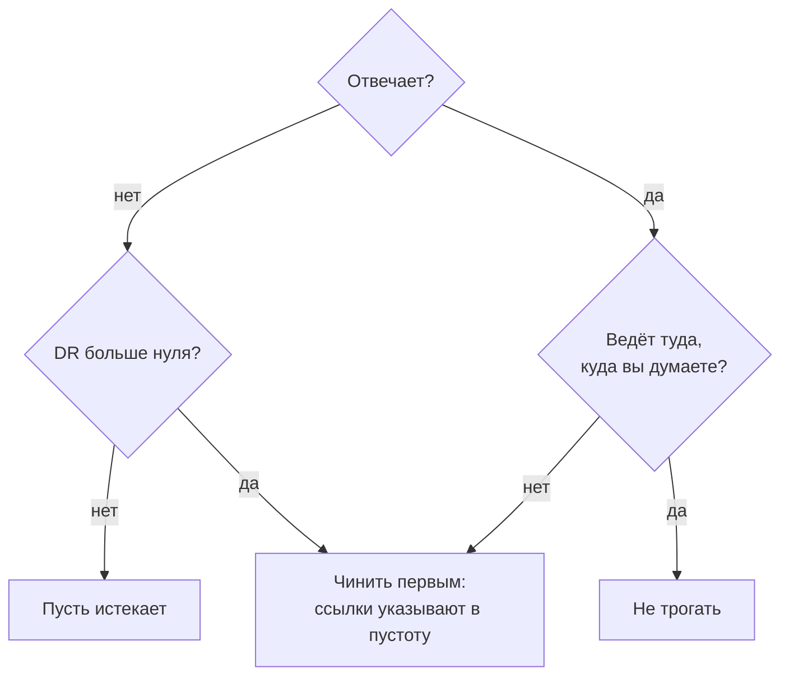

# Какие из ваших 300 доменов ещё редиректят? Один скрипт и что чинить первым

В дашборде Cloudflare нет общего вида по всем доменам. Один скрипт показывает, какие из 300 ещё отвечают, а бесплатный DR-эндпоинт Ahrefs — какие стоит чинить.

Source: https://ru.301.sh/audit-300-domains-one-script/
Published: 2026-07-22
Cloudflare facts checked: 2026-07-22

---

В марте 2025 года на r/Domains спросили, как определить все домены, которые сейчас редиректят
на основной сайт. В треде нет ни одного ответа. Компания, следящая за сотнями доменов, спросила
о похожем на r/selfhosted в 2024 году, и лучший ответ скорее признал пробел, чем закрыл его: про
отслеживание изменений в WHOIS там сказано «the situation is even worse». Ближайшее к
каноническому ответу — вопрос на Server Fault от 2013 года, в принятом ответе на который
советуют «double check your current DNS and your future DNS, just to be sure».

Тем временем люди продолжают писать этот инструмент заново. В Uptime Kuma запросы на проверку
истечения доменов висят с ноября 2021 года, а на GitHub стабильно появляются одноразовые
клоны.

Вопрос заслуживает ответа получше, чем таблица. Вот скрипт, который его даёт, и вторая колонка,
которая решает, что вы с этим выводом на самом деле сделаете.

## Почему дашборд вам этого не скажет

Интерфейс Cloudflare устроен по зонам. Всё, что здесь стоит знать, — это свойство *множества*
зон, а экрана для множества нет.

Сырые логи, которые дали бы ответ, доступны только на Enterprise: у Logpush для Free, Pro и
Business стоит **No**. Статистики по правилам тоже так и не появилось — запрос на статистику
Page Rules открыли в мае 2017 года, автор поднимал его дважды, а
[закрыли в июне 2025 года, так и не реализовав](/count-clicks-on-a-redirect/).

Значит, общую картину по всем доменам вы собираете сами. Хорошая новость в том, что сам список
API отдаёт бесплатно.

## Начинайте с аккаунта, а не со своей таблицы

Список доменов, которые вы считаете своими, и список, который Cloudflare реально обслуживает, —
это разные списки, и разница между ними и есть первая находка любого аудита.

```bash
curl -s -H "Authorization: Bearer $CF_API_TOKEN" \
  "https://api.cloudflare.com/client/v4/zones?per_page=50&page=1" \
| jq -r '.result[] | "\(.name)\t\(.status)"'
```

`status` зоны бывает `initializing`, `pending`, `active` или `moved`. Всё, что не `active`, —
уже находка: зона в `pending` — это домен, которому у регистратора так и не переключили
неймсерверы, а значит, ни одно написанное для него правило ни разу не сработало. На портфеле,
собиравшемся пачками, это
[тот самый длинный хвост, о котором предупреждает инструкция](/redirect-200-parked-domains/),
вылезающий спустя месяцы.

Не забудьте про пагинацию. Эндпоинт отдаёт постранично, и портфель из трёхсот в один ответ не
уместится — крутите `page`, пока не вернётся меньше строк, чем вы просили.

## Что проверять и почему каждая проверка ловит свой отказ

Три вопроса и три разных способа, которыми домен ломается незаметно.

**Отвечает ли он вообще?** Мёртвый домен и домен, который отвечает неправильно, в таблице
выглядят одинаково, а в браузере — совершенно по-разному.

**Ведёт ли он туда, куда вы думаете?** Работающий редирект на прошлогоднюю посадочную хуже
сломанного, потому что о нём вас никто никогда не предупредит.

**Актуален ли сертификат?** Сертификаты Universal SSL от Cloudflare «have a 90-day validity
period», и «the auto renewal period starts 30 days before expiration». Прочитайте это
внимательно, прежде чем ставить порог: на здоровом проксируемом домене остаток меньше 30 дней —
это норма, а не тревога. Важен сертификат, который уже истёк, или сертификат на домене, который
ушёл из Cloudflare и где его теперь некому продлевать. Кто продлевает сертификат, видно по сроку
его жизни, а [как разобрать по нему портфель](/200-day-certificates-on-a-domain-portfolio/),
рассказано в отдельной статье.

И отказ, которого не поймает ни одна HTTP-проверка: домен просто перестал существовать. Домен на
автопродлении вполне может уйти в NXDOMAIN — банковская карта, у которой тихо кончился срок, письмо о продлении,
улетевшее в спам, — потому что автопродление советуют все, и оно же ломается раньше, чем кто-нибудь
заметит. [Почему это не та страховка, какой кажется](/auto-renew-on-domain-still-expired/) —
отдельная тема.

## Вторая колонка: что вообще стоит чинить

Триста строк с находками — это не ответ, это новая задача. Триста доменов никто чинить не будет.
Чинят те, что несут вес, а до недавнего времени, чтобы выяснить какие именно, нужна была
подписка.

Это изменилось. Эндпоинт Domain Rating у Ahrefs теперь открыт, и его документация говорит прямо:
«Requests to this endpoint are free and do not consume any API units».

Проверено сегодня — отвечает без подписки:

```
$ curl -s "https://api.ahrefs.com/v3/public/domain-rating-free?target=cloudflare.com&output=json"
{"domain_rating": {"domain_rating": 94.0, "license": "...", "warning": "..."}}
```

С ним идут три условия, и всем трём место в статье, а не в сноске.

**С 10 августа 2026 года нужен бесплатный ключ.** Сейчас эндпоинт отвечает без авторизации и сам
об этом предупреждает — в поле `warning` собственного ответа: «Unauthenticated access to this
endpoint will be removed on 2026-08-10». Скрипт ниже уже отправляет ключ. Получить его можно
бесплатно, и сделать это сейчас дешевле, чем через три недели отлаживать скрипт.

**Атрибуция, если вы показываете число.** Лицензия даёт право «use, display, publish or integrate
DR Data» и требует указания «Domain Rating by Ahrefs» с рабочей гиперссылкой, которая «shall not
be hidden, obscured or removed». Отчёт для себя в терминале — одно, а дашборд, который читает
команда, — то место, где эта строка обязана быть.

**Только свои домены и в спокойном темпе.** Та же лицензия запрещает скрейпинг и сбор данных DR «in bulk
or systematically». Пройти по своему портфелю один раз, с паузой между запросами, — это то
применение, ради которого эндпоинт и существует. Прочёсывать чужие домены, собирая датасет DR, —
то, что он запрещает. Десять последовательных запросов с паузой 0,3 секунды прошли без нареканий;
лимиты не задокументированы, и Ahrefs оставляет за собой право менять их без предупреждения, так
что не гоните и не считайте, что потолок высокий.

Одна оговорка про саму метрику: DR — это число Ahrefs, а не Google. Это хорошая относительная
шкала для вопроса «какой из этих доменов весит больше остальных», и она ничего не говорит о
позициях в выдаче.

## Скрипт

Нужны `curl`, `openssl` и `jq`. Арифметика дат — GNU; на macOS используйте
`date -j -f '%b %d %T %Y %Z'`.

```bash
#!/usr/bin/env bash
set -uo pipefail
: "${AHREFS_KEY:?export AHREFS_KEY — free key from ahrefs.com}"

printf '%-34s %-5s %-32s %-6s %s\n' DOMAIN CODE DESTINATION CERT DR

while read -r domain; do
  [ -z "$domain" ] && continue

  head=$(curl -sI --max-time 10 "https://$domain/" 2>/dev/null)
  code=$(printf '%s' "$head" | awk 'NR==1{print $2}')
  dest=$(printf '%s' "$head" | awk 'tolower($1)=="location:"{print $2}' | tr -d '\r')

  until=$(echo | openssl s_client -servername "$domain" -connect "$domain:443" 2>/dev/null \
          | openssl x509 -noout -enddate 2>/dev/null | cut -d= -f2)
  days=""
  [ -n "$until" ] && days=$(( ( $(date -d "$until" +%s) - $(date +%s) ) / 86400 ))

  dr=$(curl -s --max-time 10 -H "Authorization: Bearer $AHREFS_KEY" \
       "https://api.ahrefs.com/v3/public/domain-rating-free?target=$domain&output=json" \
       | jq -r '.domain_rating.domain_rating // "-"')

  printf '%-34s %-5s %-32s %-6s %s\n' \
    "$domain" "${code:-DEAD}" "${dest:--}" "${days:+${days}d}" "$dr"
  sleep 0.3
done < domains.txt
```

Настоящий прогон на этом сайте и ещё двух, 22 июля 2026 года:

```
DOMAIN                             CODE  DESTINATION                      CERT   DR
www.301.sh                         301   https://301.sh/                  89d    8
301.sh                             200   -                                89d    8
spintax.net                        200   -                                85d    56
this-domain-does-not-exist-9f3.com DEAD  -                                       0
```

Четыре строки и четыре разных состояния. Форма с `www` редиректит на апекс — ровно то, что
должна делать. Два домена отвечают напрямую. Последний не резолвится вообще, и скрипт пишет
`DEAD`, а не делает вид, что имеет о нём мнение.

Обратите внимание на колонку сертификата: 89 и 85 дней. Это Universal SSL в начале своей
90-дневной жизни, и именно так выглядит норма. Строка с `4d` на домене, где сертификат никто не
продлевает, — дело другое, а строка вообще без числа означает, что рукопожатие не состоялось.

Ещё два расклада, которых в этой выборке нет, но узнавать их стоит. `522` означает, что Cloudflare
ответила, а ваш origin — нет, то есть посетители получают страницу ошибки там, где, по-вашему,
стоит редирект. А `200` на домене, который должен пересылать, означает, что редирект попросту
исчез: правило удалили или оно ни разу не применилось, потому что зона всё ещё в `pending`.
Каждый из этих случаев — [настроенный редирект, который всё равно не работает](/redirect-silently-fails/),
и всплывают они как раз в колонке `CODE`.

## Правило, которое превращает таблицу в решения



Отсортируйте сначала по сломанным, потом по убыванию DR — верх этого списка и есть работа на
ближайшие полдня. Мёртвый домен с настоящим авторитетом — самая дорогая строка таблицы: каждая
ссылка, указывающая на него, — это ценность, за которую вы уже заплатили и которую сейчас
выбрасываете.
Мёртвый домен с DR, равным нулю, — это счёт за продление, который можно перестать оплачивать.

Второй вывод стоит не меньше первого, и одной проверкой здоровья до него не добраться.

## Чего не даёт один проход

Он даёт снимок, а портфели ломаются не в тот день, когда вы на них посмотрели.

Сертификат истекает через девяносто дней. Автопродление у регистратора молча срывается в
какой-нибудь вторник. Правило правят на зоне, куда год никто не заглядывал, и редирект начинает
вести не на ту страницу, продолжая возвращать совершенно здоровый 301. Скрипт выше найдёт
всё это — в следующий раз, когда кто-нибудь вспомнит его запустить.

Вот в этом и разница между аудитом и системой, и здесь честно будет сказать, зачем нужен
[301.st](https://301.st): он гоняет это непрерывно по всему портфелю и сообщает, когда строка
изменилась. Для двадцати доменов записи в кроне и скрипта выше действительно достаточно, и
начинать стоит с них.

*Domain Rating by [Ahrefs](https://ahrefs.com/).*
