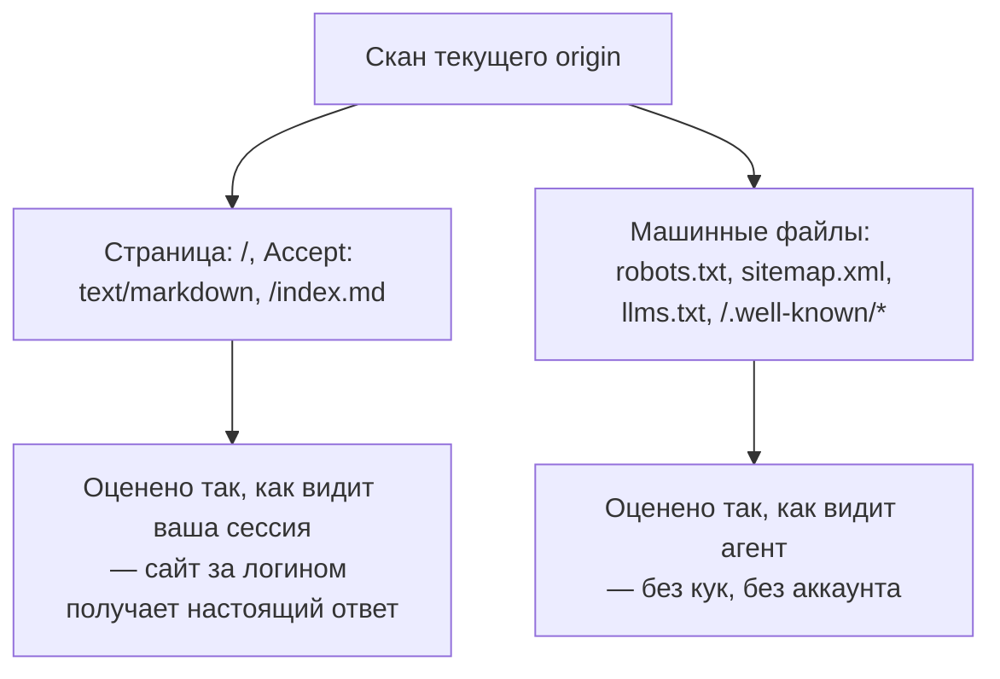

# Как проверить готовность к агентам, если сканер не достаёт до сайта

Внешнему сканеру нужен публичный адрес, поэтому у стейджинга оценки нет вообще. Что меняет перенос проверок в браузер и одно правило, которое делает результат честным.

Source: https://ru.301.sh/audit-agent-readiness-in-the-browser/
Published: 2026-08-04
Cloudflare facts checked: 2026-08-04

---

Cloudflare держит сканер, который оценивает домен по готовности к ИИ-агентам. В июле мы прошли
[все двадцать одну его проверку](/agent-readiness-audit/): какие четыре стоило внедрить и
почему восемь провалов были правильным ответом.

Вы наводите его на свой сайт, получаете оценку и чините то, на что он указал. А потом пробуете
проверить ту версию, которая и важна, — стейджинг с самой правкой, сайт, который ещё не
запущен, страницы за логином, — и наводить сканер оказывается не на что.

Это не дефект сканера. Он работает в чужом дата-центре, а значит может отвечать только про те
origin, до которых этот дата-центр дотягивается. Оба отказа — в одном `curl`, снято
4 августа 2026:

```
$ curl -sS -X POST https://isitagentready.com/api/scan \
    -H 'content-type: application/json' -d '{"url":"http://localhost:3000"}'
{"error":"Invalid URL provided"}

$ curl -sS -X POST https://isitagentready.com/api/scan \
    -H 'content-type: application/json' -d '{"url":"https://staging.301.sh"}'
{"url":"https://staging.301.sh","scannedAt":"2026-08-04T18:31:38.462Z",
 "siteError":{"httpStatus":530,"statusText":"","bodyPreview":null,
 "retryAfter":null,"server":"cloudflare"}}
```

Локальный адрес отвергается сразу. Хост, который сканер не может разрезолвить, возвращает
ошибку сайта вместо оценки. Не низкий балл — балла нет вовсе.

Весит это больше, чем звучит, из-за того, когда именно вам нужен ответ. Провести этот сайт с
Level 1 до Level 5 означало сначала пачку статических файлов, потом сервер `/mcp`, потом
DNS-записи — и каждый из этих шагов был сначала деплоем в прод, а потом сканом. Опубликовать,
затем узнать. Для редиректа вы бы такую петлю не приняли никогда.

Второе место, где можно гонять те же проверки, — браузер, а он достаёт туда же, куда достаёте
вы. Дальше — что это меняет, чего стоит и какое одно правило решает, есть ли у результата цена.

## Что есть у браузера и чего нет у дата-центра

Три вещи, и очевидна из них только первая.

**Достижимость.** `localhost:5173`, стейджинг за VPN, внутренний инструмент, домен, у которого
DNS ещё не публичный. Если вкладка грузится — аудит идёт.

**Сессия.** Ваши куки прикладываются к запросу самой страницы, поэтому сайт, показывающий
анонимному посетителю стену логина, оценивается по тому, что реально получает залогиненный
клиент.

**Среда исполнения внутри страницы.** Часть того, что потребляет агент, — вообще не HTTP-ответ.
WebMCP отдаёт инструменты через `document.modelContext` внутри страницы, после того как
отработали скрипты. HTTP-проба снаружи этого не видит, а скрипт в странице видит.

## Правило, которое держит браузерный аудит честным

Сессия — она же и ловушка, и разобраться с этим стоит до того, как вы напишете свой скрипт,
каким бы инструментом вы ни пользовались.

Аудит готовности к агентам тянет два очень разных класса вещей. Есть страница, которой законно
жить за логином. И есть машинные файлы — `robots.txt`, карта сайта, `llms.txt`, всё под
`/.well-known/`, — которые публичны по своей природе, потому что у клиента, который их читает,
нет аккаунта и никогда не будет.

Пошлёте свою сессию и туда и туда — аттестуете сайт, которого не видит никто, кроме вас.
Документ под `/.well-known/`, отвечающий только на аутентифицированные запросы, — это документ,
с которого агент получит 401 или страницу логина. То, что у вас в браузере он проходит, не
говорит ничего правдивого.

Поэтому разделение идёт по запросу, а не по скану:

| Что запрашивается | Credentials | Почему |
| --- | --- | --- |
| Сама страница | `include` | Ей можно быть за логином, и именно этот случай внешний сканер не закрывает |
| `Accept: text/markdown` на странице | `include` | Тот же адрес, та же сессия, другое представление |
| `robots.txt`, `sitemap.xml` | `omit` | Публичные машинные файлы — судить их надо так, как их получает краулер |
| `llms.txt`, `llms-full.txt` | `omit` | Так же |
| Всё под `/.well-known/` | `omit` | Документы discovery читают клиенты без аккаунта |



С редиректами логика та же. Проба идёт по хопам так же, как навигация, каждый хоп прикладывает
свои куки, а в ответе остаётся финальный адрес. Проверка, прошедшая на адресе, которого вы не
запрашивали, — это проверка, чей адрес вам стоит увидеть.

## Что меняет форму при переезде в браузер

Перенос аудита в браузер — не бесплатное улучшение. Он меняет один набор слепых зон на другой,
и инструмент, который этот обмен скрывает, хуже самого пробела.

**DNS-AID требует другого вопроса, а не другого инструмента.** В API расширений нет
DNS-резолвера — и ровно на этом текст изначально останавливался, зря: резолвер и не нужен.
DNS-over-HTTPS — это обычный `fetch`, и его JSON-ответ несёт обе половины вердикта: SVCB-записи
под `_index._agents` и флаг `AD`, то есть решение резолвера о DNSSEC. Вторая половина важна:
сайт с записями, но без проверенной цепочки, сканер тоже валит. Ни токена, ни аккаунта здесь не
участвует, поэтому ответ одинаков для всех. На этом сайте она сдалась
[последней](/agent-readiness-audit/): кеш резолвера перед ней взял ещё около сорока минут
ресканов после того, как записи уже были живые.

**WebMCP работает только здесь.** Определение внутри страницы даёт один из трёх ответов, и весь
смысл в третьем: найдено, точно отсутствует или определить не удалось. Браузер без этого API
или страница, где внедрённый скрипт не смог отработать, дают «не удалось» — а не провал.
«Не определяется» и «нет» — разные вещи, и проверка, которая оценивает их одинаково, выдумывает
дефект.

**MCP Server Card нужно пять адресов.** Аудит [это уже отмечал](/agent-readiness-audit/), и
лучше не стало: канонический путь из черновика, путь IETF, две пробы Cloudflare и де-факто
старый файл — в игре все, потому что спецификация ушла вперёд, а сканеры за ней не пошли.
Чекер, который стучится в один из них, сообщает состояние этого адреса, а не состояние вашего
сервера.

## Где ломается: оценка — это не одна оценка

Три отдельные причины, почему оценка, которую вы читаете сегодня, не сойдётся с оценкой в
другом месте.

**Неприменимые проверки уходят из знаменателя.** Общая оценка — это пройденные проверки,
делённые на применимые, и проверка, которая применена быть не может, исключается, а не
засчитывается как провал. То, до чего браузер действительно не дотягивается — не ответивший
резолвер, не отработавшая среда в странице, — выпадает там и остаётся снаружи. Тот же сайт, тот
же день, другая арифметика.

**Две собственные поверхности Cloudflare расходятся между собой.** 30 июля 2026 этот сайт
показывал в веб-интерфейсе 79 из 100 и Level 5 «Agent-Native», а `/api/scan` в тот же час
сообщал по тому же домену Level 4. Это устойчиво, а не пойманный на середине деплоя сбой, и
значит у вопроса «на каком мы уровне» два правильных ответа — смотря какой эндпоинт спросить.

**Сама матрица проверок движется.** MCP Server Card выше — один пример; DNS-AID — следующий: он
стоит на индивидуальном Internet-Draft, который истекает 28 ноября 2026, и опрашивается по
меткам, которых этот черновик не определяет. А `llms.txt` не является оцениваемой проверкой ни
в одном из двух инструментов: аудит меряет согласование форматов по `Accept`, поэтому сайт может
опубликовать полную поверхность `llms.txt` и получить ноль за доступность контента — ровно с
этого июльский разбор и начинался. Что считать готовностью, решают прямо сейчас, пока вы её
меряете.

Из этого не следует, что оценка бесполезна. Из этого следует, что она значима только против
самой себя. Что этот origin делал вчера и что изменилось после последнего деплоя. Сравнивать
своё число с числом чужого сайта — это сравнивать две арифметики.

## Расширение

Именно это и делает [Agent Readiness Inspector](https://chromewebstore.google.com/detail/agent-readiness-inspector/diofmjhnegmcccocikabageabmaokobd),
и его выход — повод для этой статьи. Это наше собственное расширение, оно гоняет 22 проверки в
браузере по тому origin, на котором открыта текущая вкладка, и оно бесплатное. Сборки для
Firefox и Edge лежат в магазинах на ревью; сегодня работает ссылка выше.

- **22 проверки, версионированные как данные.** Правила robots и ИИ-краулеров, карты сайта,
  заголовки `Link`, согласование Markdown, Content Signals, Agent Skills, API Catalog, MCP
  Server Card, OAuth-discovery, Web Bot Auth, WebMCP, плюс протоколы агентской коммерции как
  неоцениваемое превью. У матрицы есть версия, а CI-задача следит за дрейфом матрицы наверху,
  потому что раздел выше — это постоянное состояние, а не плохой месяц.
- **Доказательства по каждой проверке.** Ответ, из которого следует вердикт, вместе с финальным
  адресом после редиректов, и готовый к копированию промпт для починки.
- **Сохранённые сайты и регрессии.** Рескан по расписанию, история и сигнал, когда проверка,
  которая проходила, проходить перестала. Сигналы сначала попадают в локальный ящик; разрешение
  на уведомления опционально и запрашивается, только если вы их включите.
- **Local-first.** Сканы, история, настройки и сигналы лежат в хранилище браузера. Опциональное
  сравнение снаружи использует ваши собственные ключи к Cloudflare URL Scanner и по умолчанию
  выключено.

Это независимая реализация открытых веб-стандартов, не связанная с Cloudflare и ею не
одобренная.

## Каким инструментом что делать

| Что нужно | isitagentready.com | Agent Readiness Inspector |
| --- | --- | --- |
| Публичный боевой сайт | да | да |
| Стейджинг, localhost, до запуска, VPN | нет, ошибка сайта или невалидный адрес | да, если вкладка грузится |
| Страницы за логином | только анонимный вид | ваша сессия, на пробах страницы |
| WebMCP в странице | нет | да, определение внутри страницы |
| DNS-AID | да | да, через DNS-over-HTTPS |
| Оценка, которой вам предъявит Cloudflare | да, это первоисточник | нет, второе мнение |
| Рескан по расписанию, сигнал о регрессии | нет | да, на машине, где оно установлено |

## Где расширение останавливается

Оно аудирует origin той вкладки, которая у вас открыта, на машине, где установлено, и пока
браузер запущен. Рескан по расписанию проходит за цикл ограниченную пачку, поэтому список
наблюдения — это горстка важных вам сайтов, а не инвентаризация.

Чтобы довести сайт до готовности к агентам ещё до публикации, этого хватает целиком, и стоит
это ноль. Останавливается оно там, где вопрос меняется с «готов ли этот сайт» на «все ли они
ещё готовы»: каждый домен портфеля, проверяемый по расписанию, которое не зависит от того,
проснулся ли чей-то ноутбук, и с сигналом тому, кто на дежурстве. Это та же граница, в которую
упирается [рекордер редирект-цепочек](/see-the-redirect-chain-your-browser-followed/), и по
той же причине, а держит её через весь портфель [301.st](https://301.st/features).
Для сайта, который перед вами, — поставьте расширение и читайте доказательства.
