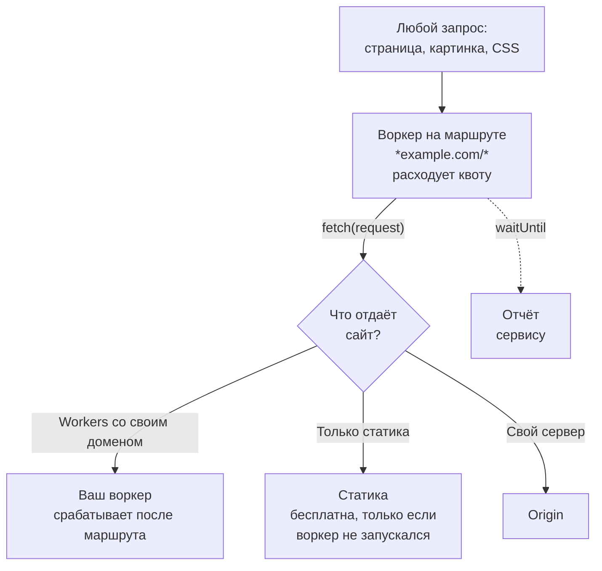

# Аналитика ботов ставит воркер на каждый запрос. Чем это обходится на Cloudflare

Сервисы аналитики ботов ставят воркер перед всем трафиком сайта. Что это делает с бесплатной квотой и данными посетителей и что Cloudflare показывает бесплатно.

Source: https://ru.301.sh/bot-analytics-worker-on-every-request/
Published: 2026-09-29
Cloudflare facts checked: 2026-09-30

---

Вы хотите знать, какие боты ходят по сайту: какие AI-краулеры, как часто и на каких страницах
получают 404. Сервис предлагает это показать, а на экране подключения просит API-токен
Cloudflare с правом Workers Scripts Edit. С этим токеном он заливает в аккаунт свой воркер и
ставит маршрут, по которому воркер срабатывает на каждый запрос к сайту.

Так устроены Ahrefs Bot Analytics, Known Agents (бывший Dark Visitors), Profound и Scrunch.
Сам воркер короткий и делает ровно то, что обещано. Меняет работу сайта маршрут, который его
запускает, а о цене этого маршрута ни один экран подключения не пишет.

Ниже — что такой маршрут делает на бесплатном тарифе Cloudflare, что Cloudflare и так даёт без
него и как записывать ботов самому в воркере, который у вас уже есть. Все лимиты сверены с
документацией Cloudflare 30 сентября 2026 года, все цифры трафика — с этого сайта, 301.sh,
который работает на Free.

## Что делает воркер

Ahrefs просит три права: Account Workers Scripts Edit, Zone Workers Routes Edit и Zone Read.
На экране подключения перечислены три шага: «Find the zone matching» ваш сайт, «Deploy the
Ahrefs analytics worker», «Set up a route to run on all requests». И приписка: «Your token is
used once and not stored.» В ручной настройке из
[документации](https://docs.ahrefs.com/en/bot-analytics/docs/cloudflare-worker) маршрут
задан шаблоном `*yourwebsite.com/*`.

Воркер пропускает каждый запрос дальше без изменений через `fetch(event.request)`. Когда ответ
уже ушёл, он отправляет отчёт внутри `event.waitUntil`, поэтому страница из-за отчёта не
тормозит. В отчёте полный URL вместе со строкой запроса, IP посетителя из `cf-connecting-ip`,
user agent, referer, метод, статус и тип содержимого. Плюс три заголовка Web Bot Auth:
`signature`, `signature-input` и `signature-agent`. Ими
[подписанный AI-агент доказывает, кто он](/agent-readiness-audit/), и это самое
интересное, что в отчёте есть.

Known Agents и Profound публикуют воркеры того же устройства. Воркер Profound не отправляет
ничего по `/checkout`, `/cart`, `/admin` и `/api`
([документация](https://docs.tryprofound.com/agent-analytics/cloudflare_worker)). Воркер
Ahrefs отправляет всё.

## Чем платит сайт за маршрут



**Каждый запрос превращается в вызов воркера.** Бесплатный тариф Workers даёт 100 000
запросов в сутки, счётчик обнуляется в полночь по UTC
([лимиты](https://developers.cloudflare.com/workers/platform/limits/)). Маршрут
`*example.com/*` ловит и саму страницу, и каждую картинку, стиль, скрипт и шрифт, которые она
подгружает. Страница с двадцатью файлами тратит на один визит двадцать один запрос из квоты.
Отчёт, который шлёт воркер, — это subrequest, а subrequests Cloudflare не тарифицирует. Сам
вызов воркера в квоту идёт.

**Статика перестаёт быть бесплатной.** Если сайт сделан на статике Workers, Cloudflare пишет:
«Requests to static assets are free and unlimited», а платными считает только запросы, которые
вызывают воркер
([тарификация](https://developers.cloudflare.com/workers/static-assets/billing-and-limitations/)).
Воркер на маршруте впереди заставляет каждый такой запрос вызывать воркер.

Как это выглядит на 301.sh. За семь дней до 30 сентября зона обслужила около 19 200 запросов,
а наш собственный воркер запускался 2 421 раз: он срабатывает только на адресах страниц, а
статику отдаёт без себя. Маршрут на `/*` запустил бы воркер на всех 19 200 — в восемь раз
чаще. Этому сайту до 100 000 в сутки далеко при любом раскладе. Сайту с 10 000 просмотров в
сутки и двадцатью файлами на странице — уже нет.

**Маршрут срабатывает раньше вашего воркера.** Документация Cloudflare о собственных доменах:
«Any Workers running on routes before your Custom Domain can optionally call the Worker
registered on your Custom Domain by issuing `fetch(request)`»
([custom domains](https://developers.cloudflare.com/workers/configuration/routing/custom-domains/)).
Значит, если у сайта уже есть свой воркер, первым каждый запрос видит код сервиса. Как такая
пара считается в квоте, документация не говорит.

**Выясните, что будет после 100 000.** Сверх суточного лимита маршрут либо пропускает воркер —
«Bypasses the Worker. Requests behave as if no Worker is configured», — либо отдаёт ошибку:
«Returns a Cloudflare `1027` error page». Режим — это переключатель на маршруте. Какой из двух
получает новый маршрут, документация не говорит, а запрос на создание маршрута в ручной
настройке Ahrefs его не задаёт.
Откройте Workers & Pages, найдите маршрут, созданный сервисом, и посмотрите. Если маршрут
отдаёт ошибку, всплеск трафика превращается в страницу ошибки на всём сайте.

**Выигрывает более точный маршрут.** «The most specific route pattern wins»
([маршруты](https://developers.cloudflare.com/workers/configuration/routing/routes/)). Если у
вас уже есть воркер на `www.example.com/*` или `example.com/api/*`, эти запросы уйдут ему, и
сервис аналитики их не увидит. О том, что их не хватает, вам никто не скажет.

**Данные всех посетителей уходят наружу.** До запуска маршрут не может отличить бота от
человека, поэтому отчёт уходит и по людям: их IP, открытая страница, строка запроса со всем,
что ваш сайт в неё кладёт. Сервис становится обработчиком персональных данных ваших
посетителей, и в политике конфиденциальности об этом, возможно, придётся написать.

**Токен шире задачи.** Документация Ahrefs предлагает токен на All accounts и All zones, а
сузить его упоминает только как вариант. Workers Scripts Edit на аккаунте позволяет залить в
него любой воркер. Создайте токен на одну зону, которая нужна сервису, и удалите его, как
только воркер заработал. Тогда в «not stored» не придётся верить на слово.

### Сколько стоит снять лимит

Тариф Workers Paid стоит $5 в месяц за аккаунт, в него входит 10 миллионов запросов, дальше
$0,30 за каждый следующий миллион
([цены](https://developers.cloudflare.com/workers/platform/pricing/)). Суточного лимита на
Paid нет, так что режим при превышении перестаёт играть роль. Для большинства сайтов вопрос
квоты на этом закрыт за $5. Остальное из списка выше не меняется: статика по-прежнему
считается вызовами, а данные по-прежнему уходят наружу.

## Что Cloudflare показывает и так

Прежде чем ставить воркер, посмотрите, что Cloudflare уже записывает по зоне.

| Инструмент | Тариф | Что показывает |
| --- | --- | --- |
| GraphQL Analytics API | все тарифы; на Free глубина 31 день, до 30 дней за один запрос | всех ботов по user agent и по категории, подтверждённой Cloudflare, с путём и кодом ответа |
| AI Crawl Control | все тарифы; рефералы — на платных | AI-краулеры по операторам, самые посещаемые пути, коды ответа |
| Security Analytics | все тарифы; на Free последние семь дней | выборку отдельных запросов с их свойствами и оценками |
| Bot Analytics | Business и Enterprise | оценки ботов и трафик подтверждённых ботов |
| Logpush | Enterprise | каждый запрос, в ваше хранилище |

[AI Crawl Control](https://developers.cloudflare.com/ai-crawl-control/features/analyze-ai-traffic/)
отвечает про AI-краулеров в дашборде. API отвечает про всех ботов, и именно эту строку мы
проверили на своей зоне.

### Спросите API

На 301.sh, зоне на Free, узел `settings` в GraphQL API перечисляет среди полей
`httpRequestsAdaptiveGroups` поля `userAgent`, `verifiedBotCategory`, `clientRequestPath` и
`edgeResponseStatus`. Этого хватает, чтобы узнать, какие подтверждённые боты получили 404 за
неделю:

```graphql
query ($zone: String!, $since: Time!, $until: Time!) {
  viewer {
    zones(filter: { zoneTag: $zone }) {
      httpRequestsAdaptiveGroups(
        limit: 50
        filter: {
          datetime_geq: $since
          datetime_lt: $until
          verifiedBotCategory_neq: ""
          edgeResponseStatus: 404
        }
        orderBy: [count_DESC]
      ) {
        count
        dimensions { verifiedBotCategory userAgent clientRequestPath }
      }
    }
  }
}
```

Отправьте его POST-запросом на `https://api.cloudflare.com/client/v4/graphql` с токеном, у
которого есть Zone Analytics Read, а ID зоны и интервал времени передайте в переменных. Уберите
строку с `edgeResponseStatus` — и увидите весь трафик подтверждённых ботов. Для ботов, которых
Cloudflare не подтвердила, фильтруйте по `verifiedBotCategory: ""` и
`userAgent_like: "%bot%"`.

На нашей зоне за семь дней до 30 сентября около 1 400 из 19 200 запросов пришли от
подтверждённых ботов девяти категорий. Больше всех поисковых краулеров, за ними AI-краулеры,
SEO-инструменты и агрегаторы. Запрос по 404 нашёл две вещи, которые стоит исправить или хотя бы
знать. DuckDuckBot тринадцать раз просил `/favicon.ico`; у сайта был только `/favicon.svg`,
после этого запроса есть оба. AI-краулеры просили адреса вроде
`/2018-gopherconuk-slides`, которых на этом сайте никогда не было.

Запрос по неподтверждённым нашёл другое. Клиент с user agent `Claude-SearchBot/1.0` 36 раз
запросил `/api/uploads/..%2F..%2F.env` — путь, который пытается выбраться из папки загрузок к
файлу с секретами. Cloudflare его не подтвердила, и ни одному поисковому краулеру такой путь не
нужен. Инструмент, который считает только по user agent, запишет эти 36 запросов на Anthropic.

Значения категорий — это названия из дашборда с пробелами, например `"AI Crawler"` и
`"Search Engine Crawler"`. Фильтр по `"AICrawler"` вернёт пустой ответ без всякой ошибки.

Чего API не даёт — истории дальше 31 дня и заголовков Web Bot Auth. Для этого нужен свой журнал.

## Записывайте ботов в воркере, который уже есть

Если у сайта уже есть воркер на страницах, пишите журнал в нём. Запрос и так вызывает этот
воркер, так что лишнего вызова запись не стоит, а что уходит из аккаунта, решаете вы. 301.sh
устроен именно так: воркер срабатывает первым только на адресах страниц, это задано через
`run_worker_first` в `wrangler.toml`, а картинки и стили уходят бесплатной статикой без него.

Workers Analytics Engine есть на Free: 100 000 записанных точек данных и 10 000 запросов на
чтение в сутки ([цены](https://developers.cloudflare.com/analytics/analytics-engine/pricing/)).
Workers Paid за $5 в месяц поднимает это до 10 миллионов точек в месяц. Подключите датасет:

```toml
# wrangler.toml
[[analytics_engine_datasets]]
binding = "BOTS"
dataset = "bot_hits"
```

И записывайте ботов на выходе:

```js
const BOT = /bot|crawl|spider|slurp|GPTBot|ClaudeBot|PerplexityBot|Bytespider|CCBot|meta-externalagent/i;

export default {
  async fetch(request, env, ctx) {
    const response = await handle(request, env, ctx); // your existing logic

    const ua = request.headers.get("user-agent") ?? "";
    const verified = request.cf?.verifiedBotCategory ?? "";
    if (verified || BOT.test(ua)) {
      env.BOTS.writeDataPoint({
        indexes: [verified || "unverified"],
        blobs: [
          ua.slice(0, 256),
          new URL(request.url).pathname,
          String(response.status),
          request.headers.get("signature-agent") ?? "",
        ],
        doubles: [1],
      });
    }
    return response;
  },
};
```

Здесь важны три детали.

**Пишутся только боты.** Запросы людей в датасет не попадают, раскрывать в нём нечего, а
100 000 точек в сутки уходят на тот трафик, который вы хотите изучать.

**`verifiedBotCategory` — проверка Cloudflare, user agent — слова самого бота.** Прислать
`GPTBot` в заголовке может кто угодно. `request.cf.verifiedBotCategory` Cloudflare заполняет
только для ботов, которых подтвердила. Пишите оба поля и сравнивайте.

**`writeDataPoint` не ждут через await.** Вызов возвращается сразу, а точку среда выполнения
сохраняет в фоне — так же, как в статье про
[подсчёт кликов на редиректе](/count-clicks-on-a-redirect/). Там же описано чтение: один
SQL-запрос и `SUM(_sample_interval)` вместо `COUNT()`.

Какие боты получают 404:

```sql
SELECT index1 AS category, blob1 AS agent, blob2 AS path,
       SUM(_sample_interval) AS hits
FROM bot_hits
WHERE blob3 = '404' AND timestamp >= NOW() - INTERVAL '7' DAY
GROUP BY category, agent, path
ORDER BY hits DESC
LIMIT 50
```

Если воркера у сайта сейчас нет, ставить его только ради этого — снова упереться в вопрос
квоты. Но его можно сузить: маршрут на пути страниц вместо `/*` не трогает картинки и стили.

## Где это ломается

**Кто бот, решает регулярное выражение.** Краулер, который представляется браузером, в датасет
не попадёт, если Cloudflare его не подтвердила. Это ограничение любого инструмента, который
читает user agent, платных тоже.

**Analytics Engine хранит данные три месяца.** Для истории за год выгружайте их по расписанию.

**Цифры API — оценка.** На больших объёмах Cloudflare делает выборку и «returns an estimate
derived from the sampled value»
([выборка](https://developers.cloudflare.com/analytics/graphql-api/sampling/)). Наша неделя
пришла со средним интервалом выборки около 2,5. Чтобы понять, какие боты и какие пути, — годится;
чтобы точно сосчитать редкое событие — нет.

**Тридцать один день — вся память API на Free.** Если нужен тренд, сохраняйте результат раз в
неделю.

**Заголовки Web Bot Auth пока редкость.** Записывать `signature-agent` ничего не стоит, и
колонка будет заполняться по мере того, как агенты начнут подписывать запросы. Пустая колонка
не доказывает, что агентов на сайте нет.

## Когда нужен 301.st

Для одного сайта мы вам не нужны. Запускайте запрос выше раз в неделю, а если нужна история
длиннее, добавьте журнал в свой воркер.

[301.st](https://301.st) управляет редиректами и правилами трафика для портфеля доменов. На
доменах, где вы задаёте ему правила, он запускает воркер в вашем аккаунте Cloudflare — это тот
же обмен, что описан выше, только ради маршрутизации трафика, а не одного наблюдения. Этот
воркер раскладывает каждый запрос по семи категориям ботов, от поисковиков и AI-краулеров до
превью ссылок и мониторинга доступности, по user agent и по отметке Cloudflare о подтверждённом
боте. Правило проверяет эти категории раньше любого другого правила на домене: AI Guard
блокирует или уводит краулеры, которые собирают данные для обучения, и не трогает поисковики, а
Bot Shield останавливает всех ботов на домене, который вообще не должен попадать в поиск.

Следующее, что мы строим, — экран, на котором эти боты видны по каждому домену, с путями и
кодами ответа.
