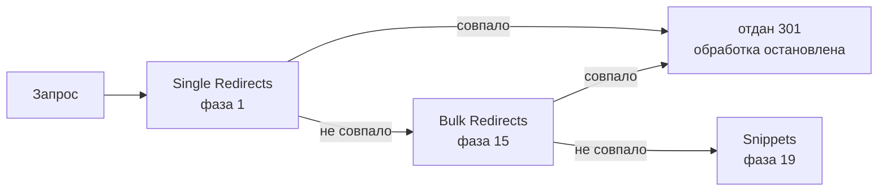

# Редирект не выполняет JavaScript. Как посчитать клики на редиректе

Web Analytics, Plausible и Umami — маяки на странице, поэтому 301 для них невидим. Аналитика редиректа: воркер плюс Analytics Engine считает клик на бесплатном тарифе.

Source: https://ru.301.sh/count-clicks-on-a-redirect/
Published: 2026-07-22
Cloudflare facts checked: 2026-07-28

---

Вопрос старше большинства инструментов, которыми его предлагают решать. Запрос на функцию под
названием «Page Rule statistics» открыли на Cloudflare Community 23 мая 2017 года, автор
поднимал его снова в 2018 и в 2019, а закрыли его 6 июня 2025 года, так и не реализовав. Тем
временем человек, который печатал короткие ссылки на бумажных материалах, спросил, есть ли
способ узнать, сколько раз сработало правило редиректа за период, и не получил вообще никакого
содержательного ответа до того, как тред закрылся автоматически.

Совет, который всё-таки существует, — поставить перед редиректом страницу, чтобы JavaScript
было где исполняться. Это не обходной путь. Это выключение редиректа.

Дальше — почему ничто из того, что у вас уже есть, не видит этот клик, и что его действительно
считает.

## Почему ни одна система аналитики этого не видит

Дело не в изъяне конкретного продукта. Это структурное свойство редиректа.

Все распространённые системы аналитики с уважением к приватности — Cloudflare Web Analytics,
Plausible, Umami, Counterscale — устроены одинаково: небольшой скрипт на странице сообщает, что страницу
посмотрели. Инструкция по установке от самой Cloudflare формулирует проблему яснее всего:

> Add the JS snippet to any of your website's HTML pages before the ending body tag.

У ответа 301 нет HTML-страницы. У него нет тега body. Маяк некуда поставить, и выполнять его нечему,
поэтому посетителя считают уже на целевом сайте — если он ваш, — и не считают вообще, если он
не ваш.

Сотрудник Cloudflare сказал то же самое в 2023 году, отвечая тому, кто хотел включить Web
Analytics на домене, который только редиректит: Web Analytics снимает метрику на стороне
клиента, а когда источник возвращает редирект на третью сторону, а не страницу, отследить это
нельзя.

У Plausible ровно та же дыра: о ней сообщили в апреле 2022 года, ответили обещанием в роадмапе,
и она до сих пор открыта.

## Порядок фаз — вот настоящее объяснение

Cloudflare публикует порядок, в котором выполняются фазы обработки запроса, и, если его прочитать,
вопрос закрывается полностью.

Single Redirects работают в `http_request_dynamic_redirect`, **первой** фазе прикладного уровня.
Bulk Redirects — в `http_request_redirect`, пятнадцатой. Snippets — в `http_request_snippets`,
девятнадцатой. А документация по правилам прямо говорит, что происходит при совпадении:

> For terminating actions (Block, Redirect, or one of the challenge actions), rule evaluation
> will stop and the action will be executed immediately.



То есть совпавший редирект выдаёт ответ тут же. Всё, что дальше по конвейеру, не выполняется
никогда — а среди этого и то единственное место, где вы могли бы записать строчку в лог. Даже
платные Snippets не спасают: они стоят на четыре фазы позже Bulk Redirects и не видят запроса,
который уже ушёл.

Вот почему у этой задачи нет решения на уровне настроек. **Считать клик должен тот же код,
который редирект и выдаёт.**

## Во что обходится встроенный ответ

У Cloudflare есть продукт, который отдаёт сырые логи запросов, и таблица его доступности
короткая:

| Тариф | Logpush |
| --- | --- |
| Free | Нет |
| Pro | Нет |
| Business | Нет |
| Enterprise | Да |

Вот честная причина, по которой написана эта статья. На любом тарифе ниже Enterprise нужный вам
лог придётся написать самому.

## Не KV, и здесь стоит быть точным

Совет, который вы найдёте в старых тредах, — писать каждый клик в Workers KV, по ключу на клик
или в один ключ-счётчик, и вычитывать обратно списком. Оба варианта неверны, и по разным
задокументированным причинам.

Бесплатный тариф даёт **1 000 записей в сутки**. Редирект с хоть сколько-нибудь настоящим
трафиком исчерпает их до обеда, а потом молча перестанет записывать.

Что важнее, KV ограничивает вас **одной записью в секунду в один и тот же ключ**, и так на всех
тарифах. Один ключ-счётчик — ровно тот сценарий доступа, который KV и создан отвергать.
Доплата этого числа не меняет.

## Что работает: воркер и Analytics Engine

Workers Analytics Engine сделан ровно под такую форму данных и доступен на бесплатном тарифе:

| | Free |
| --- | --- |
| Запись точек данных | 100 000 в сутки |
| Запросы на чтение | 10 000 в сутки |
| Хранение | три месяца |

По сравнению с тысячей записей в KV это в сто раз больше места, и путь записи рассчитан на одно
событие на запрос, а не на изменяемый счётчик. Потолок здесь — строка в счёте, а не стена: тариф
Workers Paid за $5 в месяц включает 10 миллионов точек данных в месяц.

Привяжите датасет:

```toml
# wrangler.toml
[[analytics_engine_datasets]]
binding = "CLICKS"
dataset = "redirect_clicks"
```

А дальше пусть воркер сам выдаёт редирект и попутно его записывает:

```js
export default {
  fetch(request, env) {
    const url = new URL(request.url);
    const target = "https://example.com/offer";

    env.CLICKS.writeDataPoint({
      indexes: [url.hostname],
      blobs: [
        url.pathname,
        url.searchParams.get("gclid") ?? "",
        request.headers.get("referer") ?? "",
        request.cf?.country ?? "",
      ],
      doubles: [1],
    });

    return Response.redirect(target, 301);
  },
};
```

В этих двадцати строках важны четыре детали.

**Не ждите завершения записи.** Cloudflare прямо указывает, что `writeDataPoint` не блокирует
выполнение и возвращает управление сразу, а рантайм сохраняет данные в фоне. Ожидание добавило бы задержку на хопе, вся
работа которого — быть быстрым.

**Индекс — это ключ сэмплирования**, и ограничения такие: один индекс на вызов, не больше
96 байт. Кладите туда что-нибудь низкой кардинальности — хостнейм, кампанию, — а не полный
адрес. Всё, что с высокой кардинальностью, идёт в blobs: их до двадцати, суммарно 16 КБ, при
250 точках данных на вызов.

**Читайте click ID здесь, на единственном хопе, который гарантированно его видит.** Это тот
самый параметр, который
[неверно настроенный Bulk Redirect тихо удаляет](/find-the-redirect-that-drops-your-gclid/); а
если редирект выдаёт ваш собственный воркер, вы сами решаете, что уцелеет, и вам не приходится выбирать
между двумя половинами строки запроса.

**`Response.redirect(target, 301)` — это настоящий 301.** Ни промежуточной страницы, ни
meta refresh, ни JavaScript. Поисковики видят постоянный редирект, посетитель видит один хоп.

## Как прочитать результат

У Analytics Engine есть SQL API. Один `curl`, один токен с правом Account Analytics Read:

```bash
curl "https://api.cloudflare.com/client/v4/accounts/{account_id}/analytics_engine/sql" \
  --header "Authorization: Bearer $CF_API_TOKEN" \
  --data "SELECT blob1 AS path,
                 SUM(_sample_interval) AS clicks
          FROM redirect_clicks
          WHERE timestamp >= NOW() - INTERVAL '7' DAY
          GROUP BY path
          ORDER BY clicks DESC"
```

`SUM(_sample_interval)` вместо `COUNT()` — не вопрос вкуса. На больших объёмах данные прореживаются, и
каждая сохранённая строка начинает представлять несколько настоящих:

> `_sample_interval` indicates what the sample rate is for this row (that is, how many rows of
> the original data are represented by this row)

Посчитаете строки — занизите результат, причём с коэффициентом, который меняется вместе с
трафиком. Просуммируете интервал — число будет верным на любом объёме.

## Что это даёт и чего не даёт

Это даёт число запросов с теми измерениями, которые вы решили записывать, на хопе, который
происходит до того, как браузер куда-либо уйдёт. Ни на что не надо получать согласие, блокировщику
нечего блокировать, куки не нужны: клик — это запрос к вашему собственному хостнейму, а не
скрипт, загруженный с чужого.

Это не атрибуция. Считается каждый запрос, включая ботов и всё, что подтягивает превью ссылок, и ничто здесь не
связывает клик с конверсией на странице, которая вам не принадлежит. Задача это более сложная, и у неё
[своя статья](/attribution-when-the-conversion-page-is-not-yours/).

И это меняет природу вашего редиректа. Redirect Rule — это настройка: ни деплоя, ни кода, ни
человека, который её сопровождает. Воркер — это софт, с откатом и с тем, кому потом придётся в
нём разбираться. Для одной ссылки такой размен обычно оправдан. А
[полный список способов сделать редирект и цену каждого](/every-way-to-redirect-on-cloudflare/)
стоит прочитать до того, как переносить работающее правило в код.

## Где это перестаёт быть двадцатью строками

Один редирект, один воркер, один датасет — работа на полдня, и числа ваши.

Форма задачи меняется, когда редиректы становятся портфелем. Каждой ссылке, которую надо
считать, нужен воркер перед ней, каждому домену — маршрут, а датасету — тот, кто будет
запрашивать его по расписанию, а не когда кто-нибудь задастся вопросом. В этот момент вы
сопровождаете небольшой аналитический продукт — просто потому, что хотели знать, сколько человек
кликнуло. Эту работу [301.st](https://301.st) делает по умолчанию. Для одной ссылки воркер выше
и есть весь ответ, и он бесплатный.
