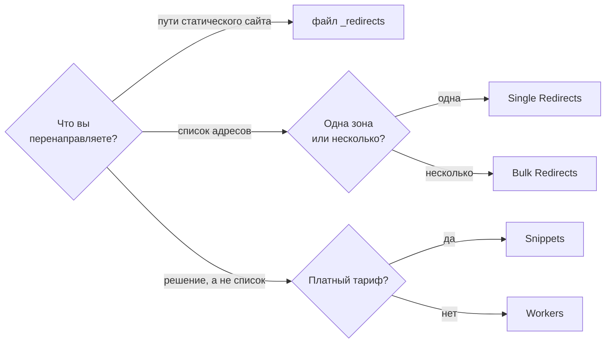

# Все способы сделать редирект на Cloudflare и где каждый ломается

Шесть способов сделать редирект на Cloudflare: Single Redirects, Bulk Redirects, Snippets, Workers, _redirects и origin. Где живёт правило, квоты Free и подвохи.

Source: https://ru.301.sh/every-way-to-redirect-on-cloudflare/
Published: 2026-07-22
Cloudflare facts checked: 2026-07-28

---

Ответить на запрос редиректом на Cloudflare можно шестью способами, плюс есть одна функция,
которая выглядит седьмым способом, но им не является. Они отличаются тем, где живёт правило, сколько
правил вам дают, по чему можно сопоставлять и что незаметно перестаёт работать по краям. Когда
способ настроен и всё равно не срабатывает,
[сбой обычно проявляется одним из трёх способов](/redirect-silently-fails/), а когда правило
стоит в статусе Active и не происходит вообще ничего —
[причину находят четыре вопроса](/redirect-rule-active-but-nothing-happens/).

Все цифры ниже сняты с документации Cloudflare 22 июля 2026 года.

## Выбор по трём вопросам

## Сравнение

| Способ | Где живёт правило | Бесплатный тариф | Сопоставление | На чём спотыкаются |
| --- | --- | --- | --- | --- |
| Single Redirects | зона | 10 правил | вайлдкарды; regex с Business | считается заново на каждой вашей зоне |
| Bulk Redirects | аккаунт | 10 000 адресов, 5 списков, 15 правил | поиск по списку, подпути, поддомены | строка запроса отбрасывается по умолчанию |
| Snippets | зона | нет | любая логика, 5 мс | вообще недоступны на Free |
| Workers | маршрут | 100 000 запросов в сутки, 10 мс CPU | любая логика | вы пишете и деплоите код |
| файл `_redirects` | деплой | 2 000 статических, 100 динамических | только путь | не умеет сопоставлять по параметрам запроса |
| Origin | ваш сервер | сколько потянете | что угодно | запрос сначала проходит весь путь |

## Single Redirects, на зону

Десять правил на бесплатном тарифе, двадцать пять на Pro, пятьдесят на Business, триста на
Enterprise. Вайлдкарды работают везде, регулярные выражения начинаются с Business.

Ключевое слово — **на зону**. Десять правил — это десять на каждом вашем домене, а не десять
суммарно, и это щедрее, чем кажется на первый взгляд. Шести доменам с четырьмя редиректами на
каждом другой продукт вообще не понадобится.

И этому способу, и Bulk Redirects нужна DNS-запись домена, проксируемая через Cloudflare.
Формулировка самой Cloudflare: оба «require that you proxy the DNS records of your domain (or
subdomain) through Cloudflare». На домене, который вы паркуете, а не обслуживаете, именно этот
шаг обычно забывают.

## Bulk Redirects, на аккаунт

Устройство ровно обратное — ради этого их и берут: Bulk Redirects «allow you to define a large
number of URL redirects at the account level, which can apply across domains in your account».
Один список, все зоны.

Бесплатный тариф вмещает 10 000 редиректов в 5 списках и 15 правилах. Pro поднимает адреса до
25 000, Business до 50 000, Enterprise до миллиона в 25 списках и 50 правилах.

Две вещи, которые надо знать до того, как на них закладываться.

Задокументированная квота и выданная аккаунту — не всегда одно число. В июле 2026 аккаунты всё
ещё упирались в старый потолок в двадцать редиректов, и лечится это обращением в поддержку:
[в документации 10 000, а в вашем аккаунте может быть 20](/cloudflare-free-plan-redirect-limits/).

И строка запроса отбрасывается, если явно не попросить её сохранить.
`preserve_query_string` по умолчанию `false`, а включение подставляет исходную строку вместо
целевой, а не склеивает их, так что теряются уже собственные параметры целевого адреса.
Настройки, при которой сохранились бы оба набора, нет, и это
[отдельное расследование, когда в дело вступают рекламные click ID](/find-the-redirect-that-drops-your-gclid/).

## Snippets, если вы платите

Небольшие куски JavaScript, которые выполняются до того, как запрос будет обслужен, поэтому
редирект может зависеть от чего угодно, что вы способны вычислить. Двадцать пять на Pro,
пятьдесят на Business, триста на Enterprise, при 5 мс выполнения, 2 МБ памяти и пакете в 32 КБ.

В таблице доступности бесплатный тариф отмечен как **No**, и сниппетов там ноль. Если вы на Free
и вам нужна логика, а не список, это не ваша строка.

## Workers, когда правило не список

Воркер умеет редиректить по чему угодно, что способен прочитать: по заголовку, стране, значению
куки, времени суток, результату поиска по списку. Бесплатный тариф даёт 100 000 запросов в сутки и
10 мс CPU на вызов, а это очень много редиректов; тариф Workers Paid за $5 в месяц поднимает
планку до 10 миллионов запросов в месяц.

Цена здесь не квота. Цена в том, что редирект теперь живёт в коде, с деплоем, откатом и
человеком, которому через год придётся в нём разобраться. Для фиксированного списка «откуда
куда» это невыгодный размен по сравнению с Bulk Redirects.

Но одну вещь умеет только эта строка. Правило выдаёт ответ раньше, чем отработает что-либо
дальше по цепочке, поэтому записать сам факт редиректа некому:
[считать клик может только тот код, который редирект и выдаёт](/count-clicks-on-a-redirect/).

## Файл `_redirects`, для статического деплоя

Если сайт выкладывается как статические файлы, редиректы могут ехать вместе с ним. Файл держит
2 000 статических и 100 динамических редиректов, всего 2 100. Он понимает 301, 302, 303, 307 и
308, а без явного указания использует 302, что удивляет тех, кто ждёт постоянного редиректа по
умолчанию.

Его настоящее ограничение — сопоставление: по параметрам запроса оно не поддерживается. Если
нужное правило звучит как «отправь этот адрес туда-то, когда он несёт такой параметр», файл
этого не выразит.

## Origin, тоже вариант

Редирект от nginx, Apache или самого приложения — не ошибка. Просто он происходит уже после
того, как запрос дошёл по сети до вашего сервера, — а это ровно то расстояние, ради экономии
которого край сети и существует. Оправдано, когда решение требует данных, которые есть только у
приложения. Расточительно, когда ответ — фиксированное соответствие, известное заранее.

## Transform Rules — это не редиректы

Самая частая путаница во всей теме, и названия ничем не помогают.

Transform Rules «allow you to adjust the URI path, query string, and HTTP headers of requests
and responses on the Cloudflare global network». Перезапись адреса меняет запрос по дороге. Ни
кода статуса, ни заголовка `Location`, и адрес в браузере не меняется. Посетитель попросил один
адрес и получил ответ для него; что произошло за краем сети, посетителю не видно.

Это правильный инструмент, когда нужен чистый публичный адрес поверх грязного внутреннего. И
неправильный, когда нужно, чтобы поисковик узнал новый адрес: ему никто не сообщает, что адрес
новый.

Free получает 10 Transform Rules, Pro 25, Business 50, Enterprise 300, с regex начиная с
Business.

## И Page Rules, для полноты

Page Rules делали редиректы через настройку Forwarding URL. Документация теперь называет этот
раздел «Page Rules (deprecated)» и публикует карту соответствия каждой старой настройки её
замене; для редиректов замена — Single Redirects. Если у вас там ещё лежат правила,
[вот куда переехала каждая настройка](/page-rules-where-every-setting-went/), включая те пять,
которым переезжать некуда.

## Много доменов, одна цель

Случай, который не помещается в таблицу: несколько сотен доменных имён, которые все должны
отвечать, и
каждому нужен сертификат. Cloudflare for SaaS закрывает Custom Hostnames, а не логику
редиректов, и включает 100 штук на Free, Pro и Business, дальше берёт $0,10 в месяц за каждый
следующий, до 50 000.

Соедините это со списком Bulk Redirects — и у большого портфеля доменов появляется ответ.
Насколько этот ответ комфортный, история длиннее:
[инструкция о том, как направить двести припаркованных доменов на один сайт](/redirect-200-parked-domains/)
разбирает зоны, порядок NS-записей и проверку, а работа именно там. Теперь, когда публичный
сертификат живёт не больше 200 дней, важно ещё и то, кто продлевает каждый из этих сертификатов:
[скрипт, который делит по этому признаку портфель](/200-day-certificates-on-a-domain-portfolio/),
разобран в отдельной статье. А о том, как узнать, что один из этих доменов сломался, —
[статья про уведомления Cloudflare на бесплатном тарифе](/what-cloudflare-free-alerts-you-about/).

## Что в итоге брать

Один домен, несколько правил: Single Redirects. Всё остальное своей сложности здесь не
оправдывает.

Список «откуда куда», особенно сразу по нескольким доменам: Bulk Redirects, предварительно
проверив, что в вашем аккаунте действительно есть та квота, которую обещает документация.

Решение, а не список: Snippets — если вы платите за тариф, где они есть; воркер — если не
платите; и ни то ни другое, если решение при ближайшем рассмотрении оказалось поиском по
списку.

Для одной зоны никакая надстройка поверх этого не нужна. Она становится нужна там, где правила
переживают человека, который их написал, расползаются по доменам, куда год никто не заглядывал,
и нигде не записано, какой домен куда должен был вести. Именно для этого сделан
[301.st](https://301.st), и честное место упомянуть его — здесь, в конце, а не посреди
сравнения.
