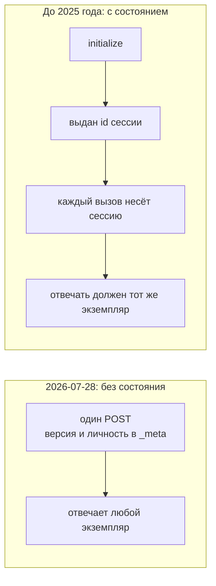

# MCP-сервер на бесплатных Cloudflare Workers: укладывается ли он в 10 мс CPU

Ревизия 2026-07-28 сделала MCP протоколом без состояния, а Cloudflare днём раньше объявила устаревшим путь через Durable Objects. Собрали сервер на Workers и замерили.

Source: https://ru.301.sh/mcp-server-on-workers-free-plan/
Published: 2026-07-28
Cloudflare facts checked: 2026-07-28

---

На этой неделе произошли две вещи, которые превращают «могу ли я держать MCP-сервер
бесплатно» из компромисса в обычное «да», с одним измеримым условием. Сегодня Model Context
Protocol выпустил ревизию `2026-07-28`, и главное изменение в ней — ядро протокола лишилось
состояния: сессии, заголовок `Mcp-Session-Id` и рукопожатие `initialize` исчезли. Пост о
релизе формулирует следствие прямо:

> Any request can now land on any server instance behind a plain round-robin load
> balancer without needing shared storage.

А вчера, на день раньше релиза, сменила рекомендацию и собственная документация
Cloudflare. Класс `McpAgent` — официальный путь, за которым каждый MCP-сервер тянул Durable
Object, потому что транспорту нужно было где-то держать сессию, — теперь помечен как устаревший,
развитие заморожено,
а рекомендованной заменой для новых серверов назван обработчик без состояния.

Оба этих хода закрывают один и тот же разрыв с двух сторон. Воркер на бесплатном тарифе всегда
был естественным местом для небольшого MCP-сервера, если бы не одно но: транспорт требовал
состояния,
а состояние означало Durable Object и привязку к конкретному экземпляру. Теперь сам протокол
обещает, что каждый запрос самодостаточен. Остаётся единственный жёсткий потолок бесплатного
тарифа — 10 мс CPU на запрос, — и влезает ли под него настоящий сервер — не вопрос для спора.
Это вопрос замера. Так что мы собрали такой сервер, на этом сайте, и замерили.

## Что именно убрала ревизия

Старый жизненный цикл открывал каждое соединение обменом `initialize`, выдавал идентификатор
сессии и требовал от клиента передавать его в каждом вызове. Всё это удалено. Версия, кто
клиент, и capabilities теперь передаются в полях `_meta` самого запроса, а единственное, что
сервер обязан реализовать, — это `server/discover`, сообщающий поддерживаемые версии и
capabilities всем, кто спросит.

Взамен транспорт стал строже. Каждый POST обязан нести заголовок `MCP-Protocol-Version`,
совпадающий с версией внутри тела, плюс заголовок `Mcp-Method`, дублирующий метод JSON-RPC, —
и `Mcp-Name` на вызовах инструментов, — чтобы балансировщики и шлюзы могли маршрутизировать,
не разбирая тело. Несовпадение — жёсткий `400`. Пакетные запросы как убрали, так и не вернули,
`ping` убран целиком, неизвестный метод теперь — HTTP `404`, а транспорт HTTP+SSE образца 2024 года
формально объявлен устаревшим. Сервер, который сам ничего не рассылает, вправе отвечать на
любой запрос обычным JSON, а на потоковый путь отдавать `405`.



Для сервера, который только читает, оставшаяся поверхность протокола невелика:
`server/discover`, `tools/list`, `tools/call` и дисциплина заголовков. Вот и весь список.

## Сервер, который теперь работает на этом сайте

Этот блог уже публикует агент-поверхность: Markdown-зеркала каждой статьи и фид `posts.json`.
MCP-сервер — это те же самые файлы за двумя инструментами: `list_articles` возвращает фид,
`get_article` возвращает полный Markdown статьи. Живёт он по адресу `https://301.sh/mcp` на том
же воркере, который занимается на сайте
[согласованием форматов по `Accept`](/agent-readiness-audit/), и без
единой зависимости: после ревизии оставшаяся поверхность протокола достаточно коротка, чтобы
написать её руками. У Cloudflare есть и путь через SDK для той же задачи (`createMcpHandler`
плюс SDK протокола), и это правильный ответ в тот момент, когда вам понадобятся ресурсы,
промпты или elicitation; серверу из двух инструментов только на чтение — нет.

Диспетчеризация, сжатая до своей формы:

```ts
switch (message.method) {
  case 'server/discover':
    return reply(id, { resultType: 'complete', supportedVersions: ['2026-07-28'],
      capabilities: { tools: {} }, ttlMs: 3_600_000, cacheScope: 'public' });
  case 'tools/list':
    return reply(id, { resultType: 'complete', tools: TOOLS, ttlMs: 3_600_000,
      cacheScope: 'public' });
  case 'tools/call': {
    // Mcp-Name header must equal params.name, or 400 + HeaderMismatch.
    const mirror = await env.ASSETS.fetch(new URL(`/${slug}.md`, origin));
    return reply(id, { resultType: 'complete',
      content: [{ type: 'text', text: await mirror.text() }], isError: false });
  }
  default:
    return fail(id, 404, -32601, `Method not found: ${message.method}`);
}
```

Здесь ничего не вычисляется. Каждый ответ — это уже задеплоенный статический ассет, полученный
через биндинг ассетов, и именно за этот выбор потом благодарит замер.

## Замер

Определение лимита у Cloudflare — как раз та часть, которую чаще всего проматывают:

> CPU time measures how long the CPU spends executing your Worker code. Waiting on
> network requests (such as `fetch()` calls, KV reads, or database queries) does **not**
> count toward CPU time.

То есть бюджет в 10 мс тратится на разбор, валидацию и сборку JSON, а не на получение тела
статьи. Мы отправили 40 запросов на боевой эндпоинт и прочитали `cpuTime` каждого вызова — его пишут
Workers Logs:

| Метод | CPU, мс (мин / медиана / макс) | Общее время, мс (мин / медиана / макс) |
|---|---|---|
| server/discover | 0 / 0 / 1 | 0 / 1 / 2 |
| tools/list | 0 / 0 / 0 | 0 / 1 / 2 |
| list_articles | 0 / 1 / 1 | 10 / 13 / 23 |
| get_article, самая большая статья | 0 / 1 / 2 | 6 / 10 / 88 |

Худший случай тратит 2 мс из бюджета в 10 мс, а самый медленный ответ — 88 мс общего времени
на отдачу самой длинной статьи сайта — почти целиком уходит в ожидание получения ассета,
которое счётчик не считает. Инструмент, который просто отдаёт байты, укладывается в пятую
часть бесплатного потолка, и с запасом; а второе число бесплатного тарифа, 100 000 запросов в
сутки, для эндпоинта, к которому агенты обращаются несколько раз за диалог, вообще не
ограничение.

## Где 10 мс действительно кусаются

Потолок настоящий, просто живёт он не в транспорте. Когда мы
[проводили аудит агент-поверхности этого сайта](/agent-readiness-audit/), мы замерили движок
шаблонов, который думали выставить наружу как сервис, и он превысил те же 10 мс в восемь раз.
Вот честное разделение: инструмент, который отдаёт байты, стоит одну-две миллисекунды;
инструмент, который вычисляет — разбирает документы, рендерит шаблоны, хеширует на больших
объёмах, —
съедает бюджет почти мгновенно. Cloudflare допускает эпизодические превышения («Each isolate
has some built-in flexibility»), но воркер, который выходит за лимит регулярно, завершается с
ошибкой 1102, а на терпимость к всплескам рассчитывать нельзя.

У снятия ограничения есть ценник, и по собственному правилу этого сайта ему место рядом с самим
ограничением: тариф Workers Paid за $5 в месяц поднимает потолок на запрос до 30 секунд по
умолчанию (настраивается до 5 минут) и включает 30 миллионов CPU-миллисекунд и 10 миллионов
запросов в месяц. Если ваши инструменты вычисляют, сравнивать надо с этим числом, а не с 10 мс
бесплатного тарифа.

## Попробуйте сами, и чего для этого не нужно

Эндпоинт живой, и один запрос показывает всю новую форму протокола:

```bash
curl https://301.sh/mcp -X POST \
  -H 'Content-Type: application/json' \
  -H 'MCP-Protocol-Version: 2026-07-28' \
  -H 'Mcp-Method: server/discover' \
  -d '{"jsonrpc":"2.0","id":1,"method":"server/discover",
       "params":{"_meta":{"io.modelcontextprotocol/protocolVersion":"2026-07-28"}}}'
```

Никакой сессии открывать не надо, никакого состояния держать не надо, никакого Durable Object в
счёте. Если ваш сайт уже публикует Markdown-зеркала или фид — а после
[аудита готовности к агентам](/agent-readiness-audit/) наш как раз стал публиковать, — то
расстояние от «статических файлов» до «MCP-сервера» — это один маршрут на воркере, который у
вас, возможно, уже запущен. Спецификация наконец совпала с тем, чем маленький сервер только на чтение всегда и
хотел быть: обычным HTTP-эндпоинтом, отвечающим на вопросы о контенте, который вы уже собрали.
Бесплатный тариф тянет это легко. Бесплатными никогда не были и не будут вычисляющие
инструменты — и теперь вы знаете число, по которому это видно.
