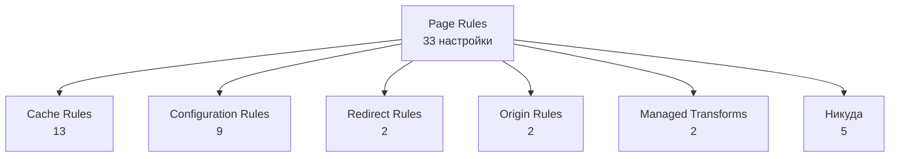

# Page Rules в Cloudflare устарели. Вот куда переехала каждая настройка

Документация Cloudflare помечает Page Rules устаревшими и говорит, чем заменить почти каждую настройку. У пяти замены нет — автоматическая миграция молча их теряет.

Source: https://ru.301.sh/page-rules-where-every-setting-went/
Published: 2026-07-22
Cloudflare facts checked: 2026-07-22

---

Документация Cloudflare теперь называет раздел про Page Rules
«[Page Rules (deprecated)](https://developers.cloudflare.com/rules/page-rules/)». На самой
странице ни баннера, ни даты, ни объяснения. Продукты-замены существуют, они описаны, карта
соответствия старого новому опубликована. Не хватает только того, кто скажет вам, какие из
ваших правил тихо перестанут что-либо делать.

Тридцать три настройки, пять направлений и пять настроек, которым идти некуда.

## Пять, которым идти некуда

Начните отсюда: именно здесь вы что-то теряете.
[Справочник Cloudflare по миграции](https://developers.cloudflare.com/rules/reference/page-rules-migration/)
перечисляет их как настройки, которые не будут перенесены, — у каждой своя причина:

| Настройка | Причина по версии Cloudflare |
| --- | --- |
| Disable Performance | this setting is deprecated |
| Disable Railgun | deprecated, since Railgun is no longer available |
| Disable Security | this setting is deprecated |
| Response Buffering | this setting is deprecated |
| Web Application Firewall | deprecated, since the previous version of WAF managed rules is deprecated |

Если одно из ваших Page Rules отключает на каком-то пути защиту или старый WAF, у этого поведения
преемника нет. Автоматическая миграция не предупредит и не воссоздаст его. То, от чего это
правило вас защищало — или что оно пропускало, — изменится без всякого деплоя с вашей стороны.

Проверьте свои правила на эти пять, пока миграция не дошла до вашей зоны.

## Полная карта

У всего остального есть куда переехать. Снято со справочника по миграции 22 июля 2026 года:

| Настройка Page Rules | Замена |
| --- | --- |
| Always Use HTTPS | Redirect Rules (Single Redirects) |
| Forwarding URL | Redirect Rules (Single Redirects) |
| Browser Cache TTL | Cache Rules |
| Bypass Cache on Cookie | Cache Rules |
| Cache By Device Type | Cache Rules |
| Cache Deception Armor | Cache Rules |
| Cache Level | Cache Rules |
| Cache on Cookie | Cache Rules |
| Cache TTL by status code | Cache Rules |
| Custom Cache Key | Cache Rules |
| Edge Cache TTL | Cache Rules |
| Origin Cache Control | Cache Rules |
| Origin Error Page Pass-thru | Cache Rules |
| Query String Sort | Cache Rules |
| Respect Strong ETags | Cache Rules |
| Browser Integrity Check | Configuration Rules |
| Disable Apps | Configuration Rules |
| Disable Zaraz | Configuration Rules |
| Email Obfuscation | Configuration Rules |
| Opportunistic Encryption | Configuration Rules |
| Polish | Configuration Rules |
| Rocket Loader | Configuration Rules |
| Security Level | Configuration Rules |
| SSL | Configuration Rules |
| Host Header Override | Origin Rules |
| Resolve Override | Origin Rules |
| IP Geolocation Header | Transform Rules (Managed Transforms) |
| True Client IP Header | Transform Rules (Managed Transforms) |

Если прочитать таблицу целиком, видно две вещи.

Page Rules в основном были про кеширование. Тринадцать из тридцати трёх настроек стали Cache
Rules, ещё девять — Configuration Rules. На редиректы, которыми Page Rules и запомнились,
приходится две.

И замены — это отдельные продукты. Одно Page Rule, которое задавало уровень кеша, включало принудительный
HTTPS и переопределяло заголовок Host, превращается в три правила в трёх разных местах. Единого
представления о том, что происходит с путём, больше нет.

К тому же у них собственные квоты — не те, что были у Page Rules, — и на бесплатном тарифе одна
из них может не совпасть с числом из документации. Стоит прочитать, прежде чем закладывать этот
лимит в план миграции:
[в документации 10 000 Bulk Redirects, а в вашем аккаунте может быть 20](/cloudflare-free-plan-redirect-limits/).

## О чём Cloudflare не говорит

Справочник по миграции ясен насчёт того, куда всё переедет, и туманен насчёт сроков. Его
формулировка:

> This process is planned for late 2025 or beyond, with no action required on your part.

Сейчас середина 2026 года, так что от «late 2025 or beyond» осталось только «or beyond».

Нет и опубликованной даты, когда создавать новые Page Rules стало нельзя. Сторонние разборы
такую дату называют, собственная документация Cloudflare — нет, а повторять дату, которую я не
могу подтвердить источником, я не стану. Что документация действительно показывает, так это то, как функцию
выхолащивают по расписанию:
[страница устаревших функций](https://developers.cloudflare.com/deprecations/) фиксирует, что
3 ноября 2025 года параметр Mirage убрали из настроек Page Rules и из операций `POST`, `PATCH`
и `PUT` по адресу `/zones/{zone_id}/pagerules`.

Честное резюме такое: Page Rules ещё существуют, ещё работают, теряют параметры по одному и
а когда их перенесут за вас — не сказано.

## Перенести руками и проверить, что получилось

Дождаться автоматической миграции — разумный выбор для большинства зон. Делать самому стоит
тогда, когда вы хотите осознанно разобраться с теми пятью настройками, которым переезжать некуда, или когда хотите,
чтобы новые правила назывались и шли в том порядке, в каком вы написали бы их сами.

Порядок — то, в чём чаще всего ошибаются. Page Rules выполнялись по приоритету внутри одного
списка. Замены — отдельные продукты, каждый срабатывает в свой момент обработки запроса,
поэтому «какое правило победит» больше не число, которым вы управляете в одном месте. После
переноса проверяйте на реальном запросе, а не на своих ожиданиях:
[Cloudflare Trace](https://developers.cloudflare.com/rules/trace-request/) прогоняет адрес
заново и сообщает, какие правила сработали. Это единственная проверка, которая отвечает на
вопрос напрямую.

Если какие-то из перенесённых правил висят на пути, куда идёт рекламный трафик, проверьте
строку запроса отдельно. Trace скажет, какое правило сработало, но не то, что уцелело при переходе, а
[редирект, который тихо теряет click ID](/find-the-redirect-that-drops-your-gclid/), во всём
остальном выглядит совершенно здоровым.

## Когда это перестаёт быть экраном настроек

Для одной зоны это работа на полдня. Прочитать список, отметить пять без преемника, воссоздать
остальное в трёх продуктах, прогнать несколько адресов через Trace.

Арифметика меняется вместе с числом зон. Те же полдня, повторённые много раз, и негде
посмотреть сразу по всем доменам, закончили вы или нет, и нигде не записано, какую зону вы уже
прошли. Ровно для такой работы и сделан [301.st](https://301.st). Для одного домена
экран настроек по-прежнему правильный инструмент.
