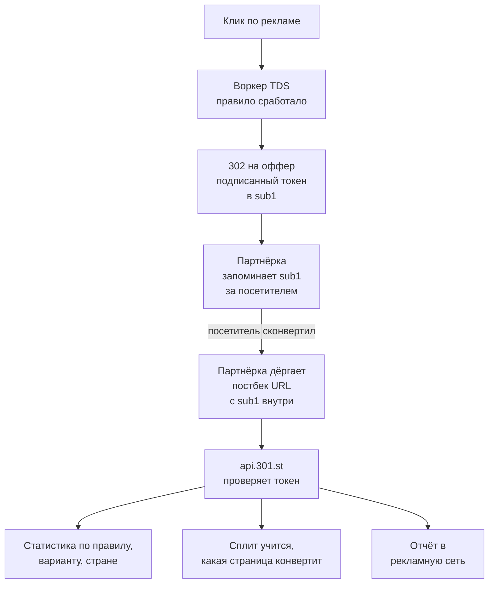
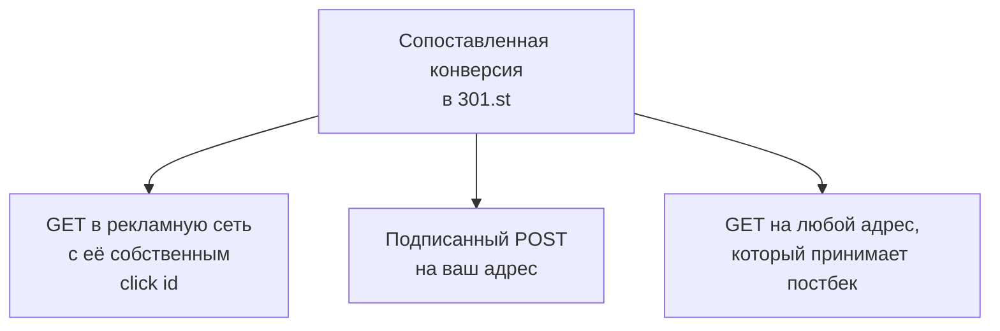

# Постбеки для TDS: как конверсия на чужом сайте находит свой клик

Воркер TDS отправляет посетителя на оффер и дальше ничего не видит. Подписанный токен клика и постбек возвращают конверсию в правило, сплит и рекламную сеть.

Source: https://ru.301.sh/postbacks-for-a-tds/
Published: 2026-10-06
Cloudflare facts checked: 2026-10-06

---

[Гайд по TDS на Cloudflare Workers](/tds-on-cloudflare-workers/) заканчивается на
редиректе. Воркер отвечает браузеру 302, браузер открывает оффер, и с этой секунды воркер
ничего не видит. Регистрация или депозит происходят на сайте партнёрки, на домене, который
вам не принадлежит и куда пиксель не поставишь.

Вернуть это событие — работа постбека. Это запрос от сервера к серверу (S2S): когда
посетитель конвертит, партнёрка дёргает адрес, который вы ей дали, и кладёт данные конверсии
в строку запроса. Чтобы такой запрос что-то значил, в нём должно быть сказано, к какому клику
он относится. Передать клик в руки партнёрки — задача редиректа.

Ниже — как это устроено в TDS [301.st](https://301.st): что она добавляет к ссылке на
оффер, что партнёрка должна вернуть, что конверсия меняет внутри платформы и как она
возвращается в рекламную сеть, которая продала вам клик. Трекер здесь — сама TDS: клик,
правило и конверсия сходятся в одном месте, без посредников. Всё сверено с исходным кодом платформы 6 октября 2026 года.
Общая схема той же петли, собранная руками на воркере, — в
[статье об атрибуции, когда страница конверсии не ваша](/attribution-when-the-conversion-page-is-not-yours/).

## Петля целиком



Должны выполняться два условия. Редирект кладёт идентификатор в параметр, который партнёрка
сохраняет, а партнёрка возвращает этот параметр в постбеке без изменений. Остальное —
настройки источника постбеков, о них ниже.

## Что уходит вместе с кликом

На каждый запрос воркер заводит click id: 32 шестнадцатеричных символа, в начале которых
зашито время клика. На редиректе он вдобавок собирает вокруг этого id токен клика. В токене
лежат сработавшее правило, страна и устройство посетителя, а для сплита — выбранный вариант
страницы. Токен подписан HMAC, и подпись проверяется, когда токен возвращается. Исправленный
или выдуманный токен эту проверку не проходит.

Таблицы кликов платформа не ведёт. Запись о клике — это сам токен, поэтому он и подписан:
всё, что платформа узнаёт о конверсии, она читает из токена, который вернула партнёрка.
Длина токена — 44 символа, для правила со сплитом — 58, и через 90 дней после клика
платформа его больше не принимает.

Добавлять ли токен, решает настройка правила **Click key in the URL**:

| Вариант | Что получает ссылка на оффер |
| --- | --- |
| Don't add | ничего, ссылка уходит как вы её написали |
| 301 key (_cid) | токен в параметре `_cid` |
| Source parameter | токен в параметре, который задан у источника постбеков, например `sub1` |

«Don't add» подходит для вайта, фильтра ботов и любой ссылки, которая ведёт не в
партнёрку. Два других варианта — для конверсий, которые возвращаются в 301.st постбеками.
Третьему нужен источник постбеков, выбранный в правиле: имя параметра берётся из него.

Воркер записывает токен поверх параметра с тем же именем, если тот уже есть в ссылке. Если в
адресе оффера стоит `sub1=что-то`, а параметр источника — `sub1`, партнёрка получит токен.
Редактор правил предупреждает об этом при сохранении.

Токен добавляется к HTTP-редиректу и к сплиту. Правило, которое отправляет посетителя через
meta refresh, JavaScript или iframe, токена не ставит, и его конверсии привязать нельзя.

## `{clickid}` — не ключ

Целевые адреса понимают макросы, и для трекинга важны два из них.

`{clickid}` подставляет в ссылку голый click id из 32 символов. Это тот же id, что лежит
внутри токена, но он не подписан и ничего больше не несёт. Партнёрка, которая вернёт его в
постбеке, вернёт значение, которое платформа сопоставить не может: конверсия запишется как
несопоставленная. `{clickid}` нужен, когда партнёрке нужен ваш id в отдельном
поле, а в параметр, который читает постбек, пусть идёт токен.

`{q.имя}` подставляет в ссылку параметр входящего запроса. Посетителя, пришедшего на
`go.example.com/promo?cid=AD123`, можно отправить дальше на
`https://network.example/offer?sub2={q.cid}`, и партнёрка получит `sub2=AD123`. Значение
кодируется для URL и обрезается до 256 символов, а отсутствующий параметр превращается в
пустую строку. Так собственный click id рекламной сети или `gclid` из Google Ads
доезжает до партнёрки и возвращается в постбеке. `{q.имя}` уже работает в любом целевом
адресе, но в списке макросов редактора его пока нет, так что впишите руками.

## Источник постбеков

Источник постбеков — это одна партнёрка или одна её кампания с точки зрения 301.st. Список —
в разделе Postbacks, Postback sources. При добавлении платформа может заполнить почти всё
сама, двумя способами. Можно вставить постбек URL, который выдала партнёрка, вместе с её
макросами, и платформа попробует её узнать. А можно сохранить источник черновиком, попросить
партнёрку отправить один тестовый постбек на показанный адрес, и платформа выучит имена
полей по этому запросу.

От этих настроек зависит, сопоставятся ли конверсии:

**Click parameter.** Имя параметра, в котором едет токен; пустое поле означает `_cid`.
Заполните, если партнёрка диктует своё имя, а так делает большинство: `sub1`, `subid`,
`data1`, `btag`.

**Macro syntax.** Как партнёрка пишет макросы в постбек URL: `{sub1}`, `[SUB1]`, `${sub1}` и
так далее. По нему платформа собирает адрес, который вы вставите обратно.

**Field mapping.** Для каждого поля, которое понимает платформа, — имя параметра, который
шлёт партнёрка: Click ID, Event type, Transaction ID, сумма и валюта оборота (Gross), сумма и
валюта выплаты (Payout), External user ID. Источник без сопоставления Click ID записывает
каждую конверсию как несопоставленную, и редактор показывает об этом плашку, пока поле не
заполнено.

**Event mapping.** Партнёрки называют события по-своему. Эта таблица переводит их названия в
те, по которым отчитывается 301.st, например `registration` и `ftd`. Событие, которого в
таблице нет, записывается как неизвестное и в цифры не попадает. Если партнёрка вообще не
умеет передавать название события, на каждое событие выдаётся свой постбек URL, и событие
вписано в него как `event_type=ftd`, как в примере ниже.

Дальше — как партнёрка доказывает, что это она. По умолчанию это секретный токен в каждом
постбек URL, его платформа генерирует для источника. Другие варианты — список IP-адресов
партнёрки, подпись HMAC в заголовке или вовсе никакой проверки. Поверх токена можно включить
дополнительную проверку IP.

Ещё три настройки определяют, что попадёт в цифры. **Окно атрибуции** в днях, по умолчанию
90: конверсия, пришедшая позже этого срока после клика, записывается как просроченная.
**Валюта выплаты**: постбек с другой валютой откладывается в сторону, а не суммируется с
вашими. И **ключ программы** (Program key): дайте один ключ нескольким источникам, если это
кампании одной партнёрской программы, и одна и та же транзакция, пришедшая через два из них,
будет посчитана один раз.

После сохранения источника платформа собирает постбек URL, по одному на событие:

```
https://api.301.st/tds/postback/<source_id>?token=<secret>&sub1={sub1}&event_id={event_id}&user_id={user_id}&amount={amount}&event_type=ftd
```

Вставьте каждый в соответствующее поле постбек-формы партнёрки. В фигурных скобках — её
собственные макросы, она подставит их сама, когда будет дёргать адрес.

## Что происходит, когда постбек пришёл

Платформа сразу отвечает партнёрке и сохраняет запрос. Обработка начинается тут же, а всё,
что не успело, подбирает задача, которая запускается раз в час. Дальше по порядку:

1. Поля читаются через сопоставление. Макрос, который партнёрка не подставила, например
   буквальный `{sub1}`, считается пустым полем, а не значением.
2. Проверяется токен. Валидный токен даёт правило, страну, устройство и вариант сплита
   исходного клика.
3. Конверсия проверяется на дубли. С transaction id одна и та же транзакция с одним
   событием считается один раз, сколько бы партнёрка ни повторяла запрос. Без него
   платформа сравнивает клик, событие, сумму и минуту.
4. Конверсия записывается как сопоставленная, несопоставленная или просроченная.

Сопоставленная конверсия попадает в почасовые итоги по правилу, варианту, стране,
устройству, событию и валюте. Возврат или чарджбэк приходит с отрицательной суммой и
привязывается к той конверсии, которую отменяет.

Сплит учится не на каждом событии. Он сравнивает события привлечения — регистрацию, первый
депозит — с кликами, которые получила каждая страница. Последующие денежные события
`deposit`, `revshare` и `ngr` добавляют правилу выручку, но сплит не двигают: они приходят от
игрока, которого страница уже привела. Новые цифры сплита воркер забирает при следующей
синхронизации. Счётчики кликов едут в обратную сторону: ваш воркер отправляет их на
платформу раз в час, за каждый закончившийся час, так что клики правила отстают от его
конверсий на час-два.

**Ревшара живёт дольше токена.** Партнёрка на ревшаре шлёт выплаты месяцами, далеко за
90 дней. Если партнёрка передаёт стабильный id игрока, сопоставленный как External user ID,
первая сопоставленная конверсия привязывает этого игрока к клику. Следующие 365 дней выплаты
по тому же игроку засчитываются тому же правилу и без валидного токена. Они идут в выручку
правила и, как другие денежные события, сплит не трогают.

## Пересылка конверсии дальше



301.st может переслать каждую конверсию в три места, это настраивается на источнике
постбеков.

**GET в источник трафика** — в рекламную сеть, которая продала вам клик. Она оптимизирует
кампанию по тем конверсиям, о которых ей сообщили, и сверяет их со своим click id. Вы
задаёте шаблон адреса с макросами `{source_click_id}`, `{event}`, `{payout}`, `{currency}` и
`{txid}`. Запрос уходит только по перечисленным вами событиям, никогда по отрицательным, и
только если у конверсии есть click id рекламной сети.

**Подписанный POST на ваш адрес.** Поле Outbound target URL у источника. Каждая конверсия
уходит в JSON с заголовком `X-301-Signature`, по которому получатель проверяет, что её
отправила платформа. Так конверсии попадают в ваши отчёты или CRM.

**GET на любой другой адрес, который принимает постбек.** Вы задаёте шаблон, а платформа
подставляет макросы: `{click_id}`, `{source_click_id}`, `{event}`, `{payout}`, `{gross}`,
`{currency}`, `{txid}`, `{conversion_id}`, `{rule_id}`, `{country}`, `{device}`.

Для обоих GET в интерфейсе 301.st пока нет экрана: они задаются через API, запросом
`PATCH https://api.301.st/tds/postback-sources/<id>`, полями `source_postback_url`,
`source_postback_events` и `outbound_get_url`. Так же задаётся сопоставление click id
источника, `source_click_id` в `field_map`, которое понадобится в примере ниже. Экран для
них уже делается.

Шаблон должен быть на https и с именем хоста, а не с IP-адресом. Значения кодируются для
URL, а то, чего у конверсии нет, подставляется пустым. Неудачную доставку платформа
повторяет при ошибке сервера, таймауте и ответе про превышение лимита: всего шесть попыток,
с паузами 30 секунд, 2 минуты, 10 минут, час и 6 часов. Любой другой ответ 4xx повторы
прекращает: тот же запрос ещё раз ничего не изменит.

## Один клик от начала до конца

Вот петля целиком: рекламная сеть продаёт клик, партнёрка платит за депозит, а рекламная
сеть узнаёт, какой из её кликов окупился.

Рекламная сеть кладёт свой click id в ссылку объявления, параметром `cid`. У источника
постбеков для партнёрки click parameter — `sub1`. Через API у источника сопоставлено
`source_click_id` → `sub2`, в `source_postback_events` указан `ftd` и задан шаблон для
рекламной сети:

```
https://ads.example/conversion?click_id={source_click_id}&event={event}&payout={payout}&currency={currency}
```

Правило делает редирект с ключом клика в параметре источника на такой адрес:

```
https://network.example/offer?sub2={q.cid}&geo={country}
```

1. По объявлению кликают, и посетитель попадает на `https://go.example.com/promo?cid=AD123`.
2. Правило TDS срабатывает, и воркер отвечает `302` с
   `Location: https://network.example/offer?sub2=AD123&geo=DE&sub1=<token>`.
3. Посетитель регистрируется и вносит депозит. Партнёрка дёргает постбек URL для `ftd` с
   подставленными `sub1=<token>` и `sub2=AD123`. Вернуть она должна оба.
4. 301.st проверяет токен, записывает `ftd` по правилу в Германии и заполняет шаблон:
   `https://ads.example/conversion?click_id=AD123&event=ftd&payout=...`.

Теперь рекламная сеть видит депозит по своему клику AD123 и может под него оптимизировать
ставки. Одно остаётся на вас: событие приходит под именем из 301.st, здесь `ftd`. Если сеть
ждёт своё название, впишите его в шаблон вместо `{event}`: раз в списке только `ftd`, другие
события через этот шаблон не пойдут.

## Куда это не дотягивается

- Конверсия привязывается только через токен. Партнёрку, которая не умеет вернуть параметр
  как есть, привязать нельзя, что бы она ещё ни присылала.
- Правила с редиректом через meta refresh, JavaScript или iframe токена не ставят.
- Токен старше 90 дней не читается, а окно атрибуции источника может сделать срок короче.
  Ревшару покрывает привязка игрока, если партнёрка передаёт его id.
- Постбеки хранятся и обрабатываются в собственной базе платформы, так что в лимит D1 вашего
  аккаунта Cloudflare они не идут. Счётчики кликов идут: каждый клик по правилу пишет в ваш
  D1, и [гайд по TDS](/tds-on-cloudflare-workers/) считает это в разделе о тарифе Free.

Если конверсии не сопоставляются, начните с редиректа. Откройте ссылку правила в браузере и
посмотрите адрес, с которым открылся оффер: токен должен быть там, в параметре, который
сохраняет партнёрка. Потом проверьте, что постбек URL партнёрки этот параметр возвращает.
