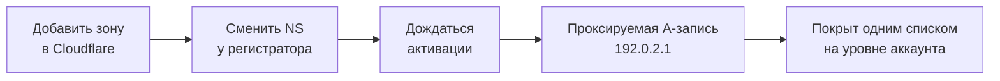

# Как перенаправить 200 припаркованных доменов на один сайт в Cloudflare

Перенаправить 200 припаркованных доменов на один сайт: каждый домен — отдельная зона, Cloudflare ограничивает скорость добавления, а NS-серверы нельзя прописать заранее.

Source: https://ru.301.sh/redirect-200-parked-domains/
Published: 2026-07-22
Cloudflare facts checked: 2026-09-02

---

Поищите, как перенаправить несколько доменов на один сайт в Cloudflare, — и вся выдача будет
отвечать про один домен. Инструкции верные — и не масштабируются, потому что на двухстах
доменах дорого обходится не редирект. Дорого обходится всё вокруг него.

Сам редирект — это один список. Дальше про всё остальное.

## На что вы подписываетесь

Редиректу на Cloudflare нужно, чтобы домен проксировался через Cloudflare, а значит, каждый домен
должен существовать в вашем аккаунте отдельной зоной. Двести доменов — это двести зон, у каждой
своя смена NS-серверов у регистратора и своё ожидание активации.

Вот где настоящая работа. Заложите её в план до старта, а не выясняйте это на сороковом домене.



Общий только последний блок. Первые четыре повторяются двести раз.

## Не прописывайте NS-серверы заранее

Инстинкт на масштабе — сначала прописать NS-серверы Cloudflare у регистратора пачкой, а потом
добавить домены. Теперь этот инстинкт ошибочен, и ломается всё тихо.

Формулировка Cloudflare:

> To prevent domain hijacking, you can no longer preset Cloudflare nameservers at your
> registrar before creating the respective zone in Cloudflare.

Пропишете заранее — и созданной потом зоне назначат **другую пару**. В итоге регистратор
указывает на NS-серверы, которые вашу зону не обслуживают, домен не активируется, и ни один из
интерфейсов не объясняет почему. На двухстах доменах именно эта ошибка даёт длинный хвост
недонастроенных имён, за которые никто не может отчитаться.

Работающий порядок такой: создать зону, прочитать пару, которую Cloudflare выдала именно для
неё, и прописать у регистратора ровно эту пару.

## Заведение зон и два числа, которые им управляют

Cloudflare ограничивает скорость создания зон. Оба числа задокументированы:

> you can only sign up a maximum of 25 domains every 10 minutes

> if you have over 50 domains and, of those domains, more are pending than active, you will
> be blocked from adding more

Второе повсеместно перевирают как «пятьдесят доменов в ожидании вас блокируют». Прочитайте
ещё раз: условие — больше пятидесяти доменов **и** ожидающих среди них больше, чем активных. Это
соотношение, а не потолок. А значит, работает не одна большая пачка, а такой порядок: добавили
пачку, дождались активации, добавили следующую, чтобы ожидающих никогда не становилось больше,
чем активных.

И после этого не верьте порогу. На аккаунтах, которые мы подключаем, блокировка срабатывает
задолго до пятидесяти доменов, если запрос идёт с API-токеном: новую зону отклоняют, как только
ожидающих становится больше, чем активных, на свежем аккаунте со второго домена. Global API Key
подчиняется документированному правилу и ничему строже. Доказательства, проверка своего
аккаунта двумя запросами и обходной путь — в
[статье про лимит зон](/api-token-cannot-add-more-zones/).

При двадцати пяти за десять минут двести доменов — это минимум восемьдесят минут одного только
добавления, даже если бы активация была мгновенной, а она не мгновенная. Планируйте это как
работу на полдня с паузами, а не как скрипт, который вы запускаете и смотрите.

## DNS-запись для домена, который только редиректит

У припаркованного домена нет origin-сервера, и редирект до него всё равно не доходит, но Cloudflare
нужно что-то проксируемое, к чему цеплять правила. Задокументированный ответ — адрес, который
намеренно никуда не ведёт:

> Use the IP address `192.0.2.1` for the `A` record. This address does not route traffic to an
> origin server but allows Cloudflare to apply rules, redirects, and Workers to incoming
> traffic.

То есть каждая зона получает `A`-запись на апексе, указывающую на `192.0.2.1`, со статусом
прокси **Proxied**, и такую же для `www`, если хотите, чтобы адрес с www тоже отвечал. Адрес
взят из диапазона, зарезервированного под документацию, — именно поэтому он безопасен: там
никогда ничего не появится.

Если запись оставить непроксируемой, редирект не сработает и посетитель получит ошибку
от адреса, которого не существует. Этот единственный переключатель стоит проверить дважды.

## Редирект: один список, а не двести правил

Вот здесь и окупается вся затея: Bulk Redirects живут на аккаунте. Описание Cloudflare:
они «allow you to define a large number of URL redirects at the account level, which can apply
across domains in your account».

Один список, загруженный один раз, покрывает все зоны. Бесплатный тариф вмещает 10 000
редиректов в 5 списках и 15 правилах, и на двухстах доменах ограничение не в этом.

Две вещи, которые надо правильно задать в самом списке.

**Include subdomains и subpath matching** решают, покрывается ли `old.example.com/anything`
записью для `example.com` или вам нужна строка на каждый путь. Для припаркованных доменов почти
всегда нужно, чтобы весь домен ловился одной записью.

**Preserve query string по умолчанию выключен**, а его включение отбрасывает то, что нёс сам
целевой адрес. Если эти домены участвуют в рекламе, это важнее, чем кажется:
[редирект, потерявший click ID, выглядит совершенно здоровым](/find-the-redirect-that-drops-your-gclid/).

И прежде чем рассчитывать объём работ на десять тысяч, проверьте, что на самом деле выдали
вашему аккаунту.
[На части аккаунтов задокументированная квота и выданная до сих пор расходятся](/cloudflare-free-plan-redirect-limits/).

## Проверка, что всё заработало, — шаг, который пропускают

Двести настроенных редиректов — это не двести работающих редиректов. Реалистичный итог первого
прохода: большинство работает, а меньшинство ломается так, что в дашборде отличить одно от
другого нельзя: зона, которая не активировалась, запись, оставшаяся непроксируемой, пара
NS-серверов, не совпадающая с тем, что стоит у регистратора.

Глазами этого не увидеть — надо опросить каждый домен:

```bash
while read -r domain; do
  code=$(curl -s -o /dev/null -w '%{http_code}' --max-time 10 "https://$domain/")
  dest=$(curl -s -o /dev/null -w '%{redirect_url}' --max-time 10 "https://$domain/")
  printf '%-30s %s %s\n' "$domain" "$code" "$dest"
done < domains.txt
```

Любая строка, где нет статуса редиректа на нужный адрес, — домен, к которому надо вернуться. Прогоните после первого прохода и ещё раз через сутки: активация не мгновенная,
и имя, упавшее в полдень, к вечеру может пройти.

## Когда задача устроена иначе

Всё описанное выше предполагает, что домены ваши и вы можете перевести их на NS-серверы
Cloudflare. Если это не так или если вам нужны сотни хостнеймов, отвечающих с сертификатами, не
забирая их DNS себе, механизм называется Cloudflare for SaaS: 100 Custom Hostnames входят
в Free, Pro и Business, дальше $0,10 в месяц за каждый следующий, до 50 000.

Это другой инструмент для другого ограничения, и он не заменяет список. Он заменяет двести зон.

## Что на самом деле снимает инструмент

Ничего сложного здесь нет. Каждый шаг описан, и каждый занимает минуту.

Больно от умножения, а потом от незнания: какие из двухсот активировались, какая запись всё ещё
серая, какой домен куда должен вести и проверял ли кто-нибудь хоть что-то с тех пор, как список
последний раз правили. Сделать один раз — работа на полдня. Держать это в соответствии с реальностью — работа,
ради которой существует [301.st](https://301.st). Для пяти доменов дашборд и цикл выше — весь
ответ.
