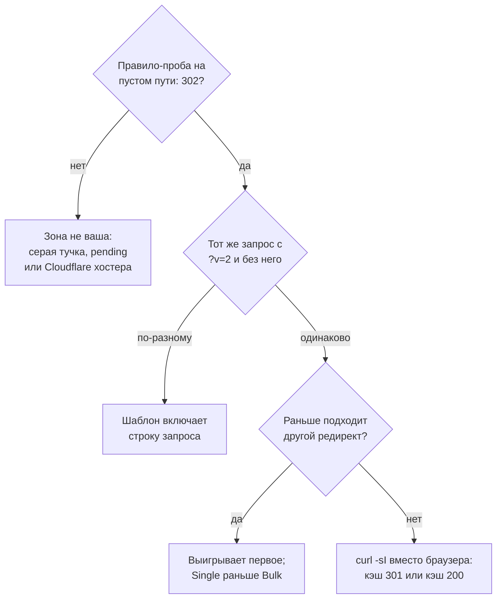

# Правило редиректа в статусе Active, и ничего не происходит

Active значит «сохранено», а не «до правила дошёл запрос». Четыре вопроса находят причину, на каждый отвечает один запрос. Всё снято живьём.

Source: https://ru.301.sh/redirect-rule-active-but-nothing-happens/
Published: 2026-08-17
Cloudflare facts checked: 2026-08-17

---

Правило лежит в списке. Переключатель говорит Active. Вы открываете адрес — грузится старая
страница, ровно как раньше. Ничто в дашборде не намекает на проблему, потому что в дашборде
ничего и не сломано: Active значит, что правило сохранено и допущено к работе. О том, дошёл ли
до него хоть один запрос, статус не говорит ничего.

Этот зазор — и есть вся диагностика. Его закрывают четыре вопроса, именно в таком порядке, и на
каждый отвечает один запрос, а не очередной взгляд в настройки. Все проверки этой статьи мы
прогнали 17 августа 2026 года на живой зоне бесплатного тарифа, включая те, ответ которых —
«правило не срабатывает»: как раз они и полезны. Если вы ещё выбираете способ, картой служит
[сравнение всех способов сделать редирект на Cloudflare](/every-way-to-redirect-on-cloudflare/);
эта статья — о том, что делать, когда выбранный способ будто бы не работает.

## Вопрос первый: запрос вообще доходит до вашей зоны

Любое другое объяснение уже предполагает, что Cloudflare видела запрос. Проверьте это первым
делом, и проверьте правилом, а не заголовком: правило — ровно та вещь, чьё отсутствие вы и
диагностируете.

Заведите временное правило редиректа на путь, которого на вашем сайте нет, с точным
сопоставлением, и уведите его куда угодно:

```txt
(http.request.uri.path eq "/zone-probe-9f3")
```

Затем спросите этот путь:

```bash
curl -sI "https://ваш-домен/zone-probe-9f3" | head -1
```

`302` означает, что ваша зона завершила этот запрос и ваши правила работают. `404` от вашего же
приложения — или что там ещё ответил бы ваш origin — означает, что не работают, и никакая
правка самого правила этого не изменит. На нашей зоне проба перешла с `404` до правила на `302`
секунды через три после его создания и вернулась к `404` после удаления, причём удаление
доезжало до каждого сервера края дольше, чем создание. Первый ответ не доказательство ни в одну
сторону; спросите дважды.

Если проба остаётся отрицательной, оказаться вне собственной зоны можно тремя способами, и в
дашборде они выглядят одинаково.

**Запись не проксируется.** Cloudflare формулирует требование прямо:

> Single Redirects and Bulk Redirects require that you proxy the DNS records of your domain (or
> subdomain) through Cloudflare.

Серая тучка — это только DNS: посетитель получает адрес вашего origin и соединяется с ним
напрямую. Предупреждение на этот случай есть, но узкое. Дашборд показывает *This rule may not
apply to your traffic* лишь тогда, когда ваше выражение называет домен, для которого нет
проксированной записи. Правило вида `http.request.uri.path eq "/"` не называет никакого домена,
поэтому сохраняется молча.

**Зона так и не активировалась.** Если NS-серверы у регистратора не переключили, зона стоит в
pending, и всё настроенное настоящее, но не живое. У этого отказа своя подпись и своя
[статья про тихие отказы редиректов](/redirect-silently-fails/).

**Ваш хостер тоже на Cloudflare.** Вот случай, который обманывает, потому что с вашей стороны
всё выглядит правильно. Если ваш домен подключён к платформе, использующей Cloudflare for SaaS,
то чьи правила выполняются, решает схема, которую Cloudflare называет Orange-to-Orange, и
условия у неё точные: запись должна быть **CNAME** на цель провайдера, она должна быть
**проксирована** в вашей зоне, а зоны должны лежать в **разных аккаунтах**. Когда это так, ваша
зона идёт первой и ваши правила выполняются. Когда не так — `A`-запись на адрес провайдера или
вовсе отсутствие своей зоны, — настройки применяет только зона провайдера, а ваше правило
редиректа остаётся заметкой в файле, который никто не читает. Признака, который можно
посмотреть, нет: документация Cloudflare прямо говорит, что ни поле API, ни настройка зоны не
сообщают, включён ли Orange-to-Orange.

Две ловушки вокруг этой проверки. `https://ваш-домен/cdn-cgi/trace` доказывает, что вы за
*каким-то* Cloudflare, а не за *своим*, и вопрос закрыть не может — зато мы подтвердили обратную
сторону: правило редиректа на `/cdn-cgi/trace` не срабатывает вовсе, так что эндпоинт остаётся
честным. А аналитика зоны с трафиком доказывает, что домен где-то резолвится в поле зрения
вашего аккаунта, но не то, что этот запрос оценивал ваш рулсет.

Подтверждение со стороны дашборда — это
[Cloudflare Trace](https://developers.cloudflare.com/rules/trace-request/), в бете и на всех
тарифах. Он симулирует запрос и перечисляет сработавшие настройки в порядке выполнения.
Подсказка вшита прямо в поле ввода: адрес «must include a hostname that belongs to your
account». Если Trace не принимает домен, ответ на первый вопрос — нет. Важная оговорка: Trace
работает по вашей конфигурации, а не по живому трафику, и саму проблему маршрутизации увидеть
поэтому не может — её видит только запрос-проба. Маршрут API у него существует, но права на него
отдельные: токен, которому можно создавать и удалять правила редиректа, получил в ответ
`Authentication error`.

## Вопрос второй: правило сопоставляется с тем, что вы отправляете на самом деле

Сюда уходит больше всего времени, и одно-единственное поведение забирает его больше, чем всё
остальное вместе взятое.

Шаблон с wildcard сравнивается с полным адресом, вместе со строкой запроса. Документация
Cloudflare по операторам говорит это примером: запрос к
`https://sub.example.com/folder2/page.html?s=value` не подходит под `*.example.com/*/page.html`,
потому что «http.request.full_uri includes the query string and its full value does not match».
В виде правила, с которым можно работать: **шаблон с wildcard, не оканчивающийся на `*`,
никогда не совпадёт с запросом, несущим строку запроса.** А именно это и происходит, когда вы
проверяете правило, добавив `?v=2`, чтобы обойти кэш браузера. Обойдено оказывается правило,
страница грузится как обычно, и вы делаете вывод, что правило сломано.

Вот эта пара, снятая живьём, вместе с остальным поведением сопоставления, которое стоит знать:

| Правило | Запрос | Ответ |
|---|---|---|
| wildcard `https://301.sh/rule-probe/*.html` | `/rule-probe/x.html` | `302` |
| то же правило | `/rule-probe/x.html?v=2` | **`404`, редиректа нет** |
| то же правило | `/rule-probe/deep/x.html` | `302` — `*` переходит через слеши |
| то же правило | `/rule-probe/x.HTML` | `302` — `wildcard` не различает регистр |
| `http.request.uri.path eq "/Rule-Probe-Case"` | `/Rule-Probe-Case` | `302` |
| то же правило | `/rule-probe-case` | **`404`, `eq` различает регистр** |
| `http.request.uri.path eq "/rule-probe-slash"` | `/rule-probe-slash/` | **`404`, слеш — часть пути** |

Строка про регистр заслуживает второго взгляда, потому что два интерфейса расходятся. Оператор
`wildcard` не различает регистр — и по документации, и по замеру; различает его вариант `strict
wildcard`. А `eq` на пути сравнивает строки, поэтому правило, набранное с заглавными буквами из
проектного документа, тихо не совпадает ни с чем, что шлют посетители.

У Bulk Redirects алгоритм сопоставления другой, и разница работает в обратную сторону. Bulk
Redirect сопоставляется по схеме, домену и пути — **строка запроса в сопоставлении не участвует
вовсе**, так что кэш-бастер, убивающий правило с wildcard, здесь безразличен. Его место
занимают значения по умолчанию: `Subpath matching` и `Include subdomains` выключены, пока вы их
не включите, поэтому `/blog` не покрывает `/blog/post`, а `example.com` не покрывает
`www.example.com`. И список сам по себе не делает ничего. Cloudflare проверяет редиректы каждого
списка, «that is enabled by a Bulk Redirect Rule» — загрузить список и не завести правило,
которое его включает, значит получить полный и молчаливый холостой ход.

## Вопрос третий: не ответил ли кто-то раньше, чем дошла очередь до вашего правила

Продукты семейства Rules выполняются в фиксированном порядке, а редирект — терминирующее
действие. Cloudflare говорит это без оговорок:

> for terminating actions (Block, Redirect, or one of the challenge actions), rule evaluation
> will stop and the action will be executed immediately

Отсюда три следствия, одно из которых мы измерили. Два правила редиректа, подходящие под один
запрос: выигрывает первое, всегда — мы выкатили пару с разными целями, и в ответе оказалась цель
первого. Single Redirects идут в порядке продуктов раньше Bulk Redirects, так что если
правило на адрес есть у обоих, отвечает Single Redirect. А Page Rules, если они у вас ещё
остались, проигрывают всему этому: современные продукты Rules «take precedence over Page Rules».
Старое перенаправляющее Page Rule — не то, что борется с вашим новым правилом. Это то, что
срабатывает, когда ваше новое правило не подошло, и симптом получается ещё более сбивающий с
толку: редирект происходит, но туда, куда вы ничего не настраивали.

Тот же порядок фаз — причина, по которой редирект нельзя посчитать на том краю сети, который его
и выдаёт; об этом [отдельная статья](/count-clicks-on-a-redirect/).

## Вопрос четвёртый: не сработало ли правило, пока вы смотрите на закэшированный ответ

Работающий редирект легко спрятать. `301` — постоянный редирект, и правила Cloudflare отдают его
без заголовка `Cache-Control`, поэтому браузер вправе закэшировать его эвристически и ещё долго
после правки водить вас на старую цель. Верно и обратное: браузер, однажды получивший на этот
адрес `200`, может продолжать отдавать его из кэша, пока край сети редиректит всех остальных.
Проверяйте через `curl -sI`, который не кэширует ничего, и только потом вкладкой браузера.

А когда потянетесь к кэш-бастеру, помните вопрос второй: дописанное `?v=2` меняет, подходит ли
правило с wildcard. Стандартный совет, как заставить браузер сходить за свежим ответом, — это
стандартный способ заставить именно эту проверку соврать. Возьмите приватное окно, другой
браузер или `curl`, но не параметр запроса.



## Когда редирект вообще был не за Cloudflare

Один случай лежит вне дерева. Если редирект живёт на вашем origin — переписывание в `.htaccess`,
маршрут во фреймворке, — то у Cloudflare нет правила, которому срабатывать, и нечего трейсить.
Она передаёт то, что сказал origin, а origin умеет вести себя противоречиво так, что из дашборда
это невидимо. В июле именно это и описали: один и тот же адрес отвечал `301`, когда шёл через
один дата-центр Cloudflare, и `200` — когда через другой, при том что на прямой запрос origin
каждый раз отдавал чистый `301`. Какой бы ни была причина, лечение структурное. Редирект,
выраженный правилом на краю сети, отвечает до того, как к origin вообще обратятся, и потому не
зависит от того, что origin решит в эту секунду.

## Где становится неаккуратно

Правило, у которого цель равна источнику, порождает петлю, и Cloudflare её не останавливает. Мы
направили правило на его собственный путь и прошли по цепочке: шесть переходов спустя оно всё
ещё вело само на себя. Браузер называет это «слишком много редиректов»; проверка мониторинга
вполне может назвать это `302` и пропустить.

Бесплатной зоне полагается 10 правил Single Redirects, и квота эта на зону. Упереться в неё
значит получить отказ при создании, а не в рантайме, так что причиной нашего симптома она не
бывает — зато бывает причиной, по которой логику ужимают в одно wildcard-правило, где описанное
выше поведение строки запроса и начинает кусаться. Полная таблица квот — в
[статье про лимиты редиректов](/cloudflare-free-plan-redirect-limits/).

Trace не оценивает выключенные правила, что правильно и временами сбивает с толку: отключённое
правило выглядит в результатах так же, как то, которое не подошло. И Trace отражает
конфигурацию: запрос, который до вашей зоны не доходит, трейсится безупречно и всё равно падает
в бою. Поэтому вопрос первый идёт первым и отвечается настоящим запросом.

## Во что это обходится на портфеле

Для одного домена это работа на десять минут. Два вызова `curl` и одно временное правило
показывают, на каком из четырёх вопросов ответ неправильный, а лечение следует из ответа.

Арифметика меняется, когда тот же вопрос надо задать двумстам доменам, которых в этом месяце
никто не открывал, — потому что ни один из этих отказов о себе не заявляет. Правило, переставшее
совпадать после переезда платформы, изнутри выглядит точно так же, как работающее. Это и есть
аргумент за то, чтобы задавать каждому домену один и тот же вопрос по расписанию: цикл из
[скрипта аудита](/audit-300-domains-one-script/), если вам нравятся скрипты, и
[301.st](https://301.st), если вам больше нравится, чтобы за портфелем следили непрерывно и
сообщали, когда строка изменилась. Для горстки доменов скрипта и записи в cron честно хватает.
