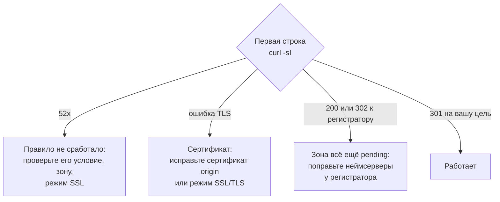

# Редирект в Cloudflare настроен, а домен отдаёт 522, 525 или страницу-парковку

Зона зелёная, правило на месте, а домен отдаёт 522, ошибку сертификата или парковку. Три сценария тихого отказа в Cloudflare и один curl, который их различает.

Source: https://ru.301.sh/redirect-silently-fails/
Published: 2026-07-23
Cloudflare facts checked: 2026-07-23

---

Вы сделали редирект. В дашборде домен активен, облачко оранжевое, правило лежит в списке там,
где вы его оставили. А потом кто-то открывает домен и получает `522`, или предупреждение о
сертификате, или страницу, предлагающую купить это имя. Ничто из этого не ваш `301`.

Редирект не упал с грохотом. Просто отвечает не он. А дашборд — неподходящее место, чтобы это
заметить. К такому приводят три разные ошибки конфигурации, у каждой свой почерк, и различает
их один запрос. Это колонка отказов из
[скрипта аудита](/audit-300-domains-one-script/) крупным планом и изнанка
[всех способов сделать редирект на Cloudflare](/every-way-to-redirect-on-cloudflare/): те же
методы и то, как каждый из них замолкает.

## Правило не сработало — и запрос ушёл на origin, которого нет

Редирект на припаркованном домене — это две части, которые выглядят как одна. Есть DNS-запись,
`A`-запись на апексе, проксируемая через Cloudflare, и есть правило, которое и делает редирект.
[Инструкция по припаркованным доменам](/redirect-200-parked-domains/) направляет эту запись на
`192.0.2.1`, а собственное примечание Cloudflare объясняет, почему адрес, ведущий в никуда, —
правильный выбор:

> This address does not route traffic to an origin server but allows Cloudflare to apply rules,
> redirects, and Workers to incoming traffic.

Работать схему заставляет именно правило. Правило редиректа выполняется на краю сети и отвечает
на запрос там же, поэтому Cloudflare вообще не открывает соединение к `192.0.2.1`. Уберите
правило, ограничьте его хостнеймом, который не совпадает, залейте список не в тот аккаунт или
включите прокси на записи раньше, чем появится правило, — и Cloudflare сделает ровно то, что ей
велит оранжевое облако. Она проксирует запрос на `192.0.2.1`. А там намеренно никто не слушает.

Посетитель получает `522`. Определение Cloudflare буквальное:

> Error 522 occurs when Cloudflare times out contacting the origin web server.

Ждать приходится не мгновение. Cloudflare отправляет SYN и, в задокументированном случае,
сдаётся, когда origin-сервер не отвечает SYN+ACK за 19 секунд, повторяя попытки с задержками
1,1,1,1,1,2,4,8. То есть домен висит секунд двадцать, а потом показывает страницу ошибки
Cloudflare. `A`-запись на месте, прокси включён, на вкладке DNS всё выглядит сделанным, а
единственная недостающая деталь никакого следа там не оставила.

Замените адрес-заглушку на настоящий origin — и то же отсутствующее правило проявится другим
кодом из того же семейства: `521`, когда origin отказывает в соединении, `523`, когда он
недостижим, `524`, когда соединение открылось, но ответ не пришёл вовремя. Причина не меняется.
Запрос дошёл до origin, потому что на краю сети его не перехватило ни одно правило.

Отсюда и признак. Если правило редиректа сработало, до origin дело не доходит вообще — значит, и
таймауту неоткуда взяться. Любой `52x` на домене, который должен редиректить, — это
доказательство, что для этого запроса редирект не выполнился. Почему правило, которое показывает
Active, всё равно может не выполняться ни разу, —
[отдельное дерево диагностики](/redirect-rule-active-but-nothing-happens/).

## Full (Strict) превращает редирект на origin в ошибку сертификата

Не всякий редирект живёт на краю сети. Многие из них — это `301`, который отдаёт сам
origin-сервер, а Cloudflare проксирует перед ним. Такая схема работает, только если Cloudflare
может достучаться до origin по TLS и принять предъявленный сертификат, а насколько строго она к
этому относится, решает режим шифрования SSL/TLS.

Поставьте режим Full (Strict) — и сертификат должен быть таким, которому Cloudflare доверяет.
Когда само рукопожатие не завершается, посетитель получает `525`:

> This error indicates that the SSL handshake between Cloudflare and the origin web server
> failed.

Cloudflare перечисляет обычные причины: не установлен валидный сертификат, закрыт порт `443`, нет
поддержки SNI, не сошлись шифры. Когда рукопожатие завершается, но сертификат не проходит
проверку, код будет уже `526`:

> Cloudflare cannot validate the SSL certificate at your origin web server.

Этот код связан именно с Full (Strict) и срабатывает на сертификате, который истёк, отозван,
выписан не на то имя, потерял часть цепочки или подписан тем, кому браузер не доверяет. Редирект,
который origin хочет отдать, при этом в порядке. Посетитель его просто не видит, потому что
соединение, которое его донесло бы, так и не устанавливается.

У той же проблемы есть более мягкая версия на только что добавленном домене. Universal SSL
выпускается не сразу и покрывает один уровень поддомена, а не два. Запрос, пришедший до того, как
сертификат стал активным, или на имя, которое сертификат не покрывает, получит TLS-ошибку в
браузере ещё до того, как у редиректа появится шанс сработать.

## Домен так и не переехал, и запрос вообще не доходит до Cloudflare

У третьего отказа нет кода ошибки Cloudflare, потому что Cloudflare здесь не участвует. Вы
добавили зону, написали правило, а неймсерверы у регистратора так и не поменяли на пару, которую
выдала Cloudflare. Зона висит в `pending`. Всё, что вы настроили, существует, и ничего из этого
не работает.

Есть и менее заметный способ попасть туда же. Прописать неймсерверы пачкой до создания зон — инстинкт на
масштабе — теперь выходит боком:

> To prevent domain hijacking, you can no longer preset Cloudflare nameservers at your registrar
> before creating the respective zone in Cloudflare.

Сделаете так — зоне назначат другую пару, регистратор будет указывать на неймсерверы, которые её
не обслуживают, и домен никогда не активируется. И ни один из интерфейсов не скажет почему.

Пока домен в ожидании, посетитель видит то, что отдаёт регистратор. Часто это страница-парковка,
иногда с предложением купить имя, и отвечает она обычно кодом `200`. Проверка, которая
спрашивает только «поднят ли домен», такой ответ засчитает: что-то же ответило. Просто ответили
не вы. А написанный вами редирект спит за зоной, которая так и не проснулась.

## Один запрос отличает все три

Каждый режим отвечает на `curl` по-своему, поэтому аудит и читает строку статуса раньше всего
остального:

```bash
curl -sI "https://the-domain/"
```

`52x` в первой строке означает, что запрос идёт через Cloudflare, а правило не сработало.
TLS-ошибка раньше любого HTTP-статуса означает, что не удалось рукопожатие до origin или на
краю сети ещё не готов сертификат. `200` или `302`, у которого `location` ведёт к регистратору,
а не `301` на ваш целевой адрес, означает, что домена на Cloudflare нет вовсе.
[Скрипт аудита](/audit-300-domains-one-script/) выводит ровно это в колонках `CODE` и
`DESTINATION` — так эти случаи и находят по всему портфелю, а не по одному домену за раз.



## Где картина менее аккуратна, чем кажется

На настоящем origin `522` бывает не постоянным, а плавающим — обычно когда файрвол на origin
блокирует часть диапазонов Cloudflare и не блокирует остальные, так что один и тот же домен то
проходит проверку, то нет. В варианте с `192.0.2.1` такой неоднозначности нет: адрес
зарезервирован и не отвечает никогда, поэтому `522` там каждый раз.

Зона в ожидании — единственный случай, который дашборд от вас активно прячет, потому что изнутри
аккаунта ничего не сломано. Правило валидно, запись валидна, зона ждёт. Свидетельства есть только
снаружи — в том, что домен отвечает на запрос, который не идёт через Cloudflare.

И страница-парковка регистратора не всегда смирно сидит на `200`. Некоторые регистраторы
отвечают `302` на собственный парковочный хост, и это редирект, просто не ваш. Скрипт аудита
ловит такое, потому что читает, куда ведёт `location`, а не просто фиксирует сам факт
редиректа. Коды и
определения здесь сверены с документацией Cloudflare 23 июля 2026 года.

## Чего не даёт один взгляд

Все три случая на первый взгляд зелёные и видны только снаружи, поэтому ловить их — значит
задавать каждому домену один и тот же вопрос по расписанию, а не доверять дашборду. Для горстки
доменов цикл из [скрипта аудита](/audit-300-domains-one-script/) в кроне — это весь ответ, и
начинать стоит с него. Бесплатный алерт Cloudflare о недоступном origin его не заменит: у нас
он был включён, и
[поддомен двадцать минут отдавал 522 без единого уведомления](/what-cloudflare-free-alerts-you-about/).

На масштабе, где у портфеля есть длинный хвост имён, которые никто не открывал месяцами, вопрос
приходится задавать непрерывно, а ответ сравнивать с предыдущим, чтобы домен, который тихо изменился,
сразу попал в отчёт. Вот эту часть [301.st](https://301.st) берёт на себя: та же проба по всему портфелю,
по кругу, с оповещением, когда строка меняется. Для двадцати доменов записи в кроне и скрипта
действительно достаточно.
