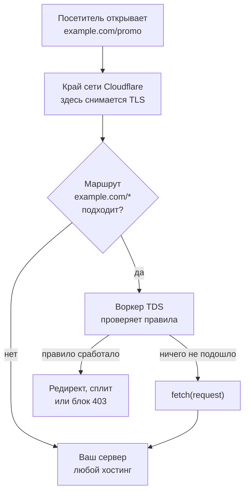
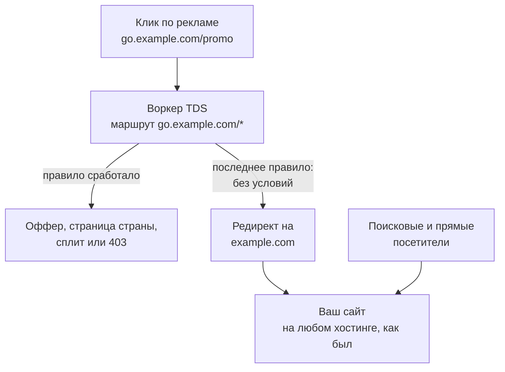
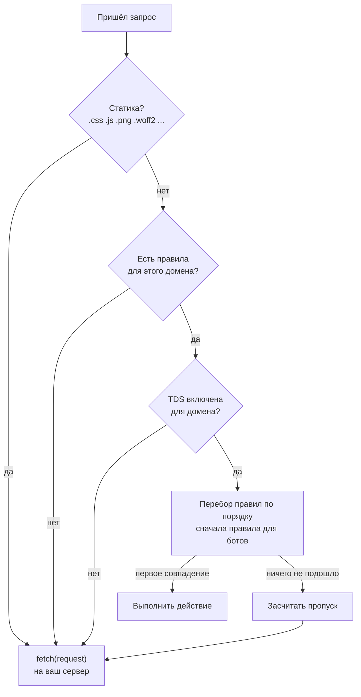
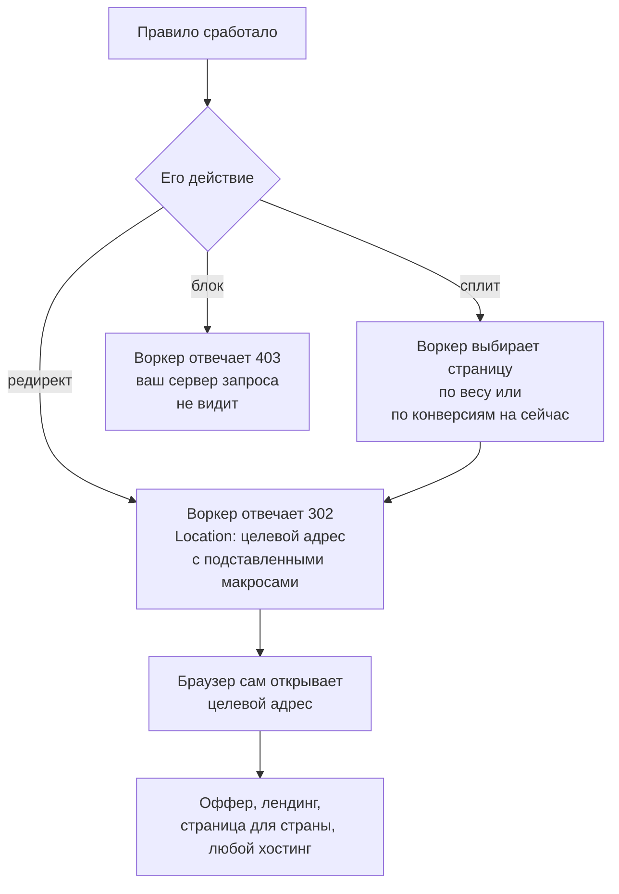

# TDS на Cloudflare Workers: как раскидать трафик до вашего сервера

Домен может смотреть на любой хостинг, а каждый посетитель всё равно сначала проходит правила TDS: страна, устройство, бот. Как это устроено в 301.st, по шагам.

Source: https://ru.301.sh/tds-on-cloudflare-workers/
Published: 2026-10-06
Cloudflare facts checked: 2026-10-06

---

> Сайт у меня на VPS во Франкфурте. Как воркер Cloudflare может куда-то отправить посетителя,
> если сайт вообще не на Cloudflare?

В этом вопросе спрятано допущение: будто воркер — это
место, где сайт должен жить, вроде хостинга. Воркер на маршруте устроен иначе. Он работает на
краю сети Cloudflare, между посетителем и тем адресом, куда указывает ваш DNS, и видит каждый
запрос к домену раньше вашего сервера.

Именно такое место и нужно системе распределения трафика. TDS смотрит на посетителя,
проверяет список правил и решает, куда его отправить: на страницу для его страны, на
мобильный оффер, на один из трёх лендингов в сплите или дальше на ваш сервер, как будто
ничего не случилось. Сервер при этом может быть каким угодно: VPS, виртуальный хостинг,
конструктор сайтов или статика на Cloudflare Pages — туда выкладывает собранные партнёрские
сайты [Site Generator](https://generator.ink). TDS всё равно, она туда только передаёт
запросы. Где ставить TDS — на сам домен сайта или на отдельный поддомен для рекламных
кликов, — разобрано ниже.

Ниже разбираем, как это работает на Cloudflare, на примере TDS в [301.st](https://301.st):
всё описано по её исходному коду. Все лимиты Cloudflare сверены с документацией 6 октября
2026 года.

## Где стоит воркер

Когда DNS-запись в зоне Cloudflare проксирована (оранжевое облако), браузер посетителя
соединяется не с вашим сервером, а с Cloudflare. Cloudflare снимает TLS, применяет правила
зоны и уже сама открывает соединение с адресом из записи. Маршрут воркера встраивается
ровно в этот промежуточный шаг. Что происходит, когда воркер передаёт запрос дальше,
сказано в документации по
[маршрутам](https://developers.cloudflare.com/workers/configuration/routing/routes/):

> Calling `fetch()` on the incoming `Request` object will trigger a subrequest to your
> application server, as defined in the DNS settings of your Cloudflare zone.

То есть воркер не заменяет сервер. Он стоит перед ним, а сервер остаётся там, куда
указывает DNS-запись.



Чтобы это работало, нужны четыре условия. Каждое из них — место, где настройка ломается
молча.

**Зона на Cloudflare.** NS-серверы домена указывают на Cloudflare. Маршрут можно создать
только внутри своей зоны.

**Запись проксирована.** Маршрутам нужна «a DNS record set up for the domain or subdomain
proxied by Cloudflare». Запись с серым облаком отправляет посетителей прямо на IP вашего
сервера, и воркер для них не запускается.

**Шаблон маршрута покрывает домен.** `example.com/*` ловит `example.com` и любые пути на
нём, но не `www.example.com`. Это отдельный домен: ему нужен свой маршрут или шаблон
вида `*example.com/*`.

**Запрос не забирает более точный маршрут.** «When more than one route pattern could
match a request URL, the most specific route pattern wins», и выполняется только этот
один воркер. Если у вас уже есть воркер на `example.com/api/*`, `/api/` останется за ним.

От вашего сервера ничего не требуется. Он отвечает Cloudflare так же, как отвечал раньше.
Обычные настройки origin при этом никуда не деваются: режим SSL в зоне должен
соответствовать тому, что умеет сервер, иначе Cloudflare ответит ошибкой 525 или 526
([разбор этих ошибок](/redirect-silently-fails/) — в отдельной статье).

## Что 301.st создаёт в вашем аккаунте

TDS работает не на нашей инфраструктуре, а в вашем аккаунте Cloudflare. Так задумано:
запросы расходуют вашу квоту Workers, правила лежат в вашей базе, и воркер продолжает
работать, даже если наш API недоступен.

При подключении аккаунта вы выдаёте 301.st API-токен. Токен нужен всей платформе, включая
DNS и редиректы; для TDS из него работают права Workers Scripts, Workers Routes, D1 и
Pages Read. С ними платформа создаёт в аккаунте:

| Что | Имя | Зачем |
| --- | --- | --- |
| Воркер | `301-tds` | сама TDS |
| Воркер | `301-health` | проверки здоровья доменов, отдельно от TDS |
| База D1 | `301-client` | правила, настройки доменов и почасовые счётчики |
| Маршрут | `yourdomain.com/*` | по одному на домен, где есть хотя бы одно активное правило |

Домен без правил маршрута не получает, и его трафик воркер вообще не видит. Маршрут,
который уже принадлежит другому воркеру, платформа не перехватывает.

Обратите внимание на шаблон. Маршрут создаётся ровно на тот домен, который вы добавили.
Если посетители приходят и на `example.com`, и на `www.example.com`, добавьте оба.

### Основной домен или поддомен go

Маршрут на `example.com/*` ставит воркер перед всем трафиком сайта: поисковыми посетителями,
прямыми заходами, роботами поисковиков и каждой картинкой, стилем и шрифтом, которые они
грузят. Рекламные клики, которые вы на самом деле хотите раскидывать, — малая часть этого
потока. Остальное тратит квоту Workers на посетителей, для которых правил нет, — так TDS и
загоняет сайт на платный тариф. А ошибка в правиле задевает весь сайт, включая поисковики.

Поэтому мы рекомендуем отдать рекламным кликам отдельный хост:



Добавьте `go.example.com` как домен в 301.st. Платформа сама создаст для него
проксированную запись-заглушку: отдавать там нечего. Рекламу ведите на `go.example.com`,
заведите на нём свои правила и ещё одно, последнее: без условий, с самым низким приоритетом и
редиректом на `https://example.com/`. Тогда каждый посетитель, которого не забрало другое
правило, попадёт на сайт. Сам сайт и его собственный трафик воркер не видит вообще.

Одно на `go` работает иначе: когда кончается квота Workers, режим «пропускать воркер» не
спасает — без воркера запрос упирается в заглушку и получает ошибку. Зато квоту там тратят
только рекламные клики, и кончается она гораздо позже.

TDS на основном домене — для тех, кому нужно раскидывать каждого посетителя. Для сайта на
сервере это работает уже сейчас. Для сайта на Cloudflare Pages, то есть на custom domain
проекта Pages, как у сайтов из Site Generator, 301.st пока не ставит маршрут на основной
домен: применение правил падает с ошибкой, в которой платформа советует поддомен. Поддержка
уже в разработке, а до тех пор — `go`.

## Один запрос по шагам

Вот что воркер `301-tds` делает с запросом, в том порядке, в каком это написано в коде.



**Два пути заняты.** На `/health` и `/_health` воркер отвечает сам: это проверки
платформы. Если на вашем сайте есть своя страница по одному из этих адресов, посетители
увидят ответ воркера вместо неё.

**Статика идёт насквозь.** Запросы к стилям, скриптам, картинкам, шрифтам и похожим файлам
правила не проходят вовсе. Воркер для них всё равно вызывается, потому что маршрут
покрывает все пути, но в базу он за ними не ходит.

**Правила берутся из вашей D1 и кешируются на минуту.** Воркер читает все активные правила
одним запросом и держит их в памяти 60 секунд. Кеш живёт внутри одного экземпляра
воркера, а Cloudflare запускает их много, поэтому после правки разные посетители ещё до
минуты могут попадать то на старые правила, то на новые.

**Изменения доезжают до края сети по кнопке Apply.** Правка правила в 301.st сохраняется
как черновик. Apply записывает правила в вашу D1 через API Cloudflare. Кроме того, раз в
час воркер сам забирает с платформы полный набор правил — на случай, если запись не
прошла.

**Срабатывает первое подходящее правило.** Правила перебираются в фиксированном порядке:
сначала правила для ботов, потом остальные правила щита, потом правила SmartLink. Внутри
каждой группы решает приоритет, от большего к меньшему. Первое правило, у которого
выполнены все условия, выполняет своё действие, остальные уже не проверяются.

Группа важнее приоритета, и на этом легко попасться. Правилом для ботов считается только
то, в котором стоит условие «бот». Допустим, у вас включён Bot Shield, который блокирует
всех ботов, и правило по дата-центрам с большим приоритетом, которое уводит трафик из
дата-центров на другую страницу. Мониторинг аптайма с облачного сервера — бот, поэтому
его первым увидит Bot Shield и заблокирует. До правила по дата-центрам дело не дойдёт.

**Ничего не подошло — запрос уходит на ваш сервер.** Он передаётся через `fetch(request)`
без изменений: с тем же методом, заголовками, куками и телом. Посетитель видит сайт так,
будто TDS нет. Воркер только прибавляет единицу к почасовому счётчику пропусков.

## Что правило умеет проверять

Правило — это набор условий, и для срабатывания должны выполниться все. Незаполненное
условие не проверяется вовсе, поэтому правило, где задан только список стран, сработает
на любом устройстве, в любом браузере и в любой час, лишь бы страна подошла.

| Условие | Откуда воркер его берёт |
| --- | --- |
| Страна или страны-исключения | `request.cf.country`, Cloudflare определяет её по IP посетителя |
| Устройство: мобильное или десктоп | клиентская подсказка `Sec-CH-UA-Mobile`, без неё — user agent; iPad считается десктопом |
| Операционная система, браузер | user agent |
| Бот, категория бота, подтверждён ли, тип сети | классификатор ботов, о нём ниже |
| Час и день недели | часы в UTC, а не местное время посетителя |
| `utm_source`, другие параметры запроса | строка запроса; список источников и список параметров в одном правиле срабатывают, если подошёл любой из них |
| `utm_campaign` | строка запроса, отдельным условием |
| Путь | регулярное выражение по пути, без строки запроса |
| Реферер | регулярное выражение по заголовку `Referer` |

Часы в UTC сделаны намеренно. Счётчики хранятся по часам UTC, и правило по местному
времени посетителя размазалось бы по всем часам отчёта. Если нужны «ночи в Германии»,
пересчитайте их в UTC сами и не забудьте про перевод часов в марте и октябре.

Пара «`utm_source` или параметр» — единственное место, где правило работает через «или».
Пресет для Facebook срабатывает на `utm_source=facebook` или на наличие `fbclid`: клики из
платной соцсети часто приходят с `fbclid` и вообще без UTM-меток.

По IP посетителя, по конкретному номеру ASN, по языку браузера и по кукам TDS не
сопоставляет. Если нужно что-то из этого, правило в 301.st сегодня этого не сделает.

## Что правило умеет делать



Редирект — это ответ браузеру. Воркер говорит ему, куда идти, и на этом его работа
закончена: дальше браузер сам соединяется с целевой стороной, где бы она ни была. Что
происходит там, воркер уже не видит. Поэтому, чтобы засчитать конверсию на чужом сайте,
нужен постбек — о нём ниже.

**Редирект.** С кодом, который вы выберете: 301, 302, 307 или 308. Постоянный код велит
браузеру запомнить ответ, а решение TDS зависит от конкретного посетителя, поэтому в
пресетах стоит 302. Кроме того, каждый редирект TDS уходит с
`Cache-Control: private, no-cache`, чтобы общий кеш не отдал ответ одного посетителя
следующему.

Отправить посетителя можно пятью способами: обычным HTTP-редиректом, страницей с meta
refresh и необязательной задержкой, meta refresh со скрытым реферером, через JavaScript
`location.replace()` или через iframe, при котором в адресной строке остаётся ваш домен.
Отдельный переключатель добавляет к любому из них `Referrer-Policy: no-referrer`. По
умолчанию реферер не скрывается: часть партнёрских сетей атрибутирует именно по нему и
молча перестала бы считать.

В целевом адресе можно использовать макросы, которые воркер заполнит из запроса:
`{country}`, `{device}`, `{os}`, `{browser}`, `{path}` и `{host}`. Правило, которое
отправляет каждую страну на `https://example.net/{country}/`, — это одно правило, а не
двести.

**Блок.** Воркер отвечает `403 Blocked`, и ваш сервер этот запрос не видит.

**Сплит.** У сплит-правила несколько целевых адресов, и для каждого посетителя оно
выбирает один. В фиксированном сплите вы задаёте веса: `90` и `10` отправляют девять
посетителей из десяти на первую страницу. Нулевой вес ставит страницу на паузу, не теряя
её статистику. Три других режима учатся на конверсиях по мере их прихода и сдвигают трафик
к странице, которая конвертит лучше: Thompson sampling (он по умолчанию), UCB и epsilon
greedy. Ещё сплит может держать отдельные пулы страниц для групп стран, чтобы немецкий
трафик тестировался на немецких страницах.

Чтобы сплит учился, он должен знать, какой посетитель сконвертился. Для этого воркер
добавляет к целевому адресу подписанный токен клика, а постбек возвращает конверсию
обратно. Как это настроить с партнёркой и рекламной сетью — в
[статье о постбеках для TDS](/postbacks-for-a-tds/).

## Как TDS отличает ботов

Каждый запрос проходит через классификатор до того, как на него посмотрит хоть одно
правило. По user agent классификатор раскладывает ботов по пяти группам: поисковики,
краулеры для обучения AI, мониторинг аптайма, модераторы рекламы и сервисы превью ссылок.
User agent короче десяти символов считается ботом. User agent со словами `bot`, `crawl`
или `spider`, который не узнала ни одна таблица, — неподтверждённый бот без группы.

User agent — строка, которую может прислать кто угодно. Поэтому у классификатора есть
второй, отдельный ответ: подтверждён бот или нет. Этот ответ даёт только Cloudflare. Когда
она убедилась, что запрос действительно пришёл от того бота, которым он представился, она
выставляет `request.cf.verifiedBotCategory`
([описание поля](https://developers.cloudflare.com/ruleset-engine/rules-language/fields/reference/cf.verified_bot_category/)).
Группу задаёт таблица user agent, подтверждение — Cloudflare. Парсер, который
представляется Googlebot, попадёт в группу поисковиков и останется неподтверждённым.

Третий ответ — сеть. Если автономная система, из которой пришёл запрос, принадлежит
хостингу или облаку (AWS, Google, Azure, Hetzner, OVH, DigitalOcean и подобным), запрос
помечается как пришедший из дата-центра. Живые люди сидят в домашних и мобильных сетях.
Чекеры, парсеры и системы модерации часто работают из дата-центров, каким бы браузером
они ни представлялись.

В правиле всё это можно комбинировать: бот или нет, какие группы, подтверждён или нет,
дата-центр или нет.

## Пресеты

Писать правила с нуля не обязательно. В 301.st есть готовые шаблоны, каждый — одно
правило с уже выставленным приоритетом.

| Пресет | На кого срабатывает | Что делает |
| --- | --- | --- |
| AI Guard | краулеры для обучения AI | блокирует или уводит на выбранную страницу |
| Cloaking Standard | модераторы рекламы, поисковики, превью ссылок | уводит на выбранную страницу («вайт») |
| Datacenter Cloak | любой запрос из сети дата-центра, бот он или нет | уводит на выбранную страницу |
| Bot Shield | любой бот | блокирует или уводит |
| Geo + Mobile | мобильные посетители из выбранных стран | редирект |
| Mobile Redirect | мобильные посетители | редирект |
| Desktop Redirect | посетители с десктопа | редирект |
| Geo Filter | посетители из выбранных стран | редирект |
| Facebook Traffic | `utm_source` из facebook, fb, fb_ads или meta, либо `fbclid` | редирект |
| Google Traffic | `utm_source` из google или google_ads, либо `gclid` | редирект |
| UTM Split | выбранные значения `utm_source` | редирект |

AI Guard не трогает поисковики намеренно. У них своя группа, а блокировка поисковиков ради
защиты от парсеров выкинула бы сайт из выдачи.

### Что делают два пресета клоаки и чем они грозят

Cloaking Standard и Datacenter Cloak показывают одну страницу системам, которые проверяют
сайт, и другую — людям, которые на него приходят. Именно это слово и означает, и пресеты
названы так прямо, чтобы никто не включил их по ошибке.

Знайте, с чем имеете дело.
[Правила Google о спаме](https://developers.google.com/search/docs/essentials/spam-policies)
определяют клоакинг как «presenting different content to users and search engines with the
intent to manipulate search rankings and mislead users». Google Ads называет его в
политике [Circumventing systems](https://support.google.com/adspolicy/answer/15938075):
«showing different content on your website to different people or to Google to try to
hide things that might break Google Ads' rules». Там же указано наказание: аккаунты «will
be suspended upon detection and without prior warning». У других рекламных площадок
правила того же рода.

На той же странице Google Ads проводит границу и для всего остального в этой статье:
«It's okay to show slightly different content to different people, like showing a landing
page or ad destination in different languages, having different special offers, or
adjusting for geographical location». А запрещённый пример там такой: магазин показывает
Google страницу с одеждой, а на самом деле продаёт оружие. Гео-правило, которое отправляет
каждую страну на свой лендинг с тем же оффером, подпадает под первое описание. По какую
сторону окажется конкретное правило — решать вам, и риск тоже ваш.

Если вы ими пользуетесь, важны два технических момента. Первый: Cloaking Standard
срабатывает по user agent, если не включить ещё и условие «подтверждён». Без него
модератор, который пришёл с обычным браузерным user agent, пройдёт на настоящую страницу,
а любой, кто впишет в user agent `Googlebot`, получит вайт. Второй: Datacenter Cloak
узнаёт сети по названию провайдера, которому они принадлежат. Крупные облака он ловит, а
провайдера, которого нет в списке, пропустит.

## Во что это обходится на Free

Маршрут запускает воркер на каждый запрос к домену: на саму страницу и на каждую картинку,
файл стилей и шрифт, которые она подгружает. Пропуск статики, о котором говорилось выше,
экономит работу с базой, но не вызовы воркера. Тариф Workers Free даёт 100 000 запросов в
сутки со сбросом в полночь по UTC
([лимиты](https://developers.cloudflare.com/workers/platform/limits/)).

У базы своя суточная норма. D1 на Free включает 5 миллионов прочитанных строк и 100 000
записанных строк в сутки ([цены D1](https://developers.cloudflare.com/d1/platform/pricing/)).
На домене с правилами каждый запрос страницы читает настройки домена и пишет как минимум
одну строку счётчика. Так что на запросах страниц обе нормы кончаются примерно на одном и
том же трафике.

А дальше они ведут себя по-разному.

**Когда кончается D1,** запросы к базе, по словам Cloudflare, перестают выполняться до
сброса. TDS считает неудавшееся чтение правил за «правил нет» и пропускает каждый запрос
на ваш сервер. Сайт продолжает работать. Перестают работать распределение и подсчёт.

**Когда кончаются Workers,** всё решает маршрут. Маршрут либо пропускает воркер — «Bypasses
the Worker. Requests behave as if no Worker is configured», — либо отдаёт ошибку —
«Returns a Cloudflare `1027` error page». 301.st сегодня этот режим при создании маршрута
не выставляет. Откройте в дашборде Cloudflare раздел Workers & Pages, найдите маршруты
воркера `301-tds` и проверьте режим на каждом. Для TDS перед живым сайтом почти всегда
нужен первый вариант: когда квота кончится, посетители попадут на ваш сервер без
распределения, а не на страницу с ошибкой.

**Сколько стоит снять оба лимита.** Тариф Workers Paid стоит $5 в месяц за аккаунт, в него
входит 10 миллионов запросов, дальше $0.30 за каждый следующий миллион
([цены](https://developers.cloudflare.com/workers/platform/pricing/)). Суточного лимита
запросов на нём нет, и суточные лимиты D1 он тоже снимает. Если TDS стоит больше чем на
паре небольших доменов, вам нужен этот тариф.

[В статье про воркеры аналитики ботов](/bot-analytics-worker-on-every-request/) та же
арифметика маршрута разобрана на живых цифрах этого сайта.

## Настройка по шагам

1. **Перенесите зону на Cloudflare**, если она ещё не там, и проверьте, что запись для
   домена проксирована. Пусть она по-прежнему указывает на ваш сервер.
2. **Сверьте режим SSL** с сервером: Full (Strict), если у сервера действительный
   сертификат, Full, если сертификат хоть какой-то есть, Flexible — только если его нет
   совсем.
3. **Создайте API-токен** с правами, которые перечислены на экране подключения 301.st, и
   подключите аккаунт. Платформа создаст оба воркера и базу.
4. **Добавьте домен, на который ведёт реклама**: `go.example.com` с последним правилом без
   условий, как описано выше, или основной домен, если нужно раскидывать каждого посетителя,
   а если посетители ходят и на `www`, то и его отдельно.
5. **Создайте правило** из пресета или вручную и нажмите Apply. Маршрут появится вместе с
   первым активным правилом.
6. **Переключите маршрут в режим пропуска воркера** в дашборде Cloudflare, если вы не на
   Workers Paid.
7. **Проверьте снаружи.** Проще всего проверить условие по user agent:

```sh
curl -sI https://example.com/ | grep -i -E '^(HTTP|location)'
curl -sI -A "Mozilla/5.0 (iPhone; CPU iPhone OS 18_0 like Mac OS X) Mobile" \
  https://example.com/ | grep -i -E '^(HTTP|location)'
```

Первый запрос должен вернуть обычный ответ вашего сервера, второй — редирект мобильного
правила. Для правил по странам нужен запрос из этой страны: через VPN или удалённый
браузер. После Apply подождите минуту, пока обновится кеш правил.

## Когда TDS вообще нужна

Если нужно одно постоянное условие, сначала попробуйте обойтись Cloudflare без воркера.
Правило Single Redirect — это выражение на языке правил Cloudflare, где есть поля для
страны посетителя (`ip.src.country`) и user agent (`http.user_agent`), и оно не расходует
никакую квоту запросов. На Free зоне таких правил дают десять, а
[в обзоре всех способов редиректа на Cloudflare](/every-way-to-redirect-on-cloudflare/)
разобрано, что умеет сопоставлять каждый из них и сколько это стоит. Воркер нужен, когда
решению не хватает того, чего нет у статичного правила: отличать подтверждённых ботов от
назвавшихся, делить трафик и выяснять, какая страница конвертит, считать каждый исход по
правилу и часу и держать одни и те же правила на целом портфеле доменов. Последнее — то,
ради чего существует 301.st, а TDS — та её часть, что стоит перед вашим сервером.
