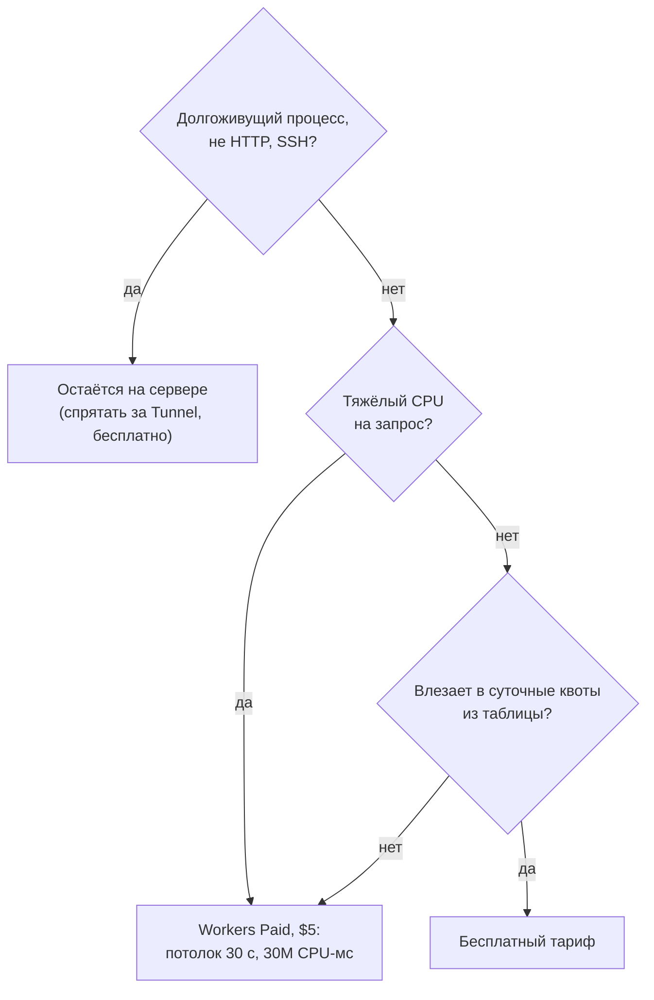

# Cloudflare вместо сервера: все задачи VPS и что с ними делает бесплатный тариф

Переезд с VPS на Cloudflare по задачам: сайт, TLS, DNS, редиректы, крон, почта, хранилище, мелкие API. Что закрывает бесплатный тариф и где он кусается.

Source: https://ru.301.sh/vps-jobs-on-cloudflares-free-plan/
Published: 2026-07-29
Cloudflare facts checked: 2026-07-29

---

Страх уйти с VPS редко упирается в какую-то одну функцию. Маленький сервер тихо делает десяток
дел сразу: отдаёт сайт, продлевает сертификаты, отвечает на DNS-запросы, редиректит старые адреса,
крутит крон-скрипт, пересылает почту, держит базу, хранит загрузки, поднимает мелкий API,
отбивает частые запросы скрейпера, — а вопрос про переезд на самом деле складывается из десяти
вопросов, заданных как один. Спросите «может ли Cloudflare заменить мой VPS» — получите агитацию в обе стороны.
Спросите по каждой задаче — получите ответы, которые можно проверить.

Вот раскладка по задачам — все цифры сняты с живой документации 29 июля 2026 года — с квотой,
ценой её снятия и честными строками, где ответ «оставьте сервер». В конце — две системы, которые
уже так живут, одна из них — боевая SaaS.

## Раскладка

| Задача VPS | На бесплатном тарифе | Квота | Где кусается |
|---|---|---|---|
| Отдавать статический сайт | Workers static assets | запросы к ассетам «free and unlimited»; 20 000 файлов по 25 МиБ | пути, идущие через код воркера, списываются из лимита 100 000 запросов в сутки |
| TLS-сертификаты | Universal SSL | сертификаты на 90 дней, продление за 30 дней до конца | только проксируемые домены |
| DNS | бесплатно, с неограниченной защитой от DDoS | 200 записей на зону (для зон, созданных с сентября 2024; у старых бесплатных зон остаётся 1 000) | неймсерверы придётся перевести в Cloudflare |
| Редиректы | Single + Bulk Redirects | 10 правил; 10 000 bulk-адресов | [квота на bulk в вашем аккаунте может отставать](/cloudflare-free-plan-redirect-limits/) |
| Крон-скрипты | Cron Triggers на воркере | 5 на аккаунт по документации, минимальный интервал 1 минута | см. следующий раздел |
| Мелкие API, динамика | Workers | 100 000 запросов в сутки, 10 мс CPU на каждый | вычисления ломают бюджет CPU, отдача — нет |
| Хранилище ключ-значение | Workers KV | 1 ГБ, 100 000 чтений и 1 000 записей в сутки | 1 000 записей — меньше, чем кажется |
| Настоящая база | D1 (SQLite) | 5 ГБ, 5 миллионов чтений и 100 000 записей в сутки | суточные потолки отдают ошибку, а не притормаживают |
| Объектное хранилище | R2 | 10 ГБ, исходящий трафик бесплатно | бесплатный тариф покрывает только класс Standard |
| Пересылка почты | Email Routing | бесплатно на всех тарифах; 200 правил, 200 адресатов | пересылка, а не отправка |
| Файрвол, ограничение частоты запросов | бесплатный WAF | 5 своих правил, 1 правило rate limiting | одно правило rate limiting — придётся выбирать, что защищать |
| Логи запросов | Workers Logs, Analytics Engine | логи с сэмплированием; 100 000 точек данных в сутки | Logpush только на Enterprise, Workers Trace Events открываются за $5 |

Три строки заслуживают большего, чем ячейка.

## Крон, который не должен срабатывать, и всё-таки срабатывает

Документация говорит, что бесплатный тариф даёт 5 Cron Triggers на аккаунт. Аккаунт, на котором
живёт этот блог, выполняет 7 — каждый день, по пяти воркерам дистрибуции, и делает это уже
неделю, публикуя на пять площадок по расписанию. Мы ни о чём не договаривались; лимит просто не
применяется к этому аккаунту.

Строить на этом нельзя. Это то же самое явление, которое мы задокументировали, когда
[в документации на Bulk Redirects значилось 10 000, а дашборд не пускал дальше 20](/cloudflare-free-plan-redirect-limits/):
задокументированные числа Cloudflare и то, что реально выдано аккаунту, расходятся, причём в обе
стороны и иногда на месяцы. Прочитайте число, а потом проверьте его. На переезде эта привычка
стоит вам полдня и спасает от архитектуры, построенной вокруг лимита, которого для вас
никогда не существовало, — или вокруг квоты, которой у вас на самом деле нет.

## Сертификаты — тихий аргумент

На VPS работа с TLS была ежегодным продлением или таймером certbot. Эта эпоха заканчивается по
расписанию: с 15 марта 2026 года правила CA/Browser Forum ограничивают публичные сертификаты
200 днями, в марте 2027-го потолок падает до 100 дней, а в марте 2029-го — до 47 дней, с
переиспользованием проверки домена не дольше 10 дней. Ручное продление перестаёт быть рабочей
привычкой и превращается в генератор инцидентов: портфель припаркованных доменов на VPS встречает
эту волну на первом же коротком продлении, а первые сертификаты на 199 дней закончились уже в
сентябре. [Как найти домены, которые всё ещё продлевает человек](/200-day-certificates-on-a-domain-portfolio/),
разобрано в отдельной статье.

За прокси Universal SSL и так выпускает сертификаты на 90 дней и продлевает их за 30 дней до
конца, а это ниже ступеней 2026 и 2027 годов того расписания. Ступень 2029 года, 47 дней, ещё
короче, и укладываться в неё — забота Cloudflare, а не ваша: срок действия сертификатов Universal SSL
определяет она. Из всего в таблице это единственная строка, где бесплатный тариф — не более
дешёвая версия задачи с VPS, а качественно лучшая.

## Потолок настоящий, и его можно измерить

Бюджет в 10 мс CPU — единственная жёсткая стена бесплатного тарифа, и обе её стороны мы замерили
на этом сайте. Воркер, который отдаёт, — [наш MCP-сервер](/mcp-server-on-workers-free-plan/),
отвечающий из статических ассетов, — тратит от 0 до 2 мс бюджета, потому что ожидание ввода-вывода
за CPU не считается. Воркер, который вычисляет, — движок шаблонов, который мы замерили в
[аудите готовности сайта к агентам](/agent-readiness-audit/), — превысил тот же бюджет в восемь
раз. Вот честное
разделение для переезда: маршрутизация, редиректы, отдача и пересылка помещаются с запасом;
разбор, рендеринг и хеширование на больших объёмах — нет.

По собственному правилу этого сайта цена снятия ограничения стоит рядом с самим ограничением:
тариф Workers Paid за $5 в
месяц поднимает потолок на запрос до 30 секунд по умолчанию и включает 10 миллионов запросов и
30 миллионов CPU-миллисекунд в месяц.

## Что честно остаётся на сервере

- **Долгоживущие процессы.** Всё, что держит сокет открытым часами, общается не по HTTP или
  требует SSH. Произвольное проксирование TCP существует (Spectrum), но только как отдельная
  опция Enterprise — это не переезд, это закупка.
- **Тяжёлые вычисления**, по замеру выше, если только $5 и 30 секунд их не покрывают.
- **Что открывается только за деньги.** Snippets на Free отсутствуют вовсе, Logpush только на
  Enterprise, Load Balancing и Argo — платные опции. Если задача вашего VPS ложится на одну из них, ответ
  бесплатного тарифа — «нет», а не «да, но с усилиями».
- **Контроль, о котором вы не знали.** В Cloudflare Registrar неймсерверы нельзя поменять
  вообще, а [продление — это поручение, а не гарантия](/auto-renew-on-domain-still-expired/).
  Переезд отдаёт настоящие рычаги одному поставщику; это решение, а не деталь.

И для сомневающихся есть мост: Cloudflare Tunnel доступен на всех тарифах, так что VPS может
остаться ровно там, где стоит, спрятанный за краем сети без единого открытого порта, пока задачи
уезжают с него по одной строке. Ничто в этой таблице не работает по принципу «всё или
ничего».

## Две системы, которые уже так живут

Этот блог — случай поменьше: шесть воркеров (сайт плюс пять воркеров дистрибуции), семь
срабатываний крона в сутки, общий namespace KV, 317 статических файлов, MCP-сервер — при
расходах ровно ноль и с замерами, опубликованными в виде статей.

Случай побольше — [301.st](https://301.st), платформа, которой принадлежит этот блог: боевая SaaS
для доменов, редиректов и распределения трафика, построенная как бессерверное приложение на
Cloudflare Workers, с D1 как источником истины и KV для кеша и сессий. Её архитектурная
документация формулирует цель прямо: клиентам не нужен платный тариф Cloudflare — всё работает на
бесплатных Workers, а Workers Paid — это путь роста, а не входной билет. Платформа, чья работа —
чужие домены, выбрала ту же таблицу, которую вы только что прочитали. Честнее рекомендовать бесплатный тариф мы
не умеем. А там, где портфель перерастает
строки, которые вы тянете сами, взять эту работу на себя — ровно то, ради чего платформа и
существует.
