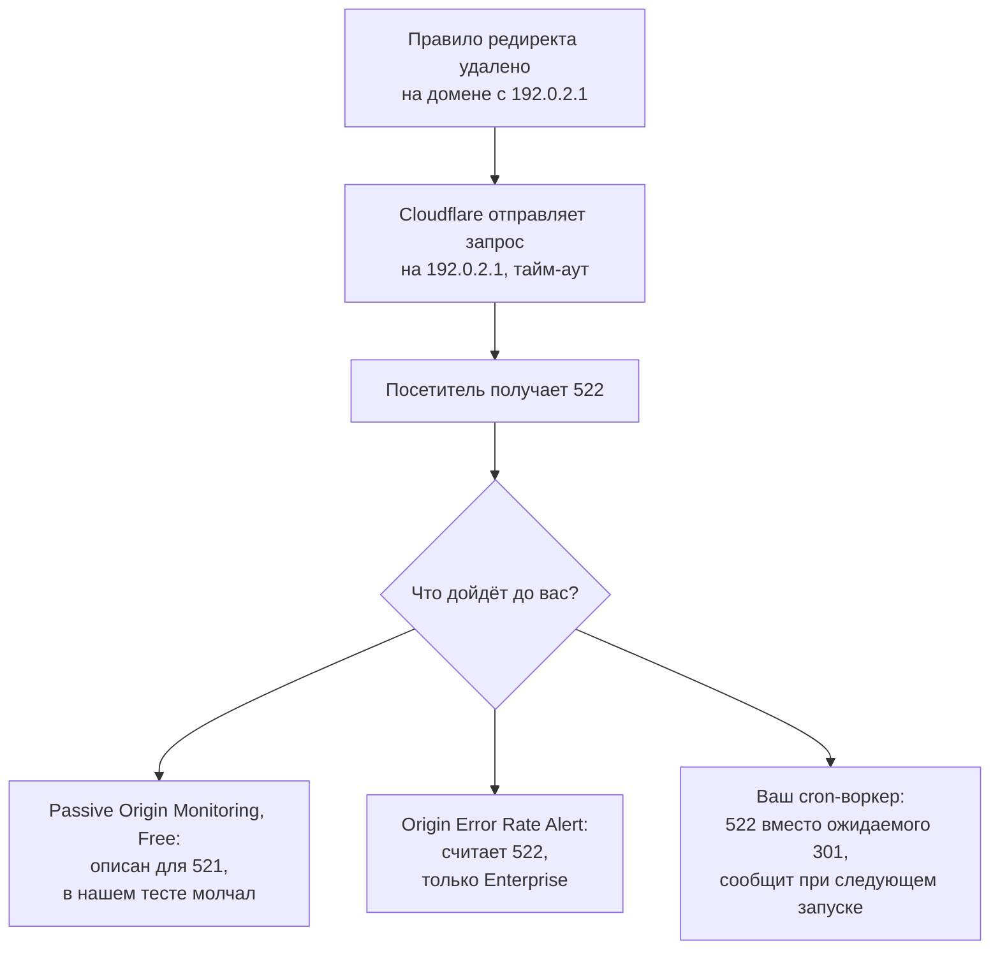

# О чём Cloudflare предупредит на бесплатном тарифе, а что проверять самому

Мы сорок минут держали поддомен сломанным при включённом бесплатном алерте Cloudflare, и он промолчал. Что отслеживает Free и воркер, который проверяет редиректы.

Source: https://ru.301.sh/what-cloudflare-free-alerts-you-about/
Published: 2026-09-23
Cloudflare facts checked: 2026-09-23

---

У вас несколько десятков доменов на бесплатном тарифе Cloudflare, и большинство из них только
редиректят. О сломанном домене хочется узнать раньше клиента. Часть поломок Cloudflare сама
пришлёт письмом и бесплатно, но только если вы это включите. О том, что редирект ведёт не туда,
что кто-то поменял DNS-запись или что у домена у другого регистратора подходит срок, Cloudflare не
скажет. Ни на каком тарифе, включая Enterprise.

Ниже — что отслеживает Free, что добавляют платные тарифы и сколько это стоит, и воркер, который
проверяет сами редиректы. Если вы ещё выбираете, чем делать редирект, начните со
[сравнения всех способов на Cloudflare](/every-way-to-redirect-on-cloudflare/).

## Что Cloudflare отслеживает на каждом тарифе

Проверено 23 сентября 2026 года по документации Cloudflare и через API уведомлений нашего
собственного аккаунта.

| Что ломается | Free | Что закрывает | Что остаётся без присмотра |
| --- | --- | --- | --- |
| Origin недоступен | Passive Origin Monitoring, письмо; в нашем тесте промолчал | | домены с малым трафиком, и `522` |
| Ошибки origin, включая `522` | ничего | Origin Error Rate Alert, только Enterprise | всё ниже Enterprise |
| Активная проверка адреса | ничего | Health Checks: 10 на Pro ($20 в месяц при оплате за год), 50 на Business ($200) | всё, что сверх 10 или 50 адресов |
| Сертификат на краю сети (Universal SSL) | Universal SSL Alert, письмо | | |
| Истечение Origin CA-сертификата | ничего | ничего | любой тариф |
| Истекает домен в Cloudflare Registrar | ежемесячное письмо Super Administrator | | |
| Истекает домен у другого регистратора | ничего | ничего | любой тариф |
| Изменение DNS-записи или NS-серверов | Audit Logs, без уведомления | ничего | любой тариф |
| Редирект ведёт не туда | ничего | ничего | любой тариф |
| Куда приходят уведомления | письмо | вебхуки при платной подписке, PagerDuty с Business | |

К двум строкам нужны пояснения.

Passive Origin Monitoring пропал из актуального списка уведомлений, обновлённого 24 апреля
2026 года. API его по-прежнему отдаёт: в нашем аккаунте он значится как `real_origin_monitoring`,
«Cloudflare is unable to reach your origin». В анонсе 2019 года Cloudflare пишет, что он «is
available to customers on all Cloudflare plans».

На странице про вебхуки сказано, что функция «is only available if your account has at least one
zone with a pro plan or above.» У нас в аккаунте две зоны на Free и подписка Workers Paid, которая
стоит от $5 в месяц, и API считает вебхуки доступными. С тем, что мы видим, сходится правило со
страницы «Get started»: «Accounts with a paid service will additionally have access to webhooks.»

## По умолчанию не включено ничего

К 23 сентября наш аккаунт обслуживал этот сайт с июля. Правило уведомлений в нём было одно:
алерт о бюджете, который Cloudflare завела сама. Ни одного из двух бесплатных алертов из
таблицы там не было.

Заводятся они в разделе **Notifications**, кнопка **Add**:

1. **Passive Origin Monitoring.** Одно правило действует на все зоны аккаунта.
2. **Universal SSL Alert.** Проверка, выпуск, продление и истечение сертификата, который видят
   посетители.

Оба приходят на адрес, который вы укажете. Указывайте ящик, который кто-то читает. Уведомление,
ушедшее бывшему коллеге, — та же поломка, что и письмо о продлении из статьи
[«Автопродление было включено, а домен всё равно истёк»](/auto-renew-on-domain-still-expired/).

## Мы дважды сломали поддомен, и бесплатный алерт промолчал

На что срабатывает Passive Origin Monitoring, Cloudflare описывает в одном-единственном месте, в
посте от июля 2021 года. Уведомление:

> tells you if every request to your origin is returning a 521 error (web server down) for a full five minutes

`521` означает, что сервер отказал в соединении. У домена, настроенного по
[инструкции для портфеля](/redirect-200-parked-domains/), отказывать некому: проксированная
`A`-запись смотрит на `192.0.2.1`, адрес, на котором никто не отвечает, а редирект работает на
краю сети. Если кто-то удалит правило редиректа или сузит его, Cloudflare отправит запрос на
`192.0.2.1`, подождёт и отдаст посетителю [`522`](/redirect-silently-fails/) — истёк тайм-аут.

Поэтому 23 сентября мы проверили оба случая, включив уведомление в своём аккаунте.

1. Проксированный поддомен на `192.0.2.1` без правила редиректа. С 08:24 до 08:44 UTC мы
   запрашивали его каждые 15 секунд. Все 35 ответов — `522`.
2. Тот же поддомен, направленный на сервер, который отказывает в соединении на порту 443:
   в нашем режиме SSL Full Cloudflare ходит на origin именно туда. С 08:46 до 09:06 UTC, с той
   же частотой. Все 78 ответов — `521`.

История уведомлений аккаунта оставалась пустой оба прогона и потом до 09:24 UTC, когда мы
перестали смотреть. Письма на адрес из правила тоже не пришло. Второй прогон — ровно тот случай,
который описан в посте 2021 года, и алерт не сработал и на нём. Минимального объёма трафика
документация не называет, но запроса раз в 15 секунд оказалось мало.

Припаркованный домен, который только редиректит, получает меньше. Passive Origin Monitoring всё
равно включите, он бесплатный, но его молчание ничего не доказывает. Единственное уведомление,
про которое в документации сказано, что оно считает `522`, — Origin Error Rate Alert, и оно есть
только на Enterprise.



## Проверяйте редиректы сами, воркером по расписанию

Ни один тариф не предлагает простого: запросить домен и посмотреть, куда указывает ответ. Это
умеет воркер по расписанию. Воркеру без собственного маршрута хватает `workers.dev`, так что
домен ему не нужен.

```js
// Each row: the URL, the status you expect, the Location you expect.
const CHECKS = [
  ['https://old-brand.com/', 301, 'https://brand.com/'],
  ['https://www.old-brand.com/', 301, 'https://brand.com/'],
  ['https://promo-brand.net/', 302, 'https://brand.com/spring/'],
];

async function probe() {
  const failures = [];
  for (const [url, status, location] of CHECKS) {
    try {
      const res = await fetch(url, { redirect: 'manual' });
      const got = res.headers.get('location');
      if (res.status !== status || got !== location) {
        failures.push(`${url} → ${res.status} ${got ?? '(no Location)'}`);
      }
    } catch (err) {
      failures.push(`${url} → ${err.message}`);
    }
  }
  return failures;
}

export default {
  async scheduled(event, env) {
    const failures = await probe();
    if (failures.length === 0) return;
    const text = failures.join('\n');
    await fetch(env.ALERT_WEBHOOK, {
      method: 'POST',
      headers: { 'content-type': 'application/json' },
      // Slack reads `text`, Discord reads `content`.
      body: JSON.stringify({ text, content: text }),
    });
  },
};
```

```toml
name = "redirect-check"
main = "index.js"
compatibility_date = "2026-09-01"

[triggers]
crons = ["*/30 * * * *"]
```

Адрес вебхука сохраните как секрет командой `wrangler secret put ALERT_WEBHOOK`, чтобы его не было
в коде. Главное здесь — `redirect: 'manual'`: воркер получает первый ответ и не идёт по нему
дальше, поэтому вы сравниваете ровно то, что получает браузер посетителя.

Функцию `probe()` мы 23 сентября прогнали с `workers.dev` на своих доменах, которые лежат в том же
аккаунте Cloudflare, что и воркер. Правильные редиректы прошли молча. Строку, где мы нарочно
ждали неверный адрес, воркер показал. Несуществующий домен вернулся не ошибкой, а ответом `530`, и
проверка статуса поймала его так же.

На Free упираться придётся в два лимита. Один вызов воркера может сделать 50 подзапросов, так что
за запуск проверяется 49 адресов, а один запрос остаётся на уведомление. Cron-триггеров на весь
аккаунт — 5. У нас их девять, семь из них у воркеров, которые рассылают этот блог, так что лимит
Free мы превысили задолго до мониторинга. Workers Paid поднимает лимиты до 10 000 подзапросов и
250 cron-триггеров, от $5 в месяц.

## Где ломается

**Проверка живёт внутри Cloudflare.** Если у Cloudflare сбой, он и у воркера, и у уведомлений.
С 11:35 19 июня до 02:50 UTC 23 июня этого года часть уведомлений о безопасности и DDoS не
доставлялась — это зафиксировано в
[треде в комьюнити](https://community.cloudflare.com/t/935405) и на странице статуса. Монитор
снаружи Cloudflare, например UptimeRobot, видит то же, что посетитель, `522` тоже.

**Уведомления настраиваются на аккаунт, а не на домен.** Отключить одну зону в правиле на весь
аккаунт нельзя, и вопрос о том, как это сделать, висит без ответа
[с июня](https://community.cloudflare.com/t/935877).

**Изменения DNS остаются только в журнале.** Audit Logs есть на всех тарифах и хранятся
18 месяцев, но ни одно уведомление их не читает. В январе у одного владельца поменялись
NS-серверы, после того как зону добавили во второй аккаунт, и узнал он об этом,
[когда сайт лёг](https://community.cloudflare.com/t/879850). Узнать раньше можно, только если
опрашивать API Audit Logs или по расписанию резолвить NS-записи каждого домена.

**Origin CA-сертификаты истекают без предупреждения.** Cloudflare говорит об этом прямо:

> Cloudflare does not currently send expiration notifications for origin CA certificates.

В статье [«Сертификат теперь живёт 200 дней»](/200-day-certificates-on-a-domain-portfolio/)
есть команда, которая читает сертификат на вашем сервере.

**Домены у других регистраторов не видны.** Cloudflare Registrar раз в месяц присылает письмо со
списком доменов, «expiring in the next 60-90 days». Домену, зарегистрированному в другом месте,
Cloudflare не пришлёт ничего.

## Когда нужен 301.st

Для нескольких доменов мы вам не нужны. Включите два алерта, запустите воркер со своим списком и
читайте почту.

Когда доменов сотни, больнее всего бьёт дыра, которую на Cloudflare не закрывает ничто: домены,
чьи NS-серверы больше не указывают туда, где живут правила редиректа. [301.st](https://301.st)
постоянно резолвит NS-записи доменов, которыми управляет, каждый домен не реже двух раз в сутки,
и сверяет их с теми, что назначила Cloudflare. Статус каждой зоны он по очереди перечитывает у
Cloudflare. Если домен с включёнными правилами перестал получать через них трафик, потому что
NS-серверы сменились или зона ушла из аккаунта, он присылает список письмом.

Остальное видно на одном экране по всему портфелю, но не приходит уведомлением: вердикт
VirusTotal по каждому домену с вашим собственным API-ключом; блокировка Cloudflare за фишинг;
ежедневный подсчёт ответов-редиректов по каждому хосту с отметкой, если их стало вдвое меньше, на
девять десятых меньше или ноль; и дата окончания регистрации из RDAP, у какого бы регистратора ни
лежал домен.

Запрашивать каждый редирект и сверять адрес с ожидаемым он не умеет. Это делает воркер выше,
и его стоит запускать рядом с 301.st.
